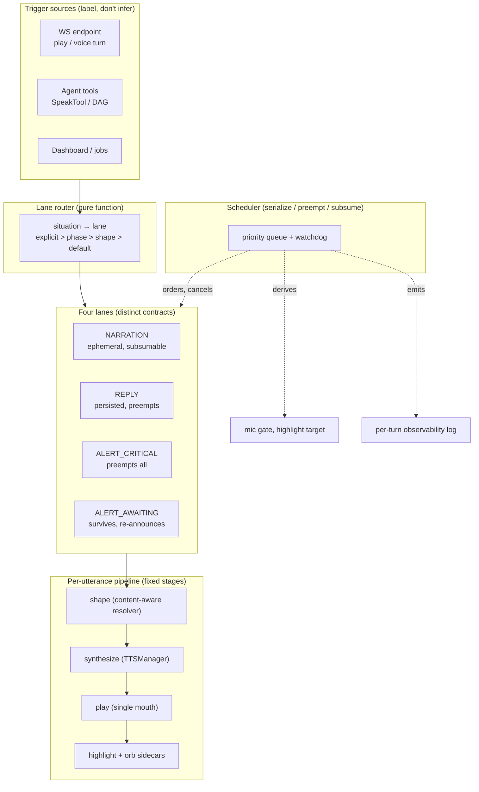

# Design: Speech Lane Engine

## Context

Speech coordination today is scattered flags and locks (`_NARRATION_PLAYBACK_LOCK`,
half-duplex toggles at 8 sites across 4 files) plus five independent spoken-line
derivations that disagree by path. The engine replaces coordination-by-flag with
coordination-by-schedule: one router, four lanes, derived gates. Synthesis itself
(worker, manager, chapter guard) is proven and untouched — the scheduler only
decides what/when, never how audio is made.

Constraints bounding the design: first-audio latency must not regress (~1.2 s
synthesis, 60 s first-chunk budget); WebSocket event shapes and frontend handlers
are locked; STT/VAD/wake-word behavior is out of scope; the Caducean inference
gate is a vocabulary reference only.

## Architecture Overview



## Sequence / Data Flow

```mermaid
sequenceDiagram
    participant U as User / Agent
    participant R as Router
    participant L as Lanes
    participant S as Scheduler
    participant T as TTSManager
    participant M as Mic gate (derived)
    U->>R: intent + trigger label + turn phase
    R->>L: utterance node (lane assigned, rule logged)
    L->>S: enqueue (priority by lane)
    S->>T: synthesize (streaming, chaptered)
    T->>S: chunks done
    S->>M: gate = any play-node running
    Note over S: Barge-in → cancel running + pending → fresh turn
    Note over S: Reply admitted → pending narration dies unspoken
    Note over S: Turn ends → narration nodes die; awaiting survives
```

## Data Models

```python
@dataclass
class UtteranceNode:
    id: str
    lane: str          # NARRATION | REPLY | ALERT_CRITICAL | ALERT_AWAITING
    trigger: dict      # {source, label, rule_fired} — L1..L4 provenance
    turn_id: str
    session_id: str
    persist: bool      # lane-derived: replies/alerts True, narration False
    content: dict      # {kind, text/show-ref} — shaped spoken line + shown anchor
    state: str         # queued|ready|playing|done|cancelled|failed
    priority: int      # lane-derived, never caller-supplied
    enqueued_at: float
    deadline: float    # node watchdog (stuck detection)
    # Narration-beat extension (session-305): beats are UtteranceNodes with
    kind: str | None   # "planned" | "reactive" (narration only; immutable)
    audio_ref: str | None  # synthesize-and-hold buffer ref (cleared on free)
    # Amendments are queue ops (ADD/REPLACE/CANCEL) against the SAME queue —
    # no parallel beat store; rejection is explicit + logged (D10).
```

## Key Decisions

- **D1 lane scheduler, not DAG.** Default considered: full DAG with topo-sort.
  WHY DAGs exist (join semantics) doesn't occur here — every relation found is
  serialize/preempt/subsume/chain (evidence: the relations table in discussion;
  zero "wait for TWO things" rules in the pipeline). Alt: keep flags (rejected:
  unorderable, unwedgeable — the stuck-producer open item is structural proof).
  Chosen: priority lane + per-utterance staged pipeline. Revisit ONLY on a named
  join passing the join test.
- **D2 no CaduceanPhaseManager reuse.** It gates inference admissions on
  quota/oscillator physics (`backend/agent/phase_manager.py`); speech needs
  turn/utterance/interruption semantics. Reuse would couple unrelated
  lifecycles and inherit flag-gating. Borrow lane/gate vocabulary only.
- **D3 strangler with shadow mode.** Alt: big-bang rewrite (rejected: the most
  timing-sensitive path in the app; unprovable before cutover). Shadow observer
  first (logs would-order, changes nothing), cut over narration → play →
  replies, flags die last as derived views. Cost: temporary dual-path
  complexity, retired by the final cutover task.
- **D4 default lane is narration.** Unclassifiable triggers must be heard
  without persisting phantom history (the 887-char class of bug argues for
  ephemerality as the safe direction). Alt reply-default (rejected: history
  pollution); alt drop (rejected: lost speech).
- **D5 content-aware shaping, one resolver.** Alt fixed-char-cap (rejected:
  mid-sentence clips, path-dependent); alt full-recite (rejected: ear
  marathons — the measured 2500-char syntheses); alt LLM-brief-everything
  (rejected: latency + cost per answer; kept as OQ-1 fallback). Resolver
  precedence: agent `speak` > type-aware shaping > first-sentence; explicit
  "read it to me" overrides the type table.
- **D6 barge-in kills (user-locked).** Alt pause/resume (rejected: resume-state
  across worker + highlight + orb is a second scheduler in disguise).
- **D7 narration ephemeral (user-locked).** Alt persist (rejected: phantom
  turns, history noise).
- **D8 gates derived, never toggled.** The 8 `set_tts_active` sites shrink to
  zero callers; highlight target reads the running node. Structurally closes
  the stuck-gate open item (no manual reset exists to forget).
- **D9 alert set is Critical + Awaiting (user-locked).** Awaiting states
  survive boundaries and re-announce once; critical preempts all within one
  breath. Reminders/nudges deferred (OQ-2 feed decides).
- **D10 beat store IS the scheduler queue (session-305).** No parallel beat
  store to desync. Beats are immutable nodes (kind: planned|reactive); the
  agent amends via atomic ops (ADD / REPLACE=cancel+add / CANCEL), each landing
  fully or rejected with a logged reason. Engine transitions status only;
  agent writes content only. Alt: separate beat manager object (rejected:
  second source of truth, drift risk).
- **D11 hybrid beat authoring (session-305).** Planning call is the first
  writer (beats are projections of the plan — free, coherent); the queue is
  amendable at any time, so live authoring can add/replace/cancel. Alt:
  mandatory separate authoring call (rejected: second LLM round-trip per task
  for text the planner already knows).
- **D12 emergent rhythm — coalesce, don't time (session-305).** Burst merge
  (AC10.9), beat spacing (AC10.10), and the filler exception (AC10.13) all
  reuse one mechanism: pending narration is subsumable. Alt: spacing timers +
  heartbeats (rejected: timer-driven chatter is the banned content class).
- **D13 hybrid pre-synthesis (session-305).** Planned beats 2..N pre-synthesize
  at authoring (latency hides in segment wait); first beat + reactive lines
  stream on demand (their text doesn't exist earlier). Invariants: lowest
  worker priority (never delays REPLY/ALERT — AC7.4 must hold for the reply
  path), bounded buffers with free paths on every exit, failure degrades to
  on-admission synthesis. Alt: synthesize-everything-on-admission (rejected:
  pays 1.2s at every play); alt: pre-synthesize-everything (impossible for
  reactive lines, wasteful for the most cancel-prone class).
- **D14 echo = existing orb chain (session-305, resolves OQ-4).** Visual echo
  rides audio_envelope + tts_started through the unified playback path; zero
  new frontend events. The only new frontend surface is the narration toggle
  on the existing settings path. Alt: transient caption/persistent log
  (rejected: new frontend surface + the log bends the ephemeral lock).
- **D15 TTS engine unchanged (session-305).** Engine swap evaluated and
  rejected (license, non-streaming diffusion, no control surface, latency
  budget). Synthesis internals untouched — the scheduler decides what/when.
- **D16 wait-states are the narration clock (session-305).** No heartbeats;
  wait entry/expectation-miss/exit are the narratable events (AC10.11).
  Requires Phase -1 grounding of wait-state symbols (OQ-5 scope).

## Ripple-Effect Map

| Area / File | Change? | Classification | Why / Evidence (file:line) |
|---|---|---|---|
| NEW scheduler module (`backend/agent/speech_lanes.py`) | Yes | CHANGE NEEDED | Router + lanes + queue + watchdog + observability; no existing module owns this. |
| `backend/agent/tts.py` (TTSManager) | No (Waves 1–3) | NO CHANGE (verified) / CHANGE NEEDED (Wave 4) | Already serializes (`_synthesis_lock`), splits long input, respawns; scheduler calls `synthesize_stream` — proven path. Wave 4 T14 adds the synthesize-and-hold action + lowest-priority job scheduling; fallback to on-admission synthesis on failure. |
| `backend/audio/tts_worker.py` | No (Waves 1–3) | NO CHANGE (verified) / CHANGE NEEDED (Wave 4) | Synthesizes what it is told; lane policy lives above it. Wave 4 T14 adds the synthesize-and-hold protocol action (grounded in T11/T14 design first). |
| `backend/agent/conversation_kernel.py` narration path | Yes | CHANGE NEEDED | `_speak_utterance` + `_NARRATION_PLAYBACK_LOCK` (:63, :488) enqueue narration nodes instead of playing directly; lock removed last. |
| `backend/agent/agent_kernel.py` filler emit (:6242-6250) | Yes (Wave 4) | CHANGE NEEDED | Random canned filler at DER start demoted to gap-filler exception (AC10.13): fires only when speech would otherwise be silent AND first beat not ready; no consecutive repeats; subsumed on beat arrival. |
| `backend/agent/tts.py` FILLER_PHRASES + pre-synthesis (:835-868) | Yes (Wave 4) | CHANGE NEEDED | Filler cache kept as the gap-filler exception path's audio source; no new phrases machinery — reuse existing pre-synthesized wav cache. |
| `backend/iris_gateway.py` `_speak_response` (4 call sites) | Yes | CHANGE NEEDED | Voice turn (:3489), agent DAG (~:5663), dashboard (:11017), play (`_handle_tts_play` :4869) route utterances through lanes; per-path spoken derivations collapse into the resolver. The tts_play path (:4911-4917) is the REUSED unified playback path all lanes adopt. |
| `backend/agent/agent_kernel.py` prompt + apply table | Yes | CHANGE NEEDED | Keep speak/show intent contract (:1970, :3995); delete nothing. Spoken-derivation helpers (`prepare_spoken_text` :3837) become resolver inputs, not deciders. Wave 4 T12 adds narration-beat authoring at the planning step (grounded by T11). |
| `backend/agent/tools/speak_tool.py` caps | Yes | CHANGE NEEDED | 500-char hard truncate (:29) becomes sentence-aware budget under the lane cap policy; rate limit (:30) stays until lanes prove it redundant. |
| Half-duplex toggles (8 sites, 4 files) | Yes | CHANGE NEEDED | `voice_command.py:1749/1768/1775`, `iris_gateway.py:2536/4283/4773`, `api/chat.py:248/262`, `engine.py:252` → deleted as callers; gate derives from running play-nodes. |
| `backend/agent/tts.py` `normalize_for_speech` + `tts_normalizer.py:92` + worker `_normalize` | No | CONTRACT LOCK | Normalization coverage per road pinned by CT (audit which roads skip it; lock all five). |
| Frontend handlers (`useIRISWebSocket.ts`, `chat-view.tsx`) | No code | CONTRACT LOCK | Event shapes unchanged; pinned by existing `tts_play` isolation + word-event integration tests. Wave 4 CT-S6 pins narration `tts_started` turn_id non-match (existing `tts-play-*` convention, `iris_gateway.py:4917`) so chat-view word-highlighting never fires for narration — no phantom card. |
| `components/iris/XurOrb.tsx` + `components/iris/orb/OrbCanvas.tsx` | No | NO CHANGE (verified) | Orb reacts to all TTS via `audio_envelope` (gateway :2466-2493 wiring; ~10Hz during playback :4961-5064; final zero-envelope stops it) + `tts_started` (`useIRISWebSocket.ts:949-956` → `iris:tts_started`; XurOrb.tsx:117-132). Narration through the unified path drives the orb automatically (AC10.8) — no new modes. |
| Frontend settings/preference path + narration toggle | Yes (Wave 4) | CHANGE NEEDED | T15 toggle rides the EXISTING settings transport (`settings_sync` WS dict, iris_gateway.py:5463); the kernel-side apply is currently a `pass` stub (:5470-5472, grounded T11) so T15 implements the narration-key apply (reuse TTS-config persist precedent); one backend admission check; no WS shape changes (AC10.14). |
| `backend/agent/phase_manager.py` (Caducean) | No | NO CHANGE (verified) | Inference admission only; vocabulary reference, zero imports added. |

## Error Handling

| Fault | Detection | Response (EARS) |
|---|---|---|
| Node wedges past watchdog | deadline on node | THE SYSTEM SHALL fail the node, free derived gates, continue visibly. |
| Worker death mid-utterance | EOF / timeout | Same as wedge + one retry next pass, then drop (REQ-8). |
| Playback device gone | play error | Node fails; Critical one-breath notice at most once per turn. |
| Router throws | exception | Default lane (narration); turn never loses speech silently. |
| Barge-in during transition | interrupt flag | Preemption wins; gate follows new state within one poll. |
| Pre-synthesis failure / worker busy with higher-lane work | job error / queue state | Beat falls back to on-admission synthesis at play time (degraded latency, never dropped for it); logged per REQ-9. |
| Cancel races pre-synthesis completion | completion callback after cancel | Held audio discarded; counted as waste (AC10.7). |
| Narration toggle off mid-task | settings change | Pending beats dropped at admission; in-flight pre-synthesis aborted; buffers freed immediately. |
| Beat amendment targets spoken/cancelled/dead-turn beat | op rejection | Op rejected with logged reason; queue state unchanged (never partial, never silent). |
| Session end with live nodes | session close | Drain silently; no orphans, gates idle, all held buffers freed. |

## Testing Strategy

- **Contract:** CT-S1 router decision table (every hierarchy cell: explicit/phase/shape/default × 4 lanes, pure unit); CT-S2 event shapes unchanged (existing tts_play + word-event suites); CT-S3 spoken ⊆ visible (spoken derived-from-shown on all five roads); CT-S4 normalization coverage per road; CT-S5 node lifecycle states; CT-S6 narration echo (tts_started turn_id non-match → no phantom card + orb-chain shape reuse — reuses existing voice_pipeline/barge_in suites as base); CT-S7 narration toggle (settings-path admission drop; replies/alerts unaffected).
- **Behavioral:** BT-S1 barge-in kill + fresh turn (multi-turn thread); BT-S2 subsumption (pending narration dies unspoken on reply); BT-S3 turn boundary (narration dies, reply finishes, awaiting re-announces once); BT-S4 ephemeral narration absent from persisted history; BT-S5 shaping table (prose/table/diagram/code/mixed/override); BT-S6 failure (mid-utterance death → gates free, one notice, turn continues); BT-S7 beat rhythm (burst merge, first-beat-immediate, coalesce-pending, wait-state triggers, repetition bounce — one suite, one mechanism); BT-S8 pre-synthesis lifecycle (played-from-hold / fell back / cancelled-waste; lowest-priority never delays reply synthesis; buffer free paths); BT-S9 filler exception (fires only in the silent+no-beat gap, no consecutive repeats, subsumed on beat arrival).
- **Intertwined:** behavioral gaps decompose into CT-S1 cells (every surprise becomes a new decision-table row).
- **Live gate:** shadow-mode session with zero unexplained divergences + first-audio latency ≤ baseline + lane counters reviewed (REQ-9 feeds OQ-1/OQ-2). Session-305 counters: barge-ins-during-narration, beats spoken-vs-cancelled, merge rate, pre-synth hit/waste, toggle flips, expectation-miss frequency.
