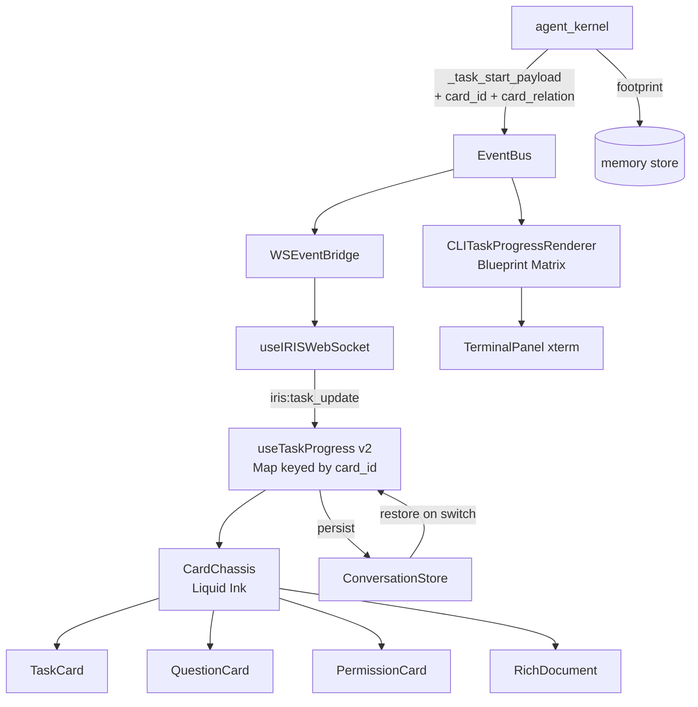
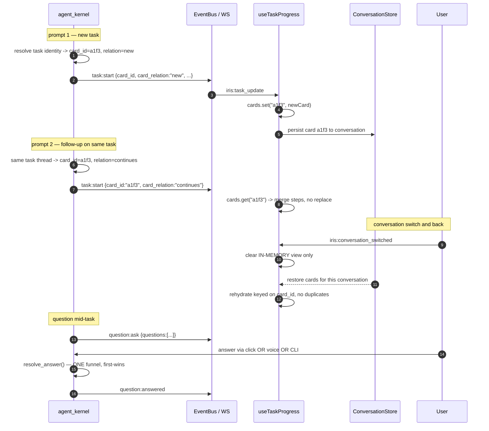

# Design: Task Card v2 — Liquid Ink + Blueprint Matrix

## Context
The task card is IRIS's execution surface, and today it is a single mutable blob:
`useTaskProgress` holds ONE card, wiped wholesale on every conversation switch
(`hooks/useTaskProgress.ts:224-229`). There is no card identity, no persistence, and no
link to the conversation that produced it. That single fact causes three of the defects
in this spec — cards vanish, follow-ups overwrite instead of extending, and nothing can
be addressed later.

Two constraints shape the design:

**The backend already has the right seam.** `agent_kernel._task_start_payload`
(`:7588-7610`) is the ONE construction point for every `task:start` emit, and it already
carries an `origin` discriminator (`initial` / `sub_loop_split` / `user_steering`). Card
identity belongs there — one place, existing pattern, no new contract surface.

**Rich documents already solved rehydration.** They persist and restore keyed on
`document_id`, with a guard against blanking a card that already has content
(`__tests__/components/chat-view-rehydration.test.ts`). Cards should follow that proven
shape rather than invent a second one.

The visual work is comparatively simple: adopt one chassis everywhere. The risk is not
in the CSS, it is in turning a single-card state machine into a keyed, persisted,
conversation-scoped collection without regressing the merge behaviour that already works.

## Architecture Overview



One chassis feeds four card types. One hook holds a keyed collection instead of a single
card. The CLI renderer consumes the same event stream, so GUI and terminal cannot drift.

## Sequence / Data Flow



## Data Models

```python
# Extended — task:start payload (REQ-3). Added at the single construction
# point agent_kernel._task_start_payload, alongside the existing `origin`.
TaskStartPayload += {
    "card_id": str,          # stable for the card's whole lifetime
    "card_relation": str,    # "new" | "continues"
    "conversation_id": str,  # scopes the card (REQ-4 AC3)
}
```

```python
# New — persisted card footprint (REQ-11)
CardFootprint = {
    "card_id": str,
    "conversation_id": str,
    "objective": str,
    "steps": list,          # id, verb, target, status, summary
    "tools_used": list[str],
    "files_touched": list[str],
    "outcome": str,         # "converged" | "failed" | "abandoned" | "unknown"
    "created_at": float,
    "updated_at": float,
}
```

```typescript
// Replaced — the hook's state. Was ONE card; becomes a keyed collection
// scoped to a conversation (REQ-3, REQ-4).
interface TaskProgressState {
  conversationId: string | null
  cards: Map<string, TaskCard>   // keyed by card_id, insertion-ordered
}
```

```typescript
// Extended — question set (REQ-5). The single-question shape stays valid
// and is normalised into a one-element set at the boundary (AC6).
interface QuestionSet {
  questionId: string
  questions: Array<{
    id: string
    header: string
    text: string
    options: string[]
    multiSelect: boolean
    allowOther: boolean
    answered: boolean
  }>
  timeoutSeconds: number
}
```

## Liquid Ink tokens as built

Extracted from `temp/task-card-redesign/variants/VariantLiquidInk.tsx` (225 lines) so the
implementation reproduces the chosen variant rather than an approximation. Where a token
conflicts with the legibility floor (Decision 14), the floor wins and the change is noted.

| Element | Token | Note |
|---|---|---|
| Surface | `linear-gradient(135deg, rgba(8,8,16,.97), rgba(14,12,20,.98) 50%, rgba(8,8,16,.97))`, border `1px rgba(255,255,255,.07)`, shadow `0 12px 40px rgba(0,0,0,.7)` | |
| Accent vein | 3px left edge, `transparent → veinColor 30% → 70% → transparent`; 8px glow halo at `${veinColor}15` | opacity 1 working / 0.5 idle |
| Vein colour | `#f97316` idle · `#fbbf24` thinking · `#34d399` crystallized | drives counter, dots, timer |
| Header | `Xur size=14`; objective 12px mono semibold, truncate | speed 1.8 working / 0.6 idle |
| Counter | `[done/total]`, 9.5px mono bold, tabular-nums, tinted by vein | |
| THK row | badge `#fbbf24` on `rgba(251,191,36,.1)`; thought amber-200/70 italic, truncate | badge 9px → **10px** (floor) |
| Verb column | `w-12` (48px), mono bold uppercase, `tracking-wider`, vein-coloured | 10px; 6 chars fit |
| Node · running | `animate-ping` ring (2s) + inner amber ring + `Xur size=7` | |
| Node · crystallized | 2.5px emerald-400 dot, `0 0 10px rgba(52,211,153,.8)` | |
| Node · done | 2px dot in vein colour, `0 0 6px ${veinColor}80` | |
| Node · pending | 1.5px dot, `bg-white/20 border-white/15` | |
| Detour badge | purple-300/80 on purple-500/10, border purple-500/20; row indented `pl-4` | 8px → **10px** (floor); label "Sub-Loop" → **"Detour"** |
| Target | 10.5px mono, white/85, truncate, flex-1 | |
| Inline summary | 9px mono white/25, `max-w-[170px]`, prefixed `·` | de-emphasized, 9px allowed |
| Expanded summary | `ml-6`, `bg-black/50`, border white/6, `break-words` | 9px → **10px** (floor) |
| Footnote | memory dot in vein colour + `latestMemory.detail`, truncate | falls back to "Active Execution" |
| Timer | `⏱ m:ss`, tabular-nums, vein-tinted pill | freezes on converge |

**Type floor (Decision 14).** The variant uses 8px in three places and 9px in five. The
rule applied here: nothing below 9px; anything a user must read to understand what
happened is at least 10px. That moves the THK badge, the Detour badge and the expanded
summary up. The inline summary and the counter stay at 9–9.5px as de-emphasized chrome.

**Detour, not Sub-Loop (Decision 13).** `branchLabel` is free text rendered as
`↳ [{branchLabel}]` — purple on the card
(`VariantLiquidInk.tsx:172-176`) and bright magenta in the CLI
(`CLITaskProgressRenderer.ts:103,174,243,315`). Changing the word touches the DATA the
backend puts in that field and the demo fixtures, not the renderers. The coloured
treatment the user likes is preserved byte-for-byte. Internal identifiers (`is_subloop`,
`sub_loop_split`, `origin`) keep their names — the ban is on user-facing surfaces only.

## Blueprint Matrix tokens as built

Extracted from `renderBlueprintCellMatrixCLI`
(`temp/task-card-redesign/CLITaskProgressRenderer.ts:281-345`) so the CLI reproduces the
chosen variant. Same rule as the GUI: where a token conflicts with a locked decision, the
decision wins and the change is noted.

| Element | Token | Note |
|---|---|---|
| Frame | `┌ ─×66 ┐` / `├ ─×66 ┤` / `└ ─×66 ┘`, cyan | inner width 66, total 68 |
| Header | `TASK :` brightCyan bold, then objective in brightWhite bold | gains an icon (REQ-9) |
| Thought row | `THK  :` brightYellow bold, thought dim italic | label padded to align with `TASK :` |
| Guide rail | `┊` dim, one per step row; blank on the last step | must hold one column (REQ-8 AC5) |
| Node · pending | `○` dim | |
| Node · running | `◎` brightYellow bold | verb takes the same colour |
| Node · done | `●` brightCyan bold | verb takes the same colour |
| Node · crystallized | `✦` brightGreen bold | verb takes the same colour |
| Verb | `s.verb.toUpperCase().padEnd(6)` | **already 6 — the variant's own choice, which is why Decision 12 caps at 6** |
| Detour chamber | `┌┄┄ ↳ [label] ┄┄┐` brightMagenta, body nested under `┊ ┊`, closed by `└┄┄┘` | label "Sub-Loop" → **"Detour"** (Decision 13) |
| Step summary | `└─ {summary}` dim, indented under its step | |
| Empty state | `┊ ○  Awaiting execution...` dim | |
| Footer | built by `buildFooter(task, wall, close, useColor)` | stacked context lines |

**Two defects to fix, both verified.**

1. **No content line closes its right wall** (REQ-8). Every `lines.push` opens with `│`
   and ends with free content — e.g. `:322` pushes `│  ┊ {orb}  {verb} {target}` with no
   padding to column 66 and no trailing `│`. Only the frame rows close. Compounding it,
   the ANSI colour wrappers mean `String.length` is not visible width, so padding must be
   computed on the escape-stripped string (and on display width for wide glyphs).

2. **The exported entry point returns the wrong variant.**
   `CLITaskProgressRenderer.render()` (`:348-350`) delegates to
   `renderCyberDoubleRailCLI` — the Flow Pipeline family, not Blueprint Matrix. Anything
   calling the class today gets a design the user did not choose. Point it at
   `renderBlueprintCellMatrixCLI` and delete the unselected variants when promoting out
   of `temp/`.

## The Two Registries

Both registries exist for the same reason: the Wormhole resonant-recall upgrade
(`docs/Wormhole-resonant-recall-.md`, `specs/node-chains`) is planned but deliberately
not built here. If verbs and memory entries are inlined in the card, that work becomes a
card rewrite. As registries, it becomes a data edit.

### Action verb registry (REQ-14)

```typescript
// lib/cards/verbRegistry.ts — ONE source, consumed by the GUI card AND the CLI renderer
type Family = "io" | "exec" | "vcs" | "forge" | "web"
            | "vision" | "gui" | "media" | "memory" | "dialog"

interface VerbEntry { verb: string; family: Family }   // verb.length <= 6, always

const VERB_COLUMN = 6   // fixed width; every verb fits natively, nothing truncates
```

The full vocabulary is 26 verbs and the longest is six characters (`COMMIT`, `BRANCH`,
`SEARCH`, `SCRIBE`, `RECALL`). That is why the column is 6 and why no acronym is needed —
`CLICK`, `TYPE`, `KEY`, `CLIP`, `SCRIBE` cover the gui and media families the demo
parser left unmapped, all as real words.

| Family | Verbs | Representative tools |
|---|---|---|
| io | `READ` `WRITE` `PATCH` `LIST` | read_file, write_file, open_file, list_directory, create_directory, delete_file |
| exec | `EXEC` | run_command, launch_app, restart, shutdown, lock_screen |
| vcs | `DIFF` `COMMIT` `PUSH` `BRANCH` `LOG` | git_status, git_diff, git_commit, git_push, git_checkout, git_create_branch, git_log |
| forge | `FORGE` | the 8 github_* tools |
| web | `SEARCH` `FETCH` | search, crawler_query, open_url, screenshot_page |
| vision | `SEE` `SNAP` | vision_analyze_screen, vision_detect_element, vision_validate_action, vision_get_context, take_screenshot, start_screen_monitor |
| gui | `CLICK` `TYPE` `KEY` | gui_click, gui_type, gui_press_key, gui_automate_* |
| media | `CLIP` `SCRIBE` `MERGE` | clip_video, analyze_video_frames, transcribe_media, combine_documents |
| memory | `RECALL` `LEARN` `PACK` | recall_memory, create_skill, improve_self, MCM recall/compress |
| dialog | `ASK` `SPEAK` | ask_user_question, speak |

Resolution order is registry entry -> family verb -> raw tool name. A blank cell is never
a valid outcome (REQ-14 AC5).

### Memory event registry (REQ-15)

```typescript
// lib/cards/memoryRegistry.ts
interface MemoryEntry {
  kind: string                    // "learning" | "recall" | "compress" | ...
  label: string
  glyph: string
  fields: string[]                // FIXED ORDER — the stable shape the agent learns
  format: (data: Record<string, unknown>) => string
}
```

`fields` is ordered deliberately. The Wormhole doc's Section 9 is explicit that a recall
surface rendered as variable prose "gets pattern-matched as noise and ignored by the
agent's own downstream reasoning — regardless of retrieval quality", and that the fix is
rendering from the node schema in fixed fields, fixed order. The registry enforces that
shape for every kind, so recall entries arriving later inherit it rather than reinventing
it.

Registered at this stage — `learning` is the only one already emitting:

| Kind | Source | Emitting today? |
|---|---|---|
| `learning` | `agent_kernel.py:11403` `task:learning` — signal, verified_label | Yes |
| `recall` | `mcm.py:161` `MCM.recall()` — NBL / episodic / filename ladder | No — T-new adds the emit |
| `compress` | `mcm.py:86` `MCM.compress()` | No — T-new adds the emit |
| `episodic` | `agent_kernel.py:752` `get_task_context()` | No — T-new adds the emit |
| `crystallized` | skill capture, arrives via `task:learning` signal | Yes |

Reserved for the Wormhole work, registered but unemitted until then: `tier` (hash|walk),
`hyperedge_posterior`, `hex_bin_id`, `resonance`, `elevation`. Adding them is a registry
edit (REQ-15 AC6), not a card change.

## Key Decisions

| Decision | Rationale | Rejected alternative |
|---|---|---|
| Card identity declared by the backend | Only the kernel knows whether it reopened a task thread; a frontend heuristic drifts from truth the moment planning changes | Frontend infers from event shape (today's `prev.turnId === d.task_id` guess) |
| Identity added at `_task_start_payload` | It is already the ONE construction point and already carries `origin`; every emit site inherits the field for free | Adding `card_id` at each of the 6+ emit sites |
| Hook holds `Map<card_id, Card>` | Branching requires more than one card to exist at once; a single slot makes REQ-3 AC4 unimplementable | Keep one card and stack a separate history list |
| Persist cards like documents | Documents already rehydrate correctly with a no-blank guard; reusing the shape inherits a solved problem | A new card-specific persistence mechanism |
| One shared `CardChassis` component | REQ-2 AC3 requires a single change point; four copies of the chassis guarantees drift | Style each card individually to match |
| CLI renderer consumes the same events | GUI and terminal cannot disagree about what happened if they read one stream | A separate CLI state machine |
| Visible-width padding for CLI walls | ANSI escapes inflate `String.length`; padding on raw length misaligns every coloured line | `padEnd` on the raw string |
| Question set normalised at the boundary | Keeps one render path; the single-question payload becomes a one-element set instead of a second code path | Branch the component on single vs multi |
| Verbs capped at 6 chars, real words | The whole 26-verb vocabulary fits natively, so the column can be fixed without truncating or shrinking type — legibility and CLI alignment fall out together | Acronyms (`GUI`, `MED`), or ellipsis truncation, or a smaller font |
| Verbs and memory entries in registries | The Wormhole recall upgrade must land as a data edit, not a card rewrite | Inline the mapping in each card and renderer |
| Memory footer renders fixed fields in fixed order | Wormhole doc Section 9: variable prose "gets pattern-matched as noise and ignored", regardless of retrieval quality | Free-form summary strings per event |
| Terminal becomes an on-demand slide-over | Dev-mode chat is already a CLI; a resident xterm duplicated it on a second channel and ate the viewport | Keep the resident panel; or delete the terminal outright |

## Ripple-Effect Map

| Area / File | Change? | Classification | Why / Evidence |
|---|---|---|---|
| `backend/agent/agent_kernel.py` `_task_start_payload` | Yes | CHANGE NEEDED | Add `card_id` / `card_relation` / `conversation_id` at the single construction point (`:7588-7610`) |
| `backend/agent/agent_kernel.py` task identity | Yes | CHANGE NEEDED | Must decide `new` vs `continues`; 6+ TASK_START emit sites inherit the payload but the DECISION is new |
| `hooks/useTaskProgress.ts` | Yes | CHANGE NEEDED | Single card -> keyed Map; reset-on-switch (`:224-229`) becomes restore-on-switch |
| `components/chat/TaskListCard.tsx` | Yes | CHANGE NEEDED | Re-chassis to Liquid Ink (434 lines today) |
| `components/chat/QuestionCard.tsx` | Yes | CHANGE NEEDED | Single-question props (`:9-14`) -> question set; re-chassis |
| `components/chat/PermissionCard.tsx` | Yes | CHANGE NEEDED | Re-chassis only (REQ-2 AC4: no capability change) |
| `components/chat/RichDocument.tsx` | Yes | CHANGE NEEDED | Re-chassis only; 889 lines, highest regression risk — chassis swap must not touch its content logic |
| `backend/capabilities.py:66-73` `get_mode()` | Yes | CHANGE NEEDED | Falls back to `"personal"` when `mode` is absent from config — and it IS absent. REQ-16 AC3: absence must not mean most-permissive |
| `data/iris_config.json` | Yes | CHANGE NEEDED | No `mode` key today; the launcher's mode-select must reach it via `main.py:1070-1083` |
| `backend/agent/tool_bridge.py:1168-1200` | No | NO CHANGE (verified) | Phase 4 permission check is CORRECT and correctly placed before execution. Nothing to fix — it is starved of a truthful mode |
| `backend/agent/permissions.py` tier matrix | No | NO CHANGE (verified) | `get_permission_action` (`:207-228`) is sound: personal gates DESTRUCTIVE, developer gates SIDE_EFFECT + DESTRUCTIVE. Do not rewrite the policy |
| `PERMISSION_REQUEST` -> card -> response chain | No code | CONTRACT LOCK | Fully wired: `permissions.py:299` -> `ws_event_bridge.py:45` -> `useIRISWebSocket.ts:1504` -> `chat-view.tsx:3411` -> `iris_gateway.py:5375-5387`. Never exercised by a test — CT-11 |
| `_DESTRUCTIVE_TOOLS` vs the runtime registry | No code | CONTRACT LOCK | 8 names, only `delete_file` exists among the 51 registered tools — CT-12 pins the drift |
| `components/chat/DocumentPanel.tsx` | Yes | CHANGE NEEDED — **MISSED IN FIRST DRAFT** | Expanded form of RichDocument (`chat-view.tsx:3606`), own gradient `rgba(10,10,20,.99)` ≠ Liquid Ink. Expanding would change surface mid-interaction |
| `components/chat/planEventMessage.ts` | No | NO CHANGE (verified) | MESSAGE path, not card path. Returns a string pushed as `sender: "system"` (`chat-view.tsx:978-983`); `Message.sender` is a first-class union at `:112`. System and error messages are DESIGNED to be plain text — an audit pass briefly proposed carding them, which was wrong and is reverted. On the CT-10 allowlist |
| `components/chat/MarkdownMessage.tsx` | No | NO CHANGE (verified) | Message BODY, not a card — on the REQ-2 AC8 allowlist |
| Error messages (`sender: "error"`) | No | NO CHANGE (verified) | MESSAGE path, same as system messages (`chat-view.tsx:1096`, `:1121`) — plain text by design |
| `components/chat/ContextPill.tsx`, `SuggestionPills.tsx`, `ConversationChips.tsx` | No | NO CHANGE (verified) | Pills and chips, not cards — on the REQ-2 AC8 allowlist |
| `components/chat/MermaidDiagram.tsx` | No | NO CHANGE (verified) | Renders INSIDE RichDocument/Markdown; inherits their chassis |
| `components/chat-view.tsx` | Yes | CHANGE NEEDED | Renders one card today; must render the keyed collection (`:3445-3459`) |
| `backend/agent/tools/ask_user_tool.py` | Yes | CHANGE NEEDED | `ask()` (`:70-104`) gains a question set; `resolve_answer` (`:171-190`) becomes the enforced funnel |
| `backend/iris_gateway.py:5399` | Yes | CHANGE NEEDED | Calls `receive_answer` directly, bypassing the documented funnel — REQ-6 AC1 |
| `backend/agent/conversation_context_store.py` | Yes | CHANGE NEEDED | `{role, content, turn_id}` (`:49-50`) cannot carry a card; needs card persistence |
| `temp/task-card-redesign/CLITaskProgressRenderer.ts` | Yes | CHANGE NEEDED | Promote out of `temp/`; add right-wall closure + visible-width padding (REQ-8) and header icon (REQ-9) |
| `components/terminal/TerminalPanel.tsx` | Yes | CHANGE NEEDED | Becomes slide-over content, not resident chrome (REQ-13); renders task blocks + question sets (REQ-7) |
| `components/chat-view.tsx:1379-1387` | Yes | CHANGE NEEDED | `>cmd` / `/run` route to `terminal_input` while the panel used `dev_cli` — REQ-13 AC6 converges them, and output becomes a Blueprint Matrix block |
| `components/workspace/DeveloperWorkspace.tsx` | Yes | CHANGE NEEDED | Hosts the resident `TerminalWidget` (`:17`); becomes the slide-over trigger. `FloatingPanel` (`:13`) already exists as the positioning primitive |
| `lib/cards/verbRegistry.ts` | Yes | NEW | Single tool->verb source for GUI + CLI (REQ-14) |
| `lib/cards/memoryRegistry.ts` | Yes | NEW | Single memory-event source for the footer + header slot (REQ-15) |
| `backend/agent/mcm.py` | Yes | CHANGE NEEDED | ZERO `emit`/`event_bus` refs today — `recall()` (`:161`) and `compress()` (`:86`) must emit for REQ-10 AC5 |
| `docs/Wormhole-resonant-recall-.md` / `specs/node-chains` | No | NO CHANGE (verified) | Planned successor work, explicitly out of scope. REQ-15 AC6 reserves the registry entries it will need |
| `temp/task-card-redesign/variants/VariantLiquidInk.tsx` | Yes | CHANGE NEEDED | Promote out of `temp/` into the shared chassis |
| `backend/agent/ask_user_tool.py` (192 lines) | No | NO CHANGE (verified) | DEAD CODE — every caller imports `backend.agent.tools.ask_user_tool` (agent_kernel `:4317`, tool_bridge `:1001`, iris_gateway `:2840`/`:5394`, crawler `:1016`). Do not edit it; delete separately |
| `backend/agent/event_bus.py` | No | NO CHANGE (verified) | `QUESTION_ASK` / `TASK_START` / `TASK_PROGRESS` / `TASK_DONE` already exist (`:40-130`); no new event type needed |
| `hooks/useIRISWebSocket.ts` question case | No | NO CHANGE (verified) | Already forwards `question:ask` / `answered` / `timeout` generically to `iris:*` (`:1516-1527`) — a richer payload passes through untouched |
| `hooks/useIRISWebSocket.ts` task case | No | NO CHANGE (verified) | Already collapses task events into one `iris:task_update` (`:1531+`); added payload fields flow through |
| `backend/memory/` stores | No | NO CHANGE (verified) | Episodic/semantic/skills already accept records; REQ-11 writes through the existing interface |
| `task:start` payload shape | No code | CONTRACT LOCK | Six-plus emit sites depend on it; additions must be ADDITIVE — CT-1 |
| `question:ask` payload shape | No code | CONTRACT LOCK | Single-question senders must keep working — CT-2 |
| Answer resolution funnel | No code | CONTRACT LOCK | First-wins + parked-source resume must hold for every input path — CT-3 |
| Document rehydration | No code | CONTRACT LOCK | Card rehydration must not regress the existing document no-blank guard — CT-4 |
| `app/task-preview` | No | NO CHANGE (verified) | Demo surface, explicitly out of scope (Decisions Locked 8) |

## Error Handling

| Failure | Response |
|---|---|
| `task:start` arrives without `card_id` | IF the field is absent THEN THE SYSTEM SHALL fall back to `task_id` merge behaviour and log once — never drop the card |
| Card persistence write fails | IF the store rejects a write THEN THE SYSTEM SHALL keep rendering the live card and log the failure — never block execution |
| Rehydration returns a malformed card | IF required fields are missing THEN THE SYSTEM SHALL render what is present and SHALL NOT blank a card that already has content |
| Answer for an unknown question | IF the id is unknown or already resolved THEN THE SYSTEM SHALL log and no-op — never raise into the WS handler |
| Two answers race | IF a second answer arrives THEN THE SYSTEM SHALL treat it as a no-op (first-wins) |
| CLI content exceeds inner width | IF a line is too wide THEN THE SYSTEM SHALL truncate or wrap INSIDE the walls |
| Terminal too narrow for the block | IF width is below the block minimum THEN THE SYSTEM SHALL degrade to available width with walls intact |
| Memory activity event absent | IF no event has been received THEN THE SYSTEM SHALL omit the header slot rather than fabricate content |

## Testing Strategy

```
tests/unit/         pure logic — relation decision, visible-width padding, set normalisation
tests/contract/     boundary pins — CT-1..CT-5
tests/behavioral/   full-loop drives — branch/continue, rehydration, answer funnel
scripts/validate_der_*.py   standing CDD harness — replays a card lifecycle every run
```

**Unit**
- Visible-width padding: a coloured string and its plain equivalent pad to the same
  column. Wide glyphs measured by display width.
- Card relation: given a task identity and prior state, assert `new` vs `continues`.
- Question set normalisation: a single-question payload becomes a one-element set.

**Contract**
- **CT-1** `task:start` carries `card_id`, `card_relation`, `conversation_id`, and every
  pre-existing key — additive only, asserted at the single construction point.
- **CT-2** `question:ask` accepts a single-question payload AND a set; both normalise to
  the same shape (REQ-5 AC6 back-compat).
- **CT-3** every answer path — click, free text, voice, CLI — routes through
  `resolve_answer`; a direct `receive_answer` call from a transport is a contract
  violation. This is the exact bug at `iris_gateway.py:5399`.
- **CT-4** card rehydration does not duplicate a rendered card and does not blank a card
  that already has content — the guard documents already have.
- **CT-5** every CLI content line closes its right wall, and all vertical rules share a
  column, with colour both enabled and disabled.
- **CT-6** every verb in the registry is at most 6 characters, and every registered tool
  resolves to a verb — a new tool with no entry falls back to its family, never blank.
- **CT-7** the memory footer renders only registered kinds, in the registry's field
  order; an unregistered kind is ignored rather than partially rendered.
- **CT-8** no rendered type is below 9px, and no meaning-carrying element is below 10px
  (Decision 14) — asserted against the chassis and every card that uses it.
- **CT-9** the string "Sub-Loop" appears in no user-facing surface — card, CLI block, or
  question set (Decision 13). Internal identifiers are exempt by explicit allowlist.
- **CT-11** PERMISSION GATE REACHED — a gated tool call emits `PERMISSION_REQUEST`,
  blocks until answered, and a denial prevents execution. Approve and deny from the card
  both reach `respond_to_permission`. This is the "is it reached from a real path?" test
  whose absence let the vision hierarchy ship unwired.
- **CT-12** TIER SET vs RUNTIME REGISTRY — every tool the tier sets name is checked
  against the 51 registered tools, and every registered tool resolves to a tier. Pins the
  drift where `_DESTRUCTIVE_TOOLS` lists 8 names of which only `delete_file` exists.
- **CT-13** MODE BINDING — the effective permission mode derives from the user's
  selection; an absent `mode` key does NOT resolve to the most permissive policy.
- **CT-10** CHASSIS COVERAGE — every CARD-path surface renders through `CardChassis`.
  The allowlist is explicit and is itself part of the contract: message body, system
  messages, error messages, pills, chips, and diagrams nested in a parent card. This is
  the test that would have caught `DocumentPanel`, and the guard against the same
  omission when a card type is added later. It must NOT drag message-path content into
  the chassis — the allowlist is what keeps the two paths separate.

**Behavioral**
- Prompt, then a follow-up on the same task -> ONE card, extended. Assert no second card.
- Prompt, then an unrelated request -> TWO cards, the first intact.
- Switch conversation and back -> the same cards return, in order, not duplicated.
- A card mid-execution when the user leaves -> returns terminated-unknown, not spinning.
- Multi-question set -> every question rendered; answering one leaves the others live.
- Click an option -> the agent receives it AND a parked source resumes, identical to
  voice.
- Expand a document from its card -> the expanded panel is the same surface, no style
  jump (REQ-2 AC6).
- A plan event (validation failure / recovery / budget / vision-unavailable) arrives ->
  it stays a PLAIN system message on the message path, NOT a card (REQ-2 AC7).
- Complete a card -> its footprint is retrievable by `card_id` without loading the whole
  conversation (REQ-11 AC4).
- Open the terminal slide-over, dismiss it, reopen -> scrollback and session survive
  (REQ-13 AC4); the composer and active card are never occluded (AC3).
- Run `>cmd` -> output renders as a Blueprint Matrix block in the stream (REQ-13 AC5).
- In developer mode, call a `SIDE_EFFECT` tool -> a permission card appears and execution
  BLOCKS until answered (REQ-16 AC4, REQ-17 AC1).
- Deny it -> the tool does not run and the denial is reported (REQ-17 AC2).
- With no mode ever selected -> the gate does NOT silently fall through to permissive
  (REQ-16 AC3, REQ-17 AC3).

**Intertwined:** each behavioral gap decomposes into the contract that would have caught
it. The vanishing card is CT-4; the dropped click answer is CT-3; the overwritten
follow-up is CT-1; the two surfaces this spec initially missed are CT-10.

**Requirement coverage matrix** — every REQ has at least one contract or behavioral test.
Built during the final audit specifically to find REQs that had none.

| REQ | Contract | Behavioral |
|---|---|---|
| REQ-1 Liquid Ink chassis | CT-8 (type floor), CT-9 (no "Sub-Loop") | fidelity to tokens |
| REQ-2 chassis on the CARD path | **CT-10 (coverage + allowlist)**, CT-8 | expand-document; system message stays plain |
| REQ-3 card identity | CT-1 | continue vs branch |
| REQ-4 rehydration | CT-4 | switch-and-return, mid-execution |
| REQ-5 multi-question | CT-2 | independent answering |
| REQ-6 answer funnel | CT-3 | click equals voice |
| REQ-7 CLI questions | CT-3 (same funnel) | CLI answer path |
| REQ-8 CLI containment | CT-5 | colour on/off parity |
| REQ-9 header icon | CT-5 (column alignment) | — |
| REQ-10 memory in header | CT-7 | emitted-only, never fabricated |
| REQ-11 footprints | CT-1 (card_id key) | retrievable by id |
| REQ-12 observability | — | relation/rehydration/answer logs present |
| REQ-13 slide-over | — | open/dismiss/reopen, `>cmd` block |
| REQ-14 verb registry | CT-6 | — |
| REQ-15 memory registry | CT-7 | — |
| REQ-16 permission gate reached | CT-13 (mode binding) | side-effect gated, deny blocks |
| REQ-17 enforcement proven | CT-11, CT-12 | approve/deny reach the backend |

**Standing CDD harness:** extend the `scripts/validate_der_*.py` family with a card
lifecycle replay driving start -> continue -> branch -> switch -> rehydrate on every run,
so a future edit cannot silently collapse cards back to a single overwritten slot.
