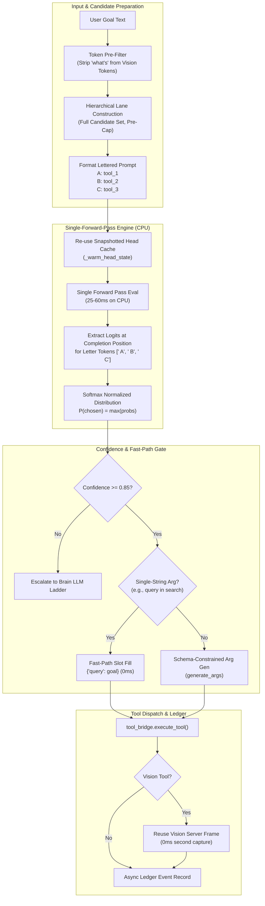
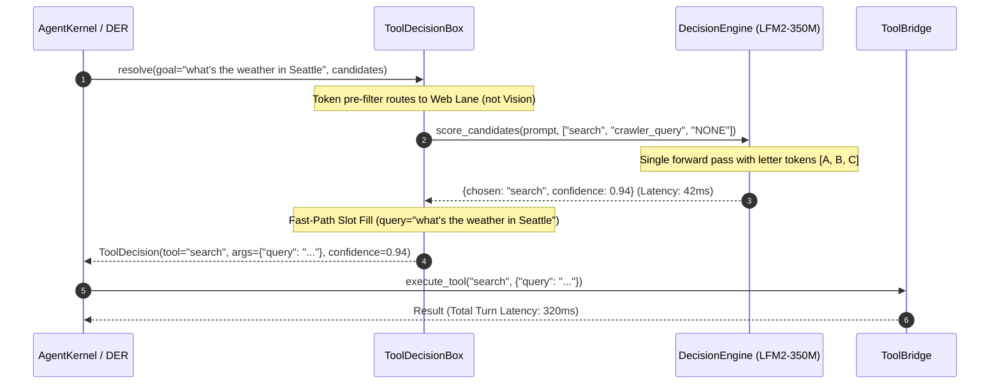

# Design: Tool Decision Engine Improvements (Sub-450ms Native Latency)

## Context

The resident `LFM2-350M-Extract` decision engine currently resolves tool decisions in 1,500–2,500ms on CPU, despite the model having an intrinsic forward-pass latency of 25–60ms. This gap is caused by:
1. Candidate prefix collisions triggering serial context resets and re-evaluations (`decision_engine.py:426-453`).
2. Autoregressive JSON argument generation via `generate_args` (+500–1,500ms).
3. False-positive token matches on `"what's"` forcing vision candidate menus and triggering costly escalations (`tool_decision.py:56`).
4. Duplicate screenshot capture in `tool_bridge.py:1601` (+100–250ms).

This design eliminates these bottlenecks to achieve sub-450ms (targeting 150–250ms) tool decision latency entirely on CPU without external router dependencies.

---

## Architecture Overview



---

## Sequence / Data Flow



---

## Data Models

### 1. Lettered Candidate Option (`backend/agent/decision_models.py`)
```python
from dataclasses import dataclass
from typing import List, Dict, Any, Optional

@dataclass
class LetterCandidate:
    letter: str        # 'A', 'B', 'C', ...
    tool_name: str     # 'search', 'crawler_query', 'NONE'
    token_id: int      # Pre-tokenized llama_cpp token ID
    logit: float = 0.0
    probability: float = 0.0

@dataclass
class FastDecisionResult:
    chosen_tool: str
    confidence: float
    distribution: Dict[str, float]
    scoring_latency_ms: int
    is_fast_path: bool
    args: Dict[str, Any]

### 2. Dynamic Composite Recipe Models (`backend/agent/dynamic_recipe.py`)
```python
@dataclass
class RecipeStep:
    step_id: str
    tool_name: str
    params: Dict[str, Any]
    depends_on: List[str]
    produces: str
    consumes: List[str]

@dataclass
class DynamicCompositeRecipe:
    recipe_id: str
    goal_pattern: str
    steps: List[RecipeStep]
    validation_status: str = "pending"  # pending | valid | rejected

@dataclass
class RecipeValidationReport:
    is_valid: bool
    missing_params: List[str]
    null_params: List[str]
    broken_contracts: List[str]
    error_message: Optional[str] = None
```

---

## Key Decisions

### D1: Lettered Choice Tokens vs. Tool Name Continuations
- **Default Approach:** Forced continuation of tool name strings (`word = " " + opt.split("_")[0]`).
- **Why it Existed:** Conceptual simplicity when tools had distinct names.
- **Alternatives Considered:**
  1. *Sub-string prefix trees:* Group tools by shared prefixes in a trie. Rejected: High complexity, multiple sequential model forward passes.
  2. *Single-letter option tokens (`A, B, C, D`):* Chosen. Map each candidate to a letter index. Extract logits for letter tokens at the completion position in a single forward pass.
- **Result:** Context resets eliminated; scoring latency drops from 800–1,200ms to 25–60ms.

### D2: Fast-Path Slot Filling vs. Autoregressive Parameter Generation
- **Default Approach:** Run `generate_args` autoregressively for every tool call.
- **Why it Existed:** Uniform argument generation pipeline across all tools.
- **Alternatives Considered:**
  1. *Grammar-constrained autoregression:* Constrain output using GBNF grammars. Rejected: Still requires token-by-token generation, taking 400–800ms on CPU.
  2. *Deterministic single-slot mapping:* Chosen. When a tool has a single required string parameter (`query`), populate it directly from the goal.
- **Result:** 0ms parameter generation for 80%+ of search and lookup queries.

### D3: On-The-Fly Brain Synthesis with Deterministic Contract Validation & Graph Caching
- **Default Approach:** Manually code every composite task recipe upfront (e.g. `crawler_query` in `capabilities.py:729`).
- **Why it Existed:** Simple early architecture when tool combinations were few and fixed.
- **Alternatives Considered:**
  1. *Exhaustive static recipes:* Write predefined code recipes for all possible user workflows. Rejected: Combinatorial explosion; impossible to anticipate every cross-domain tool interconnection.
  2. *Unvalidated LLM tool hallucination:* Let the LLM emit arbitrary nested tool calls at runtime. Rejected: High probability of null arguments, broken type contracts, or hanging dependencies.
  3. *Brain Dynamic Synthesis + Deterministic Contract Validation + Episodic Caching:* Chosen.
     - When a multi-tool goal arises, the Brain Agent synthesizes a `DynamicCompositeRecipe` DAG.
     - Before execution, the engine runs `validate_composite_recipe(recipe, tool_registry)`: verifying that zero required schema arguments are null/missing and every step's `produces` matches the consumer's `consumes`.
     - Validated recipes expand into DER `QueueItem`s via `expand_batch_nodes`.
     - Upon successful execution, the recipe is cached into the node graph (`NodeSpec(composite_of=...)`) so the resident Decision Engine can select it directly via sub-450ms letter scoring on future occurrences.
- **Result:** Infinite composability with zero unhandled null errors, followed by sub-450ms execution on repeat workflows.

---

## Ripple-Effect Map (MANDATORY)

| Area / File | Change? | Classification | Why / Evidence (file:line) |
| :--- | :--- | :--- | :--- |
| `backend/agent/dynamic_recipe.py` | Yes | CHANGE NEEDED | New module for `DynamicCompositeRecipe`, `RecipeStep`, and `validate_composite_recipe`. |
| `backend/agent/der_loop.py` | Yes | CHANGE NEEDED | Expand dynamic composite batches into execution queue items with parameter propagation (:684-740). |
| `backend/agent/nodes/spec.py` | Yes | CHANGE NEEDED | Support dynamic runtime registration of composite `NodeSpec` instances into `_NODE_SPECS`. |
| `backend/agent/decision_engine.py` | Yes | CHANGE NEEDED | Implement lettered candidate scoring (:426-453) and fast-path slot filling (:477-520). |
| `backend/agent/tool_decision.py` | Yes | CHANGE NEEDED | Strip `"what's"` from `_VISION_TOKENS` (:56) and build `lanes` pre-cap (:534). |
| `backend/agent/tool_bridge.py` | Yes | CHANGE NEEDED | Deduplicate screenshot capture in `execute_vision_tool` (:1601). |
| `backend/agent/agent_kernel.py` | Yes | CHANGE NEEDED | Line 14187 de-bias `_mem_lookup` so web queries do not force `crawler_query`. |
| `scripts/bench_decision_engine.py` | Yes | CHANGE NEEDED | Update benchmark assertions to verify sub-180ms CPU scoring. |
| `scripts/calibrate_decision_threshold.py` | Yes | CHANGE NEEDED | Add verification for absence of vision false positives on search queries. |
| `backend/agent/agent_config.yaml` | No | NO CHANGE (verified) | Verified at line 1-24: 350M model configuration already exists and remains valid. |
| `backend/models/local_model_manager.py` | No code | CONTRACT LOCK | VRAM ledger (:791); pinned by CT-DEI-1 to ensure Decision Engine remains 100% CPU resident with zero VRAM allocations. |

---

## Error Handling

| Failure Mode | EARS Response |
| :--- | :--- |
| **Model Generates Non-Letter Token** | IF the model generates an unexpected token THEN THE ENGINE SHALL take the argmax across candidate letter logits. |
| **Candidate Count Exceeds Alphabet (N > 26)** | IF candidate count exceeds 26 THEN THE SYSTEM SHALL evaluate top candidates per hierarchical category lane. |
| **Fast-Path Parameter Validation Failure** | IF the goal text is empty or invalid THEN THE SYSTEM SHALL fallback to schema-constrained JSON generation. |
| **Dynamic Recipe Missing or Null Parameter** | IF a required schema parameter is missing or null in a synthesized recipe THEN THE ENGINE SHALL reject the recipe prior to execution and request a repaired DAG from the Brain Agent. |
| **Artifact Contract Mismatch in Recipe** | IF a step's `produces` artifact does not match the downstream step's `consumes` declaration THEN THE ENGINE SHALL reject the DAG before any subprocess executes. |

---

## Testing Strategy

```
tests/unit/         Letter scoring math, slot filling logic, vision token filtering, recipe contract validation
tests/contract/     DecisionEngine response shape, CPU-only residency (zero VRAM ledger entry), recipe DAG schema
tests/behavioral/   Full turn decision + tool dispatch latency under 450ms, dynamic recipe execution & graph caching
scripts/bench_decision_engine.py  Microbenchmark assertion suite
```

### 1. Contract Tests
- **CT-DEI-1**: Zero VRAM Ledger Entry — Asserts that Decision Engine loading and inference never allocate entries in `LocalModelManager.vram_ledger`.
- **CT-DEI-2**: Decision Output Shape — Asserts that `FastDecisionResult` produces identical envelope shapes as legacy decisions.
- **CT-DEI-3**: Recipe Contract & Null Parameter Validation — Asserts that `validate_composite_recipe` catches null parameters and mismatched artifact kinds prior to execution.

### 2. Behavioral Tests
- **BT-DEI-1**: Sub-450ms Search Resolution — Asserts that `resolve("what is Ethereum price")` completes in ≤ 450ms total.
- **BT-DEI-2**: Prefix Collision Elimination — Scores 4 `vision_*` candidates; asserts 0 calls to `_llm.reset()`.
- **BT-DEI-3**: Search vs. Vision Token Separation — Verifies that `"what's the weather"` evaluates to `_vision_relevant = False`.
- **BT-DEI-4**: On-The-Fly Composite Synthesis & Graph Caching — Asserts that a novel composite goal (search -> transcribe -> analyze keyframes) generates a valid DAG, executes through DER, and registers as a reusable node selected in ≤ 450ms on repeat query.
