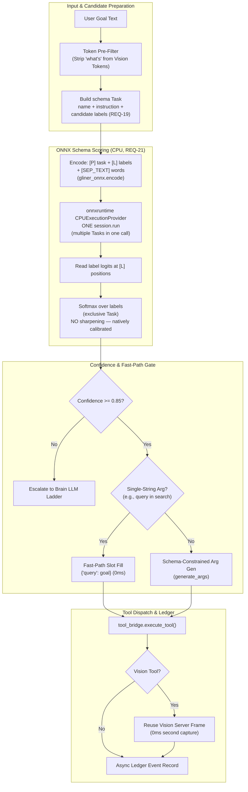
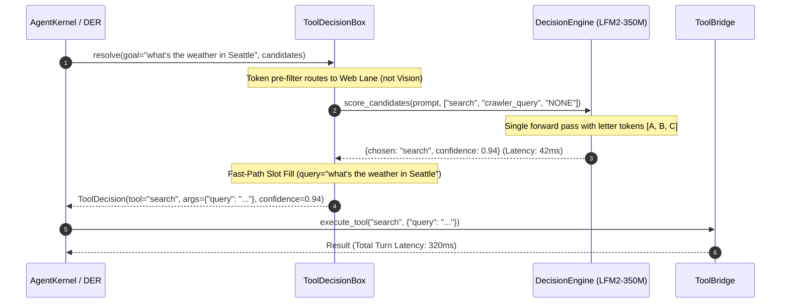

# Design: Tool Decision Engine Improvements (Sub-450ms Native Latency)

## Context

The resident `LFM2-350M-Extract` decision engine currently resolves tool decisions in 1,500–2,500ms on CPU, despite the model having an intrinsic forward-pass latency of 25–60ms. This gap is caused by:
1. Candidate prefix collisions triggering serial context resets and re-evaluations (`decision_engine.py:426-453`).
2. Autoregressive JSON argument generation via `generate_args` (+500–1,500ms).
3. False-positive token matches on `"what's"` forcing vision candidate menus and triggering costly escalations (`tool_decision.py:56`).
4. Duplicate screenshot capture in `tool_bridge.py:1601` (+100–250ms).

This design eliminates these bottlenecks to achieve sub-450ms (targeting 150–250ms) tool decision latency entirely on CPU without external router dependencies.

> **Model change (2026-09-25, REQ-21/D12).** Measurement showed the bottlenecks above were
> symptoms, not the root cause: the incumbent LFM2-350M-Extract scores **33.3% (production
> `decide_tree`) / 60.0% (flat)** and reports **0.9859 confidence while wrong**, so no amount of
> latency work would make it trustworthy. The resident model is therefore replaced by
> **`GLiNER2.5-Decide` via its ONNX export on `onnxruntime`** — **71.7% accuracy at 119ms p50**,
> with all errors ≤ 0.352 confidence. The items in this Context section are retained as the
> historical bottleneck audit; items 1 and 2 are resolved by removing the LFM path entirely
> rather than by optimising it. Evidence: `BENCH-2026-09-25-model-comparison.md`.

---

## Architecture Overview



---

## Sequence / Data Flow



---

## Data Models

### 1. Scored Option & Typed Decision Envelopes (`backend/agent/decision_models.py`)
```python
from dataclasses import dataclass, field
from typing import List, Dict, Any, Optional

@dataclass
class ConsumerTaskSpec:
    """One consumer = one schema Task (REQ-19, revised). Replaces the LFM prompt head."""
    consumer_id: str
    instruction: str                      # e.g. "Which tool should handle this request?"
    exclusive: bool = True                # softmax over labels; False = independent sigmoids
    threshold: float = 0.40               # REQ-22 — per-consumer, curve-derived
    labels: Dict[str, Optional[str]] = field(default_factory=dict)  # label -> description

@dataclass
class NoulResult:              # REQ-14 AC14.6 — calibrated P(statement true)
    statement: str
    noul: float                # 0..1, no separate confidence field (JEV shape)

@dataclass
class FastDecisionResult:
    chosen_tool: str
    confidence: float
    distribution: Dict[str, float]
    scoring_latency_ms: int
    is_fast_path: bool
    args: Dict[str, Any]
```
`OptionCandidate` (letter/first-token + pre-tokenized `token_id`) is **deleted** with the LFM
path (REQ-21 AC21.6) — the ONNX backend scores labels, not option tokens.

### 2. Dynamic Composite Recipe Models (`backend/agent/dynamic_recipe.py`)
```python
@dataclass
class RecipeStep:
    step_id: str
    tool_name: str
    params: Dict[str, Any]
    depends_on: List[str]
    produces: str
    consumes: List[str]

@dataclass
class DynamicCompositeRecipe:
    recipe_id: str
    goal_pattern: str
    steps: List[RecipeStep]
    validation_status: str = "pending"  # pending | valid | rejected

@dataclass
class RecipeValidationReport:
    is_valid: bool
    missing_params: List[str]
    null_params: List[str]
    broken_contracts: List[str]
    error_message: Optional[str] = None
```

---

## Key Decisions

### D1: Single-Token Option Scoring vs. Tool Name Continuations (probe-gated)
- **Default Approach (as-built):** Forced continuation of tool name strings — first-token scoring (`word = " " + opt.split("_")[0]`) with a `reset()` + full-prompt re-eval tie-breaker loop for prefix-shared names (`decision_engine.py:426-453`).
- **Why it Existed:** Conceptual simplicity when tools had distinct names.
- **Alternatives Considered:**
  1. *Sub-string prefix trees:* Group tools by shared prefixes in a trie. Rejected: High complexity, multiple sequential model forward passes.
  2. *Single-token read at one answer position:* Chosen **as the target shape, with the token form left to T0**. Either lettered (`A, B, C, D`) or tie-break-free first-token — whichever the T0 A/B probe wins on accuracy, coverage at 0.85, and p50 CPU latency.
- **Result (target):** Tie-breaker loops and context resets eliminated; scoring latency drops from 800–1,200ms to 25–60ms.
- **Correction (2026-09-25) — neither alternative is fully as-built.** The live path is first-token scoring **with** the tie-breaker loop (`:437-453`), so AC1.3/AC1.4 are currently FALSE and letters are not implemented (`_letter_token_ids` is populated at `:315-319` and never read). The probe chooses the token form; it does NOT license keeping the loop — removing it is invariant (see REQ-1). Two further assumptions in this design were unverified and are now tasks: the warm-head snapshot is never loaded (T23), and the head is tool-choice-specific for every consumer (D10/T25).

### D2: Fast-Path Slot Filling vs. Autoregressive Parameter Generation
- **Default Approach:** Run `generate_args` autoregressively for every tool call.
- **Why it Existed:** Uniform argument generation pipeline across all tools.
- **Alternatives Considered:**
  1. *Grammar-constrained autoregression:* Constrain output using GBNF grammars. Rejected: Still requires token-by-token generation, taking 400–800ms on CPU.
  2. *Deterministic single-slot mapping:* Chosen. When a tool has a single required string parameter (`query`), populate it directly from the goal.
- **Result:** 0ms parameter generation for 80%+ of search and lookup queries.

### D3: On-The-Fly Brain Synthesis with Deterministic Contract Validation & Graph Caching
- **Default Approach:** Manually code every composite task recipe upfront (e.g. `crawler_query` in `capabilities.py:729`).
- **Why it Existed:** Simple early architecture when tool combinations were few and fixed.
- **Alternatives Considered:**
  1. *Exhaustive static recipes:* Write predefined code recipes for all possible user workflows. Rejected: Combinatorial explosion; impossible to anticipate every cross-domain tool interconnection.
  2. *Unvalidated LLM tool hallucination:* Let the LLM emit arbitrary nested tool calls at runtime. Rejected: High probability of null arguments, broken type contracts, or hanging dependencies.
  3. *Brain Dynamic Synthesis + Deterministic Contract Validation + Episodic Caching:* Chosen.
     - When a multi-tool goal arises, the Brain Agent synthesizes a `DynamicCompositeRecipe` DAG.
     - Before execution, the engine runs `validate_composite_recipe(recipe, tool_registry)`: verifying that zero required schema arguments are null/missing and every step's `produces` matches the consumer's `consumes`.
     - Validated recipes expand into DER `QueueItem`s via `expand_batch_nodes`.
     - Upon successful execution, the recipe is cached into the node graph (`NodeSpec(composite_of=...)`) so the resident Decision Engine can select it directly via sub-450ms letter scoring on future occurrences.
- **Result:** Infinite composability with zero unhandled null errors, followed by sub-450ms execution on repeat workflows.

---

### D4: Wire Existing Search Providers vs. Build a New Quick-Search Service
- **Default Approach:** Build a new lightweight HTTP provider (SearXNG / DuckDuckGo / Exa) per the improvements doc Track 2.1.
- **Why it Existed:** The doc predates discovery that `backend/crawler/search_providers/` (`base.py`, `exa.py`, `llm.py`) already implements this layer — it is built but unwired.
- **Alternatives Considered:**
  1. *New SearXNG service:* Rejected — duplicates a working layer; new infra for a solved problem.
  2. *Wire existing providers into the `search` tool path:* Chosen. Reroute `tool_bridge.py:3644-3745`, keep `crawler_query` on the orchestrator, preserve REQ-16 progress/card frames (CT-DEI-4 locks them).
- **Result:** Tier separation with zero new services; the only new code is the reroute + description split.

### D5: Recovery Veto vs. Full Brain Replan per Graft
- **Default Approach:** Each graft spends a Brain reasoning call to plan recovery steps (`_der_graft_recovery_plan`, `agent_kernel.py:13256`), with no memory of which tool just failed reaching the re-resolution.
- **Why it Existed:** Recovery planning is thinking-shaped work, so it defaulted to the thinker; the re-resolution path (`tool=None` → box) was built separately and never handed the failure.
- **Alternatives Considered:**
  1. *Engine picks the recovery tool directly (new wiring):* Rejected — already true; graft children resolve engine-first today. Nothing to wire.
  2. *Failure-evidence veto + `recovery_strategy` consumer gate before Brain spend:* Chosen. `resolve()` takes `failed_tool`/`error_snippet`, veto survives counter reset, engine triages retry-different/decompose/escalate in ~40ms; Brain plans only on DELEGATE/below-threshold.
- **Result:** No repeat-tool grafts (the conv-144 3x pattern becomes AC11.4 escalation), Brain tokens spent only where the cheap gate declines.

### D6: Off-Thread Lookup vs. Bigger Sync Budget
- **Default Approach:** `_asyncio.run(sr.resolve(...))` synchronously inside `_mem_lookup` (`agent_kernel.py:14656`).
- **Why it Existed:** Simplest call shape from sync code; cost (50–200ms) was invisible until the engine made every pre-filter millisecond load-bearing.
- **Alternatives Considered:**
  1. *Raise the budget / accept the block:* Rejected — it sits ahead of every engine decision; 50–200ms here breaks the 450ms total by itself.
  2. *`run_coroutine_threadsafe` + bounded TTL cache with budget fallback:* Chosen. Miss-slow never stalls the current decision (AC12.3 late-attach).
- **Result:** Pre-filter off the critical path; engine start unblocked.

### D7: Foundation-Then-Optimize (Shadow-First for Every New Consumer)
- **Default Approach:** Wire each new consumer straight into the deciding path and tune later.
- **Why it is wrong here:** An enforced-but-uncalibrated consumer silently routes traffic on fiction thresholds — the exact failure the ledger/calibration loop exists to prevent. And "optimize later" without a gate means later never comes.
- **Alternatives Considered:**
  1. *Direct enforcement:* Rejected — no measured reliability curve exists for any new consumer on day one.
  2. *Shadow-first foundation (Wave 6), threshold enforcement as optimization (Wave 7):* Chosen. Every new consumer records rows while legacy code decides (foundation = correct shape + flowing data); enforcement flips per consumer only on ≥50 rows at P(correct | conf ≥ threshold) ≥ 0.90 (optimize = measured savings + Brain calls skipped).
- **Result:** No consumer can regress routing on day one; no consumer can linger unenforced without a gate noticing (TG-7 asserts skip rates and savings).

### D8: Bool-Gate Split (Engine Scores, Brain Writes)
- **Default Approach:** Replace each bool+text Brain call wholesale with an engine call.
- **Why it is wrong:** The engine cannot write the `missing` / next-goal / `refined` text — replacing the whole call drops information the loop needs.
- **Alternatives Considered:**
  1. *Engine writes short text via completion:* Rejected — uncalibrated generation from a 350M extractor; fiction risk with no ledger join.
  2. *Split per call:* engine scores the bool; Brain is invoked for text ONLY on the negative branch (`refine`, insufficient, not-done, drifted): Chosen.
- **Result:** Brain spend collapses to exactly the cases needing prose; positive-path turns skip the Brain call entirely.

### D9: Measured Calibration vs. Asserted Calibration (and the `softmax_tau` question)
- **Default Approach:** Call the engine "calibrated" and validate it with precision-at-threshold (`P(correct | conf ≥ 0.85) ≥ 0.92`), while sharpening the softmax with a fixed `softmax_tau = 0.5` so decisions cross the 0.85 gate.
- **Why it is wrong here:** Those are two different properties. Precision-at-threshold is satisfiable by a badly miscalibrated model, and a fixed monotone sharpening inflates confidence without changing accuracy ordering — it is calibration-destroying by construction. JEV's RLCD exists precisely to guarantee that reported confidence tracks correctness; asserting it while transforming the distribution to cross a threshold is the failure mode the whole pattern is designed to avoid.
- **Alternatives Considered:**
  1. *Keep tau, keep calling it calibrated:* Rejected — the confidence in the ledger would not mean what REQ-18's gates assume.
  2. *Fitted monotone calibration map (temperature scaling fit to the ledger) + ECE/Brier measurement:* Chosen (REQ-18). A fitted map is still monotone but is *derived from measured data*, so it can be reported honestly and re-fit when the model changes.
- **Result:** Enforcement flips (REQ-13–17) gate on ECE as well as precision; the reported confidence is defensible; a model swap is detectable via AC6.5's pin check rather than silently invalidating thresholds.

### D10: Per-Consumer Criteria via Consumer-Specific Heads
- **Default Approach:** One static prompt head shared by every consumer, with `consumer_id` appearing only in the tail (`decision_engine.py:356-373` head, `:390` tail).
- **Why it Existed:** The head is the cacheable part (`_warm_head_state`), so a single head made the KV-snapshot optimization trivial. That optimization is not wired anyway (T23).
- **Why it is wrong here:** The head reads "Choose the best tool for each task. Answer with the exact tool name." with four tool-selection examples. REQ-13–17 add ~7 consumers (`mode`, `review_verdict`, bools, `recovery_strategy`) that would all be scored under a tool-selection prompt with no criteria of their own — directly against JEV's rule that criteria precision is what makes probabilities trustworthy, and likely to fail BT-DEI-8's ≥0.90 parity check.
- **Alternatives Considered:**
  1. *Single shared head, tail-only differentiation:* Rejected — a 350M cannot infer "score this verdict" from a tail alone against a tool-selection head.
  2. *Per-consumer head (instructions + one worked example + option criteria), each with its own cached KV state:* Chosen (REQ-19). Bounded by an LRU cap; a cold head costs one extra prefill, not correctness.
- **Result:** Every consumer is scored against the question it actually asks; `tool_choice` behavior is regression-guarded (AC19.4).

### D11: Batched Multi-Question Scoring (JEV's Flat-Latency Property)
- **Default Approach:** One question per forward pass; each consumer is an independent call site.
- **Why it is wrong here:** JEV's defining property is that all questions against one state are answered in parallel and "adding questions barely changes the response time." The loop already needs several judgments about the same step (Reviewer: verdict + on-track + done; recovery: strategy + tool choice), so the current shape pays N full passes over the same state — the exact cost the parallel sampler exists to remove. Per-consumer heads (D10) make batching *more* feasible, not less, since questions in one batch share a state and a head family.
- **Alternatives Considered:**
  1. *Keep N sequential calls:* Rejected — multiplies the sub-450ms budget by the number of consumers added in Wave 6.
  2. *Batched entry point answering N typed questions in one pass, with per-question isolation and graceful degradation to the existing per-consumer path:* Chosen (REQ-20).
- **Result:** Wave 6's six new consumers do not multiply loop latency; a batch failure degrades to today's path with identical envelope shapes (AC20.4).

### D12: ONNX Schema Scoring Replaces llama.cpp Logit Continuation (model decision)
- **Default Approach (as-built):** resident `LFM2-350M-Extract` GGUF via `llama_cpp`; candidates scored by reading the first token of each tool name at one answer position, with a `reset()` tie-breaker loop for prefix-shared names (`decision_engine.py:396-453`).
- **Why it Existed:** the project reproduced JEV's "System One" pattern on the only small local model it had, using logit continuation as a stand-in for a decision head.
- **Why it changes:** measured head-to-head on 60 labeled cases, the incumbent scores **33.3% (production `decide_tree`) / 60.0% (flat) at 5.4s / 1.2s p50**, and reports **0.9859 confidence while wrong**. `GLiNER2.5-Decide` is a model actually built for typed decisions: **71.7% at 119ms**, with all errors ≤ 0.352 confidence.
- **Alternatives Considered:**
  1. *Retain LFM2-350M-Extract as-is:* Rejected — 0.9859-confidence errors make any threshold unsafe.
  2. *Upgrade to LFM2.5-350M:* Rejected by measurement — **11.7%** accuracy with a single-token collapse to `read_file` at up to 0.9999 confidence.
  3. *GLiNER2.5-Decide via `transformers`+`gliner2`:* Rejected — requires `transformers<5` (project runs 5.12.0) and fails to load the checkpoint even when satisfied.
  4. *GLiNER2.5-Decide via its ONNX export on `onnxruntime`:* **Chosen.** Torch-free, uses three already-installed deps, no second environment, no custom-architecture loader.
- **Result:** ~10× faster, +11.7 accuracy points overall, and +29 points at comparable coverage — with a confidence signal that is genuinely usable. LFM machinery (`_score_options_one_pass`, `_letter_token_ids`, `_warm_head_state`, `softmax_tau`) is deleted, not left dormant.
- **Consequence accepted:** the LFM path is retired with **no fallback model**; failure returns `None` to the existing legacy-heuristic path. `llama-cpp-python` itself stays — eight other modules depend on it.

### D13: Threshold Derived From the Backend's Measured Curve (0.85 → 0.40)
- **Default Approach:** a single 0.85 threshold, carried over from the LFM backend and its `softmax_tau` sharpening.
- **Why it is wrong now:** 0.85 was chosen to fit a *sharpened* LFM distribution. GLiNER's softmax spreads across the candidate menu, so 0.85 cuts coverage to 8.3% for no accuracy benefit.
- **Alternatives Considered:**
  1. *Keep 0.85:* Rejected — 8.3% coverage means 92% of decisions escalate, defeating the engine's purpose.
  2. *Pick a threshold by intuition:* Rejected — the same failure mode as the hand-set `ModeResult.confidence`.
  3. *Derive it from the measured coverage/accuracy curve:* **Chosen.** At 0.40: 38.3% coverage at **100%** accuracy — comparable coverage to today's 40% at +29 accuracy points.
- **Result:** the operating point is re-derivable from `calibrate_decision_threshold.py` rather than hard-coded, and `int8`'s lossiness is handled by recording the deployed variant on calibration rows (AC22.5).

### D14: Foundation Integrity Before Optimisation (Wave 9 gates every later wave)
- **Default Approach:** continue with Wave 8 (the model swap) and the Wave 6/7 consumer work, and treat the pre-existing defects as unrelated cleanup.
- **Why that is wrong here:** three findings make later measurement dishonest if left in place.
  1. **T31 edits a value nothing reads** — `decision_driver` is unparsed (zero grep hits), so the "threshold becomes 0.40" change is a no-op and every downstream calibration would be measuring the old operating point.
  2. **Wave 6's seven consumers all depend on the presentation observer seam** — the same `gate()`/observer pattern returns `None` in shadow today (`agent_kernel.py:14299-14300`), so building seven more consumers on it means seven more blind calibration paths.
  3. **The engine records no latency breakdown** — `scoring_latency_ms` / `args_latency_ms` have zero grep hits, so no optimisation in Wave 10 could be attributed to a stage.
- **Alternatives Considered:**
  1. *Optimise first, fix the plumbing later:* Rejected — every measurement taken before Wave 9 is against an unknown configuration.
  2. *Fix only the config, defer the rest:* Rejected — the observer seam and the latency breakdown are the instruments Waves 10–13 read.
  3. *Wave 9 fixes the measurement instruments and the two real reds, then gates:* **Chosen.**
- **Result:** each subsequent wave's gate measures against a verified baseline. TG-9 asserts the config actually round-trips and the latency fields actually emit — a green test suite alone is not sufficient evidence.

### D15: Evidence as a Weighted Prior, Never a Filter (and read-only)
- **Default Approach (as-built):** the memory hint arrives as a PRUNED MENU — `_apply_pre_filter` removes tools, a `veto` set bricks them shut, and `Decision(source="memory")` can bypass the engine entirely (`tool_decision.py:513-514`, `:664-665`, `:1015-1020`).
- **Why it is wrong:** the graph's posterior is genuinely useful information, but as a *filter* it is presented as fact rather than as evidence. The engine cannot weigh it, cannot outvote it, and cannot report that it disagreed. It also inverts the ownership: the engine is being steered by a layer it is supposed to inform.
- **Owner constraint (2026-09-25):** *"it has to be in the proper context and how and when its handed over matters."* A bare score is not evidence. Hence AC28.2 (posterior LOWER BOUND + observation count, scoped to region and mediator — never a global number), AC28.8 (freshness and scope travel with the value), AC28.5 (late arrival never stalls or re-decides), and AC28.6/28.7 (the row records present-vs-used, because "retrieved" is not "useful").
- **Alternatives Considered:**
  1. *Keep the hint as a filter/veto:* Rejected — that is the current shape, and it is why the engine cannot learn from the graph.
  2. *Post-hoc multiplier on the engine's output:* Rejected — that is the steering side-channel pattern that already burned the surface gate (`_last_surface_choice`, written and read by nothing).
  3. *Evidence in the frame, weighted, outvotable, read-only:* **Chosen** (REQ-28).
- **Result:** the engine can weigh graph evidence against its own confidence and report the disagreement; the graph is never written by the engine. Ships UNPOPULATED because `specs/wormhole-aperture/` is not implemented — the seam exists so a future provider needs no engine change.

### D16: Cache Key Completeness (evidence in the key from day one)
- **Default Approach (as-built):** `_engine_cache` is keyed on `(goal[:200], tuple(names), task_class, needs_vision)` (`tool_decision.py:379`, get `:584`, set `:624`).
- **Why it is wrong:** the key omits the memory hint, and therefore any evidence payload. The moment a prior is injected, a cache hit returns a verdict computed **without** it — silently, and only on repeated goals. The bug would surface as "the prior doesn't seem to do anything", pointing debugging at the wrong layer.
- **Alternatives Considered:**
  1. *Add evidence to the key when the provider lands:* Rejected — the cache would be correct-by-accident for as long as nobody remembered, and the failure mode is invisible.
  2. *Disable the cache:* Rejected — it exists for a reason, and removing it changes behaviour outside this REQ.
  3. *Include the evidence payload in the key NOW, while it is always empty, and bound the cache:* **Chosen** (REQ-27). The dict is also unbounded today (3 grep hits, no eviction), against the project's own quality bar.
- **Result:** when the provider arrives, the cache is already correct. The bound prevents an unbounded dict on a long-lived backend.

### D17: Measured Tuning With Revert-on-Regression
- **Default Approach:** adopt library defaults for the ONNX session and assume the vendor's numbers transfer.
- **Why it is wrong:** the reference runner sets only an optional `intra_op_num_threads` (`gliner_onnx.py:51-55`) and the bench never passes it, so **onnxruntime defaults apply** — no `inter_op_num_threads`, no `graph_optimization_level`, no `execution_mode`, no arena, no IO binding. On an 8-core CPU that leaves real performance unclaimed, and the vendor's 119ms figure was measured under those same defaults.
- **Alternatives Considered:**
  1. *Adopt defaults and stop:* Rejected — unmeasured, and the latency budget is the spec's headline target.
  2. *Tune aggressively without a baseline:* Rejected — an unmeasured "optimisation" that regresses p95 is worse than the default.
  3. *Tune against the recorded Wave 8 baseline, revert on regression, and report a per-stage breakdown:* **Chosen** (REQ-30).
- **Result:** every change is attributable to tokenize / encode / session / post, and a regression is recorded and reverted rather than silently kept.

### D18: Operating-Point CONFIRMATION, Not Re-Derivation (Decision C)
- **Default Approach:** flip consumers to enforced once their bar passes, using the 0.40 threshold derived at menu width 6.
- **The real problem is not the flip — it is that `candidate_cap` was DECORATIVE.** `grep -rn "decision_driver" backend/ --include=*.py` returns **zero hits**, so nothing read the block; the engine used the code default 6 while the YAML said 32. Making the block live is the fix. But a LIVE cap can be changed, and a different width changes the softmax spread across candidates — so a bar measured at width 6 would not transfer to width 32.
- **Alternatives Considered:**
  1. *Ship 32 and re-derive every consumer's bar:* Rejected — pays for a re-measurement nobody asked for, re-opens settled flips, and 32 is unmeasured in the first place.
  2. *Delete the key and freeze the cap permanently:* Rejected — fixes the decoration but permanently loses a real tuning knob, and silently removes a documented capability.
  3. *Make the block live, ship `candidate_cap: 6` (the calibrated width), and re-validate only when the configuration actually moves:* **CHOSEN (Decision C, owner, 2026-09-25).** The defect is fixed, the calibration stays valid, **Wave 7 / TG-7 remains the authoritative enforcement gate**, and TG-13 becomes a **CONFIRMATION plus a conditional re-validation**.
- **Result:** the operating point describes the engine as it actually runs, settled flips are not re-litigated, and the moment anyone moves the cap the threshold is marked stale (AC25.5) and the AC31.3 menu-width study fires BEFORE the change ships. The knob is honest and available rather than decorative or dangerous. Pinned by REQ-25 AC25.7 and recorded at `agent_config.yaml:25-35`.

---

## Ripple-Effect Map (MANDATORY)

| Area / File | Change? | Classification | Why / Evidence (file:line) |
| :--- | :--- | :--- | :--- |
| `backend/agent/dynamic_recipe.py` | Yes | CHANGE NEEDED | New module for `DynamicCompositeRecipe`, `RecipeStep`, and `validate_composite_recipe`. |
| `backend/agent/der_loop.py` | Yes | CHANGE NEEDED | Expand dynamic composite batches into execution queue items with parameter propagation (:684-740). |
| `backend/agent/nodes/spec.py` | Yes | CHANGE NEEDED | Support dynamic runtime registration of composite `NodeSpec` instances into `_NODE_SPECS`. |
| `backend/agent/decision_engine.py` | Yes | CHANGE NEEDED | Implement single-token option scoring (probe-winning form, no `reset()` loop) at (:426-453) and fast-path slot filling (:477-520). |
| `backend/agent/decision_engine.py` (`_warm_head_state` / scoring path) | Yes | CHANGE NEEDED | REQ-1/T23: `save_state()` runs at `:308` but `load_state()` is called nowhere in `backend/` — the head snapshot is dead code and every decision re-evaluates the full prompt (`:410-412`). Wire the snapshot + tail-only eval, or delete it and stop citing it as the latency mechanism. |
| `backend/agent/decision_engine.py` (heads) | Yes | CHANGE NEEDED | REQ-19/D10: the prompt head is consumer-independent (`:356-373`) and `_warm_head_state` warms only `"tool_choice"` (`:304`). Add per-consumer head specs + per-consumer cached KV states (LRU-bounded). |
| `backend/agent/decision_engine.py` (calibration) | Yes | CHANGE NEEDED | REQ-18/D9: add reliability/ECE/Brier measurement and resolve `softmax_tau` (`:126`) — replace the fixed sharpening with a fitted monotone map, or stop reporting the sharpened value as a calibrated probability. |
| `backend/agent/decision_engine.py` (batched scoring) | Yes | CHANGE NEEDED | REQ-20/D11: add a batched entry point answering N typed questions against one state in a single pass, degrading to the per-consumer path on failure. |
| `backend/agent/decision_engine.py` (provenance) | Yes | CHANGE NEEDED | REQ-6 AC6.5/AC6.6: record `model_id` + file hash on calibration rows and assert at load (glob at `:143`/`:157-160` is unpinned); emit truncation events for the silent cuts at `:374`/`:379`/`:386`. |
| **`backend/agent/decision_backend_onnx.py`** | **Yes** | **CHANGE NEEDED (NEW, REQ-21)** | New module wrapping `GlinerOnnx` behind the existing `DecisionScore` envelope: schema `Task` per consumer, `onnxruntime` `CPUExecutionProvider`, `None` on any failure. Reference implementation to port: the vendored `gliner_onnx.py` runner (`encode`/`logits`/`probabilities`). |
| **`backend/agent/decision_engine.py` (LFM machinery)** | **Yes — DELETION** | **CHANGE NEEDED (REQ-21 AC21.6, amended 2026-09-25)** | Delete `_score_options_one_pass` (`:396-454`), `_letter_token_ids` (`:218`, `:315-319`), `_warm_head_state` (`:293-321`), `softmax_tau` (`:126`), `decide_tree` for tool choice (`:517-605`), `resolve_model_path`'s GGUF glob (`:143`, `:157-184`), **and the LFM-only config fields that go dead with it**: `n_gpu_layers` (`:130`), `hierarchy_trigger` (`:121` — already read nowhere), `max_answer_tokens` (`:106`), plus the `IRIS_DECISION_GPU_LAYERS` env knob (`:264`). Do **not** delete the `DecisionScore`/`ArgsResult` envelope or the `gate()` primitive — callers depend on both. |
| **`requirements.txt`** | **Yes** | **CHANGE NEEDED (REQ-21 AC21.5)** | Add `onnxruntime` and `tokenizers`. Both are installed but **undeclared** today (`grep`: neither appears in `requirements.txt`). `llama-cpp-python` **stays** (`:81`) — eight other modules use it. |
| **`backend/agent/agent_config.yaml`** | **Yes** | **CHANGE NEEDED (REQ-22 AC22.1)** | `decision_driver` gains an ONNX model directory and `default_threshold: 0.40` (replacing 0.85 at `:31`). Note `constraints.candidate_cap: 32` (`:29`) is currently **not wired** into `EngineConfig` — either wire it or remove it; do not leave it looking authoritative. |
| **ONNX model artifacts** (`model_int8.onnx` 642.6 MB, `tokenizer.json` 8.3 MB) | **Yes** | **CHANGE NEEDED (REQ-21)** | Must be placed at the configured path and shipped/installed with the app. 651 MB vs the incumbent's 218.7 MB — an accepted +432 MB. `model_fp16.onnx` (874 MB) / `model.onnx` (1.75 GB) are exact alternatives. |
| `backend/agent/decision_engine.py` (engine field) | Yes | CHANGE NEEDED | REQ-21 AC21.7: report the backend identity on the decision envelope so ledger calibration distinguishes new rows from historical LFM rows. |
| `backend/tests/{unit,contract,behavioral}/` (decision set) | Yes | CHANGE NEEDED | The two tracked **stale reds** (`TestCtDe3Ledger`, `TestBtDe4ReasonSingleRow`, see `docs/architecture/tool-decision-engine-improvements.md` §9.5) sit in this suite; a model swap is the natural moment to resolve them. Do not weaken them (TEST RULE) — resolve the pinned property with the owner. |
| `backend/agent/tool_bridge.py` (`:1719` GUI path) | Yes | CHANGE NEEDED (scope question) | REQ-5 amendment: `_capture_screenshot_blob()` is duplicated at `:1709` (vision) **and** `:1719` (GUI). This spec's REQ-5 is vision-scoped; the GUI site carries the same 100–250ms defect. Extend AC5.1–5.3 to both or open a follow-up — do not leave it unmentioned. |
| `backend/agent/tool_decision.py` | Yes | CHANGE NEEDED (REQ-3 only) | Strip the isolated token `"what's"` from `_VISION_TOKENS` (`:55`). **CORRECTED 2026-09-25:** the "build `lanes` pre-cap (`:534`)" half of this row is **WITHDRAWN** — lanes are dead code once `decide_tree` is retired (REQ-4 superseded, T4 cancelled, the block deleted by T29). |
| `backend/agent/tool_bridge.py` | Yes | CHANGE NEEDED | Deduplicate screenshot capture in `execute_vision_tool` (:1601). |
| `backend/agent/agent_kernel.py` | Yes | CHANGE NEEDED | De-bias `_mem_lookup` (`:14507`) so web queries do not force `crawler_query`; move `sr.resolve` off the DER thread (REQ-12, current sync block at `:14656`). Graft paths pass failure evidence into box resolve (REQ-11; split reset at `:12986`, resolve call at `:15012-15031`). |
| `backend/agent/explorer.py` | Yes | CHANGE NEEDED | REQ-11: `propose()` (the single resolver for graft-goal steps, `:122-214`) accepts failure evidence and vetoes the just-failed tool before the Brain single-shot fallback. |
| `backend/crawler/search_providers/` | No | NO CHANGE (verified) | `base.py`, `exa.py`, `llm.py` already implement the lightweight provider layer — REQ-8 wires it, builds nothing new. |
| `backend/agent/tool_bridge.py` (`search` path) | Yes | CHANGE NEEDED | Reroute `search` (`:3644-3745`) from `CrawlOrchestrator().research()` to the provider layer (REQ-8), preserving progress/card emits. |
| `backend/agent/event_bus.py` | No code | CONTRACT LOCK | REQ-16 `TASK_PROGRESS` + browser-panel frames the `search` path emits (`tool_bridge.py:3672-3745`); pinned by CT-DEI-4 so the provider reroute cannot silence the card. |
| `backend/agent/tool_registry.py` (web descriptions) | Yes | CHANGE NEEDED | REQ-8 AC8.4: distinguish `search` vs `crawler_query` descriptions so the engine menu separates them. |
| `backend/agent/decision_engine.py` (consumers) | Yes | CHANGE NEEDED | REQ-11: register the `recovery_strategy` consumer alongside `tool_choice`/`presentation`/`narration`; REQ-9: contrast-pair worked examples in `_build_prompt_parts` (`:356-373`). REQ-13–17: register `review_verdict`, `sufficient`/`done`/`on_track`, `mode`, `web_intent`, `retry_same` triage extension — all shadow-first (D7). |
| `backend/agent/der_loop.py` (Reviewer) | Yes | CHANGE NEEDED | REQ-13: engine `review_verdict` Choice over envelope-view inputs (`:1095-1122`); Brain keeps `refined`-text duty (D8); verdict semantics locked (AC4.4 of DER model). |
| `backend/agent/mode_detector.py` | Yes | CHANGE NEEDED | REQ-15: engine `mode` consumer shadows the keyword branch (`:43-80`); slash overrides + IMPLEMENT default untouched. |
| `backend/agent/agent_kernel.py` (monitor + chat paths) | Yes | CHANGE NEEDED | REQ-14: bool consumers at sufficiency (`:13361-13411`), done-bit (`:18261-18306`), drift (`:18382-18397`) — refs re-pinned 2026-09-25 (first edition's `:18102-18121`/`:18202-18214` had drifted ~150 lines); goal-contract override preserved. REQ-16: RespondDirect (`:3111-3129`) routed/shadowed; web-trigger copies (`:6723-6782`) deleted after fold. |
| `backend/agent/explorer.py` (`propose`) | Yes | CHANGE NEEDED | REQ-16: engine Choice over `live_tools` before the Brain single-shot (`:146-214`); REQ-11 failure-evidence veto already rowed above. |
| `scripts/bench_decision_engine.py` | Yes | CHANGE NEEDED | Update benchmark assertions to verify sub-180ms CPU scoring. |
| `scripts/calibrate_decision_threshold.py` | Yes | CHANGE NEEDED | Add verification for absence of vision false positives on search queries. |
| `backend/agent/agent_config.yaml` | **Yes — CORRECTED 2026-09-25 (c); value applied 2026-09-25 (Decision C)** | **CHANGE NEEDED (REQ-25)** | The earlier "NO CHANGE (verified)" row was WRONG. The `decision_driver` block is **never parsed** — `grep -rn "decision_driver" backend/ --include=*.py` returns **zero hits**. `n_ctx`, `candidate_cap`, `acquire_timeout_s`, `default_threshold`, `device`, `dtype` were all decorative. REQ-25 parses the block into `EngineConfig`; every key is parsed or removed. **Decision C applied:** `candidate_cap` changed **32 → 6** (the width the 0.40 curve was derived at) with an explanatory comment, so making the block live does not invalidate the calibration. No live behaviour changed — the block is unread today, so the edit is inert until T35 lands. `default_threshold` intentionally left at 0.85: T31 owns that change (Wave 8), and moving it before the ONNX backend exists would alter the live LFM engine's behaviour. |
| `backend/models/local_model_manager.py` | No code | CONTRACT LOCK | VRAM ledger (:791); pinned by CT-DEI-1 to ensure Decision Engine remains 100% CPU resident with zero VRAM allocations. |
| `backend/agent/agent_kernel.py` (`_engine_gate_surface`) | Yes | CHANGE NEEDED (REQ-23) | Shadow must RETURN the verdict (`:14299-14300` returns `None`); the card-turn early return (`:14250-14252`) must go so an observer verdict is still produced; the hardcoded `"card_already_rendered": False` (`:14262`) must become truthful; `_last_surface_choice` writes (`:14269`, `:14301`) must be removed — it is read nowhere. Two RED tests own this: `test_decision_engine_gates.py:241,267`. |
| `backend/agent/agent_kernel.py` (`_observe_surface_async`) | Yes | CHANGE NEEDED (REQ-23, OQ-DEI-6) | `:14304` is the likely consumer of the returned shadow verdict; its shape must be pinned so the observer contract cannot drift. |
| `backend/agent/agent_kernel.py` (`_get_failure_warnings`) | Yes | CHANGE NEEDED (REQ-24) | `:5975-5993` passes a `str` where `ResolutionEncoder.encode_with_resolution(failure: Dict, conn=None)` (`interpreter.py:24`) expects a `Dict`; the `except Exception: pass` swallows the resulting `AttributeError`, so it **always returns `"None"`**. Callers at `:6296` and `:9067`. Return type must be settled (`str`) — six test stubs disagree (`[]` at `test_narration_beats_behavior.py:70`). |
| `backend/agent/decision_engine.py` (lock discipline) | Yes | CHANGE NEEDED (REQ-26) | `generate_args` uses a bare `with self._lock` (`:657`) with **no timeout**, unlike `decide` (`:476`). Add a bounded acquire to every entry point. |
| `backend/agent/decision_engine.py` (latency attribution) | Yes | CHANGE NEEDED (REQ-26) | `scoring_latency_ms` / `args_latency_ms` have **zero grep hits** across `backend/` and `scripts/`; only `engine_latency_ms` is recorded, inside the lock (`:495-500`), excluding load and lock wait. |
| `backend/agent/tool_decision.py` (`_engine_cache`) | Yes | CHANGE NEEDED (REQ-27) | Key at `:379`/`:584`/`:624` omits the memory hint and any evidence payload, so an injected prior is silently ignored on a hit; the dict is also **unbounded** (no eviction — 3 grep hits, all init/get/set). |
| `backend/agent/tool_decision.py` (evidence seam) | Yes | CHANGE NEEDED (REQ-28) | The frame must accept an `evidence` field; today the hint only ever arrives as a filter/veto/short-circuit (`:513-514`, `:664-665`, `:1015-1020`). Ships UNPOPULATED. |
| `backend/agent/tool_decision.py` (NONE-gate heuristics) | Yes | CHANGE NEEDED (REQ-29) | `_vision_relevant` / `_goal_needs_action` / `_goal_records_terminal_failure` (`:55`, `:99`, `:124`) gate the engine's own `NONE` commit; the safe direction (when in doubt, act) is preserved. |
| `backend/agent/trailing_director.py` | Yes | CHANGE NEEDED (REQ-29) | `:100` spends `adapter.infer(..., max_tokens=800)` **per completed step** when the common case needs only a negative bool. Shadow `has_gaps` consumer; Brain still writes gap items. |
| `backend/agent/der_loop.py` (escalation keywords) | Yes | CHANGE NEEDED (REQ-29) | `:513` `incomplete_keywords` phrase list triggers escalation; shadow `escalate_incomplete` consumer. Budget and veto-cap checks UNCHANGED — the engine may never permit. |
| `backend/agent/semantic_gate.py` | No code | NO CHANGE (verified) — NON-FIT | `tier0_classify` (`:372`) is documented pure, deterministic, no-I/O, no-model-call, resolving most traffic at <1ms. Routing it through a ~119ms model would be a REGRESSION. Recorded in Non-Requirements (REQ-29 AC29.5) so it is not re-proposed. |
| `backend/memory/mycelium/` (write path) | No code | CONTRACT LOCK (REQ-28 AC28.4) | The engine is READ-ONLY w.r.t. the graph. `tool_choice` edge writes belong to the execution layer (`record_region_mediator_outcome`, `agent_kernel.py:16143`, via `_der_mediator_for(item)`). Pinned by CT-DEI-15 asserting zero engine writes on every decision path. |
| `backend/tests/behavioral/test_decision_engine_gates.py` | Yes | CHANGE NEEDED (pin only) | `test_document_render_data_keys_pinned` (`:115`) needs the documented additive-key extension for `title` (emit at `agent_kernel.py:10351`), exactly as `card_id` / `partial` each received. The other two reds are NOT edited — the gate is fixed instead (TEST RULE). |
| `backend/tests/**` (stubs) | Yes | CHANGE NEEDED (REQ-24 AC24.2) | Six stubs of `_get_failure_warnings` must adopt the settled return type; `test_narration_beats_behavior.py:70` returns `[]` while the others return `"None"`. |
| `scripts/bench_decision_engine.py` | Yes | CHANGE NEEDED (REQ-30 AC30.6) | Must report the per-stage latency breakdown (tokenize / encode / session / post), not just load+warm and end-to-end wall time. |
| **`backend/agent/tool_decision.py` (`_decision_threshold`)** | **Yes** | **CHANGE NEEDED (REQ-22 AC22.1 — HIDDEN THRESHOLD SOURCE)** | `ToolDecisionBox.__init__(decision_threshold=0.85)` (`:333`, stored `:370`) is **what `tool_choice` actually reads** (`:639`, `:678`, `:700`) — and it is **never passed** at its single construction site (`agent_kernel.py:14967`), so it is hardcoded 0.85. It is NOT `EngineConfig.default_threshold`. An agent editing only `EngineConfig` or the YAML would move `presentation`/`narration` and leave `tool_choice` at 0.85. AC22.1 now names all three sources. |
| **`backend/iris_gateway.py` (narration threshold)** | **Yes** | **CHANGE NEEDED (REQ-22 AC22.1)** | A **fourth** `threshold_for("narration")` consumption site not previously in this map: `:3907`, `:3913`, `:3935`. Changing `threshold_for`'s resolution (AC25.8 backend-keying) ripples here alongside `narration.py:269` and `agent_kernel.py:14272`/`:14279`. |
| `backend/tests/behavioral/test_decision_engine_gates.py` (`_GateEngine` stub) | Yes | CHANGE NEEDED (stub only) | The stub hardcodes `default_threshold = 0.85` and `threshold_for → 0.85` (`:48`, `:52`). It must be updated to the new resolution contract. **This is NOT licence to touch the two RED tests in the same file** (`:241`, `:267`) — update the stub, fix the gate (T33), leave the assertions alone (TEST RULE). |
| `backend/agent/decision_engine.py` (`IRIS_DECISION_ENFORCE`) | No code | CONTRACT LOCK | `enforced_consumers()` reads `IRIS_DECISION_ENFORCE` (`:89-91`, default `"tool_choice"`) — i.e. `tool_choice` is enforced by default while `presentation`/`narration` are not. Any change to enforcement defaults must go through this env var's contract, not a new switch. |
| **`scripts/run_engine_calibration.py` + `scripts/bench_decision_models.py`** | **Yes** | **CHANGE NEEDED (REQ-21 AC21.6 — breaks on T29)** | Both call `eng.decide_tree(...)` (`run_engine_calibration.py:125`, `bench_decision_models.py:166`). Deleting `decide_tree` raises `AttributeError` in both. `run_engine_calibration.py` is the project's own **calibration-row generator**, so it must be migrated to flat `decide` in the SAME task as T29 or the calibration path dies with the model swap. **A grep for imports will NOT find these — they are attribute accesses on the engine object.** |
| **`backend/agent/tool_decision.py` (lane block `:590-620`)** | **Yes — DELETION** | **CHANGE NEEDED (REQ-21 AC21.6; obsoletes REQ-4/T4)** | `lanes` / `lanes_for_engine` are built at `:603-609` and consumed at **exactly one** place — `_dt("tool_choice", lanes_for_engine, frame)` (`:613`). With `decide_tree` retired, `name_to_cat` (`:598`), the `_pre_cap_count > _cap` trigger (`:610`) and the lane construction are all dead. Delete the block. This is why **REQ-4 is superseded and T4 is cancelled** — the lane fix would have targeted code being deleted. |
| `backend/agent/tool_decision.py` (`_idem_cache`) | No code | NO CHANGE (verified) | A **second** cache exists at `:356` (`key -> (result, expiry_ts)`), used at `:1376-1379` and `:1559`. Unlike `_engine_cache` it HAS a TTL (`_IDEMPOTENCY_TTL`), so it is bounded by time and is not part of REQ-27's scope. Noted so the REQ-27 fix is not mistakenly applied to the wrong cache. |

---

## Error Handling

| Failure Mode | EARS Response |
| :--- | :--- |
| **Model Generates Non-Letter Token** | IF the model generates an unexpected token THEN THE ENGINE SHALL take the argmax across candidate letter logits. |
| **Candidate Count Exceeds Alphabet (N > 26)** — **SUPERSEDED 2026-09-25** | ~~IF candidate count exceeds 26 THEN THE SYSTEM SHALL evaluate top candidates per hierarchical category lane.~~ **Replaced:** the backend scores an arbitrary label set in ONE pass (REQ-20/REQ-21), so no lane grouping is required. The menu is bounded by `candidate_cap` (REQ-25 AC25.7) and the `DELEGATE`/`NONE` control labels are appended AFTER the cap (AC21.8). |
| **Fast-Path Parameter Validation Failure** | IF the goal text is empty or invalid THEN THE SYSTEM SHALL fallback to schema-constrained JSON generation. |
| **Dynamic Recipe Missing or Null Parameter** | IF a required schema parameter is missing or null in a synthesized recipe THEN THE ENGINE SHALL reject the recipe prior to execution and request a repaired DAG from the Brain Agent. |
| **Artifact Contract Mismatch in Recipe** | IF a step's `produces` artifact does not match the downstream step's `consumes` declaration THEN THE ENGINE SHALL reject the DAG before any subprocess executes. |
| **Calibration Out of Bound (2026-09-25)** | IF a consumer's ECE exceeds the configured bound THEN THE SYSTEM SHALL keep it in shadow and record the gap; enforcement SHALL NOT flip on precision alone. |
| **Unpinned / Swapped Model (2026-09-25)** | IF the resolved decision-model identity does not match the identity recorded on the calibration rows THEN THE SYSTEM SHALL treat every calibrated threshold as stale and refuse to enforce until re-calibrated. |
| **Input Truncation (2026-09-25)** | IF the prompt builder truncates any input THEN THE SYSTEM SHALL emit a structured truncation event (field + original length) rather than deciding silently. |
| **Batched Scoring Failure (2026-09-25)** | IF a batched multi-question call fails or the engine is unavailable THEN THE SYSTEM SHALL degrade to the existing per-consumer path unchanged, preserving envelope shapes. |
| **Consumer Scored Without Criteria (2026-09-25)** | IF a consumer is invoked with no registered head/criteria THEN THE ENGINE SHALL refuse to score it and return the legacy path, never borrow another consumer's head. |
| **ONNX Model or Tokenizer Missing (2026-09-25)** | IF the configured ONNX model directory is absent or incomplete THEN THE ENGINE SHALL report unavailable once, return `None`, and let callers take the legacy path — never fall back to another model. |
| **ONNX Session Init Over Budget (2026-09-25)** | IF session initialisation exceeds the acquire timeout THEN THE ENGINE SHALL return `None` rather than block the DER thread. |
| **Backend Returns Empty Label Set (2026-09-25)** | IF the candidate label set is empty or the tokenizer produces no label positions THEN THE ENGINE SHALL return `None`, never a fabricated uniform distribution. |
| **Deployed Variant Differs From Calibrated (2026-09-25)** | IF the deployed ONNX variant (`int8`/`fp16`/`fp32`) differs from the variant recorded on the calibration rows THEN THE SYSTEM SHALL mark thresholds stale and refuse to enforce until re-calibrated. |
| **Config Key Absent or Malformed (REQ-25)** | IF a `decision_driver` key is missing or malformed THEN THE ENGINE SHALL fall back to the code default and log the fallback ONCE — never crash, never silently accept a partial config. |
| **Cap Change Invalidates the Curve (REQ-25/REQ-31)** | IF `candidate_cap`, the backend, or the deployed variant changes THEN THE SYSTEM SHALL mark the calibrated threshold STALE and refuse enforcement until the curve is re-derived. |
| **Engine Lock Overrun (REQ-26)** | IF any engine entry point cannot acquire its lock within budget THEN THE ENGINE SHALL return `None` and the caller SHALL take its legacy path — never block indefinitely, never retry in a loop. |
| **Cache Key Incomplete (REQ-27)** | IF a path's inputs are not fully represented in the cache key THEN THE CACHE SHALL NOT be consulted on that path — a recompute is always preferable to a wrong verdict. |
| **Evidence Out of Scope or Stale (REQ-28)** | IF supplied evidence is scoped to a different region/mediator, or is older than its freshness bound THEN THE SYSTEM SHALL treat it as absent and record that on the row. |
| **Evidence Arrives Late (REQ-28)** | IF evidence arrives after the decision budget THEN THE SYSTEM SHALL proceed without it and SHALL NOT stall or re-decide; the late result attaches to the next step (the REQ-12 AC12.3 shape). |
| **Engine Write Attempted (REQ-28 AC28.4)** | IF any code path would write to the memory/graph store from inside the engine THEN THE SYSTEM SHALL fail the contract test — the engine is read-only by construction. |
| **Failure Evidence Unavailable (REQ-24)** | IF no failure state exists, or the encoder returns empty THEN THE FUNCTION SHALL return the documented empty value and SHALL NOT raise and SHALL NOT emit a veto. |
| **Tuning Regresses p95 (REQ-30)** | IF a performance change regresses p95 against the Wave 8 baseline THEN THE SYSTEM SHALL record the regression with its numbers and REVERT the change rather than keep it. |
| **Consumer Bar Unmet at the Deployed Config (REQ-31)** | IF a consumer's precision or ECE fails its bar at the deployed configuration THEN IT SHALL stay in shadow with the gap recorded — no flip on precision alone, and no flip carried over from a superseded configuration. |

---

## Testing Strategy

```
tests/unit/         Schema Task construction, slot filling logic, vision token filtering, recipe contract validation
tests/contract/     DecisionScore response shape, CPU-only residency (zero VRAM ledger entry), ONNX backend contract, recipe DAG schema
tests/behavioral/   Full turn decision + tool dispatch latency under 450ms, ONNX backend parity vs the 60-case battery, dynamic recipe execution & graph caching
tests/contract/     + presentation observer shape, failure-evidence type, read-only engine (zero graph writes), config authority round-trip, cache key & bounds  (Wave 9-11)
tests/behavioral/   + baseline integrity, config round-trip end-to-end, bounded wait under contention, evidence present-vs-used, measured tuning with revert, deployed-config operating point  (Wave 9-13)
scripts/bench_decision_models.py  Cross-model comparison harness (LFM vs GLiNER, flat vs tree)
scripts/bench_decision_engine.py  Microbenchmark assertion suite — gains a per-stage latency breakdown (tokenize / encode / session / post) under REQ-30 AC30.6
```

**Progressive verification rule (Waves 9–13).** Each wave's gate is a *verification*, not a
checkpoint. A wave is complete only when its own gate asserts the wave's claim with evidence —
a green suite is not sufficient. Concretely: TG-9 asserts the config actually round-trips and the
latency fields actually emit (not merely that tests pass); TG-10 asserts a measured improvement
against a recorded baseline with no accuracy regression; TG-11 asserts the evidence field is
inert while absent and the cache distinguishes payloads; TG-12 asserts shadow rows flow with
legacy decisions unchanged; TG-13 re-derives the operating point and records the numbers behind
every enforcement decision. No later wave may be measured before its predecessor's gate passes.

### 1. Contract Tests
- **CT-DEI-1**: Zero VRAM Ledger Entry — Asserts that Decision Engine loading and inference never allocate entries in `LocalModelManager.vram_ledger`.
- **CT-DEI-2**: Decision Output Shape — Asserts that `FastDecisionResult` produces identical envelope shapes as legacy decisions.
- **CT-DEI-3**: Recipe Contract & Null Parameter Validation — Asserts that `validate_composite_recipe` catches null parameters and mismatched artifact kinds prior to execution.
- **CT-DEI-4**: Quick-Search Path Contract — Asserts `search` emits the REQ-16 `TASK_PROGRESS` + browser-panel frames with zero browser-subprocess spawns, and registry descriptions separate `search` from `crawler_query`.
- **CT-DEI-5**: Recovery Evidence Shape — Asserts `resolve()` failure evidence (`failed_tool`, `error_snippet`) reaches the engine frame as `ruled_out` and a vetoed tool scores zero probability.
- **CT-DEI-6**: Verdict/Bool Consumer Shapes — Asserts `review_verdict`, `sufficient`/`done`/`on_track`, `mode`, and `web_intent` decisions carry the standard consumer envelope (chosen, confidence, candidates, threshold, latency) so calibration joins work uniformly.
- **CT-DEI-7**: No-Bypass Coverage — Asserts every tool-choice path (`propose()`, RespondDirect, box) emits an engine row (deciding or shadow); a path with zero rows fails the suite.
- **CT-DEI-8**: Calibration Report Shape — Asserts `calibrate_decision_threshold.py` emits reliability buckets, ECE, and Brier alongside precision-at-threshold, and reports INSUFFICIENT_DATA (never a verdict) below the row floor.
- **CT-DEI-9**: Consumer Head Binding — Asserts each consumer is scored with its own registered head spec, and that scoring a consumer without criteria degrades to the legacy path rather than borrowing another consumer's head.
- **CT-DEI-10**: Batched Envelope & Isolation — Asserts the batched entry point returns one well-formed envelope per question with identical shapes to the per-consumer path, and that one malformed question does not corrupt sibling answers.
- **CT-DEI-11**: ONNX Backend Contract (REQ-21) — Asserts the ONNX backend returns the unchanged `DecisionScore` envelope, runs on `CPUExecutionProvider` with zero VRAM ledger entries (CT-DEI-1 preserved), returns `None` when the model dir is absent, and never loads a second model.
- **CT-DEI-12**: Backend Identity & Variant (REQ-21 AC21.7, REQ-22 AC22.5) — Asserts the decision envelope/ledger carries the backend identity and the deployed ONNX variant, so calibration rows are attributable and a variant swap marks thresholds stale.
- **CT-DEI-13**: Presentation Observer Contract (REQ-23) — Asserts the gate returns the engine verdict when the consumer is NOT enforced, still produces a verdict on a card turn with `card_already_rendered: true`, writes no steering field on any path, and emits the same meta row shape on both enforced and shadow paths. Pins the two RED tests green.
- **CT-DEI-14**: Failure-Evidence Contract (REQ-24) — Asserts `_get_failure_warnings` returns ONE settled type (`str`), never raises when the memory interface is absent, and logs a non-recoverable error with its exception type instead of returning `"None"`. Asserts all stubs agree with the settled type.
- **CT-DEI-15**: Read-Only Engine Contract (REQ-28 AC28.4) — Asserts ZERO writes to the memory/graph store from any engine decision path, on every consumer. The engine may read evidence and must never write posteriors, edge scores, or node state.
- **CT-DEI-16**: Config Authority Contract (REQ-25) — Asserts every documented `decision_driver` key is either parsed and reflected in the effective config, or absent from the block. Asserts a round-trip: set a non-default value, construct the engine, read the effective value back.
- **CT-DEI-17**: Cache Key & Bounds Contract (REQ-27) — Asserts the cache key includes the evidence payload, that two entries differing only in evidence do NOT collide, and that the cache is bounded with a documented maximum.
- **CT-DEI-18**: Production Menu Composition (REQ-21 AC21.8) — Asserts the menu the PRODUCTION path builds (`tool_decision.py:617-621`: registry names + `DELEGATE`/`NONE`, after pre-filter and cap) yields a label set with **no duplicates**, that both control labels **survive the cap** at the shipped width (6), and that the backend scores that exact set. Rationale: the 60-case battery builds its own fixture-driven menu (`bench_decision_models.py:102-103`), so it replicates the menu SHAPE without executing the production composition code — the measured parity result does not cover this path.

### 2. Behavioral Tests
- **BT-DEI-1**: Sub-450ms Search Resolution — Asserts that `resolve("what is Ethereum price")` completes in ≤ 450ms total.
- **BT-DEI-2**: Prefix Collision Elimination — Scores 4 `vision_*` candidates; asserts 0 calls to `_llm.reset()`.
- **BT-DEI-3**: Search vs. Vision Token Separation — Verifies that `"what's the weather"` evaluates to `_vision_relevant = False`.
- **BT-DEI-4**: On-The-Fly Composite Synthesis & Graph Caching — Asserts that a novel composite goal (search -> transcribe -> analyze keyframes) generates a valid DAG, executes through DER, and registers as a reusable node selected in ≤ 450ms on repeat query.
- **BT-DEI-5**: Quick Search End-to-End — Asserts `resolve("what is Ethereum price")` serves via the provider tier with total resolution + execution ≤ 800ms and card/progress frames intact.
- **BT-DEI-6**: Graft Veto Behavior — Asserts a grafted step whose parent failed on tool X resolves to a tool ≠ X, and a double-consecutive same-tool failure escalates instead of grafting a third attempt.
- **BT-DEI-7**: Memory Pre-filter Budget — Asserts the pre-filter completes within AC12.2 budgets with no `_asyncio.run` on the DER thread (fail-closed assertion on the call shape).
- **BT-DEI-8**: New-Consumer Parity — Asserts shadow engine verdicts/bools/modes agree with the legacy decider at ≥ 0.90 on the labeled battery before any enforcement flip.
- **BT-DEI-9**: Brain-Spend Savings — Replays the battery with enforcement on and asserts measured Brain-call skip rates (per REQ-13–17 optimize ACs) with zero routing regressions vs the shadow baseline.
- **BT-DEI-10**: Calibration Quality — Asserts ECE ≤ 0.05 and reports Brier on the labeled battery, and that no consumer is enforced while its ECE is out of bound (REQ-18/AC18.4).
- **BT-DEI-11**: Batched Flat Latency — Asserts batching two questions stays within 1.5× the single-question p50, and that a batch failure returns the per-consumer results unchanged (REQ-20).
- **BT-DEI-12**: Head-Cache Wiring — Asserts the warm-head snapshot is actually loaded, i.e. the head token span is not re-evaluated per decision (guards T23 against silent regression to full-prompt prefill).
- **BT-DEI-13**: ONNX Backend Parity & Latency (REQ-21/REQ-22) — Replays the 60-case labeled battery through the ONNX backend and asserts **accuracy ≥ 70%**, **accuracy ≥ 99% above the 0.40 threshold**, and **p50 ≤ 180ms**. This is the migration's acceptance test: the incumbent measured 60.0% / 70.8% / 1172ms, so a regression to those numbers fails the suite.
- **BT-DEI-14**: Threshold Curve Reportable (REQ-22) — Asserts `calibrate_decision_threshold.py` reports the coverage/accuracy-above-threshold curve for the deployed backend and that the recorded operating point is re-derivable, not hard-coded.
- **BT-DEI-15**: Baseline Integrity (REQ-23/REQ-24, Wave 9 gate) — Re-runs the decision-engine suite and asserts the recorded baseline matches reality, that the presentation observer tests are GREEN (fixed, not edited), and that the `title` pin has been extended. A suite that reports green while these are red is a gate failure.
- **BT-DEI-16**: Config Round-Trip End-to-End (REQ-25) — Loads a config with a non-default `candidate_cap`, drives a real decision, and asserts the menu width actually changed AND that the calibrated threshold was marked stale as a result.
- **BT-DEI-17**: Bounded Wait Under Contention (REQ-26) — Holds the engine lock past its budget and asserts every entry point returns within budget with a degraded result, that `decision_latency_ms` reflects the wait, and that lock-wait is separable from compute.
- **BT-DEI-18**: Evidence Present-vs-Used (REQ-28) — Drives decisions with and without a supplied evidence payload and asserts: behaviour is byte-identical when absent; the prior reorders candidates when present; it cannot push a candidate above the threshold on its own; and the row records present-vs-used separately, with an unused retrieval NOT scored as a success.
- **BT-DEI-19**: Measured Tuning With Revert (REQ-30) — Applies each performance change and asserts p50/p95 against the recorded Wave 8 baseline with NO accuracy regression (BT-DEI-13 re-run). A change that regresses p95 must be recorded and reverted.
- **BT-DEI-20**: Deployed-Configuration Operating Point (REQ-31, TG-13) — Re-derives the curve at the deployed backend/cap/variant, asserts ECE within bound, measures at least two menu widths and records the optimum, and asserts no consumer is enforced on a curve measured at a superseded configuration.
