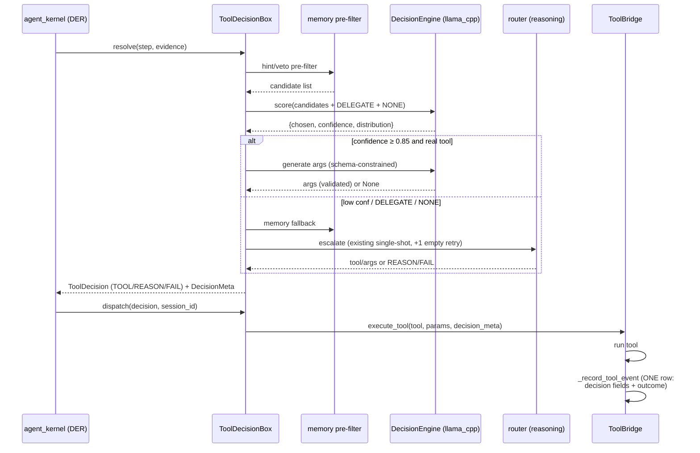

# Design: Tool Decision Engine (Calibrated Small-Model Tool Selection)

## Context

The DER loop resolves each DAG step's tool in `ToolDecisionBox.resolve()`
(`backend/agent/tool_decision.py:421`): memory pre-filter → one single-shot
`router.generate` (:491, role `tool_execution` or `reasoning`) → parse → memory fallback
→ terminal `FAIL` (:657). There is no confidence, no retry on empty completions
(session-342 E5: `[TOOL_DECISION_FAIL] Empty response from Ollama`), and no
decision-level attribution in the ledger.

Two code facts bound the design:

1. **No logprob plumbing exists anywhere above llama.cpp.** `InferenceRouter.generate`
   (:887) returns `(text, thinking, tool_calls)`; neither `OpenAICompatTransport` nor
   `OllamaTransport` requests logprobs. A calibrated probability therefore cannot ride
   the router — the engine must own an in-process `llama_cpp` context where candidate
   scoring is a primitive.
2. **`_record_tool_event` (`tool_bridge.py:1936`) is the single existing event writer.**
   It already runs on a daemon thread, bounds payloads via `_summarize`, and never
   raises. Reusing it (with a `decision` block inside its payload) gives us the ledger,
   the DAG join, and the no-double-record guarantee for free.

The Jev/RLCD pattern is adapted to this harness, not copied: Jev scores caller-provided
options in parallel and returns calibrated probabilities; RLCD (Reinforcement Learning
for Calibrated Decisions) is what makes Jev's probabilities honest. We have no trained
calibrated model, so we reproduce the *interface* (parallel option scoring, probability
output, threshold-gated escalation) with candidate-continuation logprobs, and we build
the *feedback loop* (ledger → reliability curve → measured threshold) that RLCD
approximates with training.

## Architecture Overview

```mermaid
flowchart LR
    subgraph DER["DER loop (agent_kernel)"]
        STEP[DAG step] --> BOX[ToolDecisionBox.resolve]
    end
    BOX --> PF[memory pre-filter<br/>hint / veto]
    BOX --> ENGINE{{"DecisionEngine<br/>LFM2.5-350M in-process CPU"}}
    PF --> ENGINE
    ENGINE -->|confidence ≥ 0.85<br/>+ args generated| TOOL["TOOL decision<br/>+ DecisionMeta"]
    ENGINE -->|"low conf / DELEGATE"| MEM[[memory fallback]]
    MEM -->|miss| ESC[escalation: existing<br/>router.generate reasoning]
    ESC --> TOOL2["TOOL / REASON /<br/>FAIL decision"]
    TOOL --> DISP[dispatch]
    TOOL2 --> DISP
    DISP --> EXEC["ToolBridge.execute_tool(params, decision_meta)"]
    EXEC --> ROW["_record_tool_event:<br/>ONE row, decision block + outcome"]
    ROW --> CAL[calibration script:<br/>reliability, route latency,<br/>escalation rate]
```



Key structural fact: the engine sits **inside** the box, before dispatch. Everything
downstream of `resolve()` — the kernel seam, the dispatcher, the bridge — keeps its
contract.

## Sequence / Data Flow



**Bidirectional summary (REQ-9):**

| Direction | Content | Writer | Reader |
|---|---|---|---|
| IN (read set) | tool menu, param schemas, memory hint/veto, goal+evidence | bridge / memory / kernel | engine |
| OUT (immediate) | `{chosen, confidence, distribution}`, args | engine | box |
| OUT (ledger) | decision fields on the single tool event row | box (via execute_tool) | calibration script, live-test harness |
| NOT WRITTEN | memory entries, events, DAG node records | — | (engine has no handle) |

## Data Models

```python
# backend/agent/decision_engine.py
@dataclass
class CandidateScore:
    name: str            # tool name | "DELEGATE" | "NONE"
    logprob: float       # summed continuation logprob
    prob: float          # softmax-normalized

@dataclass
class DecisionScore:
    chosen: str
    confidence: float
    distribution: list[CandidateScore]
    engine_latency_ms: int

# decision_meta carried end-to-end (DecisionMeta, REQ-9 AC9.1)
{
  "decision": {
    "engine": "lfm2.5-350m", "engine_route": "engine|escalated|memory-fallback|failed",
    "confidence": 0.0, "chosen": "...", "candidates": 7,
    "args_valid": true, "retried": false,
    "decision_latency_ms": 312, "engine_latency_ms": 210,
    "dag_node_id": "...", "step_index": 3
  }
}
```

Ledger row = existing `_record_tool_event` payload plus the `decision` block above.
Join key to the DER/DAG side: `dag_node_id` + `session_id` (already present on the row).

## Key Decisions

**D1 — In-process `llama_cpp`, CPU, no server.**
Default: reuse the router's `tool_execution` role. Why it exists: uniform transport
abstraction. Rejected: (a) router/transport path — no logprob plumbing, and adding
per-token scoring semantics to every transport is a large fake generality;
(b) shared 8082 llama server — the single-resident model (`local_model_manager.py`
load → unload) means the brain would be evicted per decision or vice versa;
(c) dedicated llama-server subprocess — new port, process lifecycle, health loop; a
350M on CPU answers a ≤512-token decision quickly enough to not need a server.
Chosen: in-process context, lazy load, `threading.Lock`-serialized, bounded wait.
Measured-latency claim is UNVERIFIED until REQ-10's baseline + gate.

**D2 — Two-phase decision: parallel Choice scoring, then constrained args generation.**
Jev's canonical split (small model picks, never writes prose). Rejected: single JSON
generation with read-back of the emitted tool-name token logprob — the generated token
is conditioned on the model's own sampling, top_logprobs covers only the argmax path,
and the probability is not comparable across candidates. Continuation scoring over the
candidate set is the honest reproduction. Its cost: one eval pass per candidate per
decision (bounded by pre-filter size; cap candidate list at the existing pre-filter
budget).

**D3 — Escalation is internal; `DecisionKind` unchanged.**
Rejected: new `DELEGATE` kind crossing into `agent_kernel.py:14255` — it would touch
the DER seam, goal-contract coverage semantics, and every consumer of the kind set for
zero behavioral gain: escalation only changes *who* generated the decision, not what
the kernel does with it. Contract CT-DE-2 locks the kind set.

**D4 — One ledger row; decision data rides `execute_tool`'s payload (no double record).**
Rejected: a separate engine event channel (`ffi_ingest_event` call from the box) —
doubles write volume, breaks the decision↔outcome join (two rows, eventual race), and
violates the "single writer to memory" rule. Chosen: `dispatch()` passes
`decision_meta` to `execute_tool` as an optional kwarg (precedent: `_skip_resilience`);
`_record_tool_event` merges it into the payload it already writes. Route-only outcomes
(REASON/DELEGATE/FAIL with no execution) write the same row shape with
`outcome=None` through that same function — never a second channel.

**D5 — Threshold 0.85 default, calibration-tool override.**
Per owner proposal; tools that self-report are meaningless below measurement. The
calibration artifact writes the measured override; the config is the storage.

**D6 — Measurement comes from the ledger, not a new metrics service.**
Per-route latency and escalation rate are derivable from AC5.1 fields. A separate
metrics pipeline would be an over-build (a framework where a query belongs). The REQ-10
baseline is a one-off instrumented run stored next to calibration output.

**D7 — Bounded empty retry covers ALL model calls on the decision path.**
The E5 gap was specific (tool_decision, no retry) but the class is general; both the
engine args generation and the escalation generation get exactly one retry
(`agent_kernel.py:17651-17666` is the reference shape). Retry count is a ledger field
so silent retries are visible.

**D8 — The engine is a decision service; gates are consumers.**
Default considered: build Wave 4 as three small dedicated call sites duplicating
engine plumbing. Rejected: triples lifecycle/lock/ledger code and invites drift.
Chosen: `DecisionEngine.decide(consumer_id, options, frame)` behind a registry;
consumers are declarative (option set ctor + frame builder + admission point).
Rejected alternative: one generic "gate anything" hook for arbitrary UI — over-build;
exactly three consumers are known.

**D9 — Enumerated feature frame, no prose.**
Inputs: `{task_class, content_chars_bucket, has_structured_content,
card_already_rendered, goal_coverage C, blocked_facts, turn_kind, mode, xi_band}`.
Every field has a deterministic producer already in code (goal-contract records,
`_last_render_emitted`, lane state, Caducean trajectory read). Rejected: 500-char text
excerpt — nondeterministic prompt cost, un-calibratable. Rejected: passing the raw
response text to the 350M — its small context is for the menu, not the essay.

**D10 — Shadow-first for visible gates.**
Tool Choice enforces at 0.85 immediately (failure mode is a handled escalation).
Presentation/narration gates start shadow (record-only): a misfire there is
user-visible (a card drowned an answer; a turn stayed silent). Enforcement flips only
after the REQ-6 calibration report shows ≥ 50 decisions and accuracy ≥ 0.90 at the
chosen threshold.

**D11 — VLM drives the live gate.**
The vision stack (fetch_vision, takeover, capture store) that sessions 341-343 proved
IS the acceptance instrument, not a Rube-Goldberg add-on: assertions read screenshots
and the TTS event stream, never REST mocks. Rejected: REST-driven "UI-equivalent"
battery — it validates API traffic, not the surfaces the user complained about
(the card/chat duplication exists exactly where REST never looks).

**D12 — Speaker figure-of-authority is the recorded decision, not the observed side
effect.** The ledger row's `narration` decision is what TTS assertions check against;
the screenshot of a muted speaker icon or log line alone never proves a decision was
made (RCA trap from session-342 TTS flood: the symptom lagged the decision by design).

**D13 — Ledger reads are read-only sqlite, never a new API.**
Verified (`backend/gateway/iris_ffi.py:722-745`): the fallback engine writes to
`system_events` in `data/memory.db`; NO `ffi_query`/`ffi_get_events` read wrapper exists.
Calibration reads it directly: `sqlite3.connect(f"file:{db}?mode=ro", uri=True)` —
the established pattern (`scripts/export_der_traces.py:43-46`). If `memory_config.json`
says encryption is enabled, the read reports UNVERIFIED rather than opening the DB.
Language-level pin: `decision_engine` name collides with NOTHING in backend/
(grep-verified 2026-09-20); engine shutdown hooks the lifespan teardown at
`backend/main.py:960-1008` beside `server_manager.stop_all_servers()`.

**D14 — `Decision.meta` is a property, not a dataclass field.**
Surfaced by the implementation itself: `test_tool_decision_contract.py::
TestDecisionShape.test_fields_present` pins the Decision field set at exactly 6
("no extra fields"). Both contracts hold simultaneously only if meta is a
property attaching to the instance (`__dict__["_meta_value"]`), not a field —
that's the implementation. Kernel wiring is INJECTION at
`agent_kernel.py:14037` (`_get_tool_box`), never lazy global adoption, so unit
suites stay deterministic when a 350M file exists on the machine.
Narration composition (AC12): the engine ANDs into `may_narrate` WITHOUT
consuming the 18 s timer slot when it says silent, and the gateway backstop
is suppressed ONLY when the engine was available, enforced, and confident in
`silent` — verified by TestCtDe8*.

**D15 — gate() octet.** `decision_engine.gate(consumer_id, options, frame) ->
(score|None, enforced)` is the shared visible-gate primitive: shadow returns
`(score, False)` so callers record without enforcing; unavailable returns
`(None, False)`. All three sealed call sites consume the octet identically —
one pattern, zero per-consumer special cases.

**D16 — One-pass parallel option scoring (Jev's parallel sampler reproduced).**
Replaces per-option continuation scoring. Measured defect (2026-09-20 live):
the continuation approach costs ~2.5s PER OPTION on CPU (104s+ first measured
when max_tokens=0 streamed the whole context). Jev's actual published property
is "all questions answered in a single pass"; community reproductions pin the
faithful local form as: enumerate options as lettered candidates (A, B, C…),
evaluate the prompt ONCE, and read the logprob of each letter token at the
single answer position from the model's logits. One forward pass per decision.
Confidence = softmax over the letter logits. Rejected: (a) multi-sample
generation voting — ballots a nondeterministic model, contradicts the
calibration story; (b) per-option continuation scoring — the sequential form;
even fully correct it's O(n × prompt cost), the exact pattern the parallel
sampler exists to kill.

**D17 — Cross-step continuity via read-only frame fields.**
The engine stays stateless (D9 stands); per-step context for coherence
(`previous_chosen`, `previous_outcome`, `step_index`) is injected by the box
from its own `ToolCallTree` record, never queried by the engine (AC15.1/15.3).
Rejected: giving the engine a plan-history window — collapses responsibility
that belongs to the goal-contract layer and multiplies engine prompt cost for
no measured benefit.

**D18 — Vision candidates are inside the menu, not above it.**
REQ-16's mechanism: when a step is vision-relevant the scoring option set must
contain the vision tools even if the memory pre-filter dropped them, because
option-truncation by the candidate cap would silently deny a vision step its
real choice. The engine's authority ends at CHOICE; server residency/borrow
belongs to the vision stack (AC16.3), and the crawl→vision escalation policy
stays with the orchestrator's failure-taxonomy path (Non-Requirement).

## Ripple-Effect Map

| Area / File | Change? | Classification | Why / Evidence |
|---|---|---|---|
| `backend/agent/decision_engine.py` | Yes (new) | CHANGE NEEDED | The engine: one-pass parallel scoring, lifecycle, args stage, counters |
| `backend/agent/tool_decision.py` `_engine_try` frame | Yes | CHANGE NEEDED (T12) | Frame gains previous_chosen / previous_outcome / step_index (from `_tool_call_nodes`); option set may include vision tools (T13) |
| `backend/agent/tool_decision.py:421` resolve | Yes | CHANGE NEEDED | Engine-first routing, retry, escalation ladder, DecisionMeta creation |
| `backend/agent/tool_decision.py:491` model call | Yes | CHANGE NEEDED | Becomes escalation-only call; gains bounded empty retry |
| `backend/agent/tool_decision.py:689` dispatch | Yes | CHANGE NEEDED | Threads `decision_meta` into `execute_tool` |
| `backend/agent/tool_decision.py:51` `_PROPOSE_PROMPT` | No | NO CHANGE (verified) | Reused verbatim as the escalation prompt; :458-461 menu format retained |
| `backend/agent/tool_decision.py:311` `_selection_role` | No | NO CHANGE (verified) | Still governs which role serves the escalation call |
| `backend/agent/tool_decision.py:657` FAIL | No | NO CHANGE (verified) | Still the terminal after the ladder |
| `backend/agent/agent_kernel.py:14255-14333` DER seam | No | CONTRACT LOCK (CT-DE-2) | Consumes DecisionKind TOOL/REASON/FAIL only; kind set must not grow |
| `backend/agent/agent_kernel.py:17651/17692` synthesis retry | No | NO CHANGE (verified) | Reference pattern only |
| `backend/agent/tool_bridge.py:1247` execute_tool | Yes | CHANGE NEEDED | Optional `decision_meta=None` kwarg; merged into payload |
| `backend/agent/tool_bridge.py:1936` `_record_tool_event` | Yes | CHANGE NEEDED | Payload gains `decision` block; stays single writer, daemon thread |
| `ffi_ingest_event` call site (`tool_bridge.py:2009-2018`) | No | NO CHANGE (verified) | `payload_json` is a freeform dict (:1992-2005); new block needs no signature change |
| `backend/agent/tool_bridge.py:378` `get_available_tools` | No | NO CHANGE (verified) | Shape (name/description/parameters/category, :396-403) already supplies the engine menu |
| memory pre-filter (`tool_decision.py:449`) | No | NO CHANGE (verified) | Engine consumes its output; pre-filter stays the gatekeeper |
| memory layer (`backend/agent/memory/*`, `core/memory/*`) | No | CONTRACT LOCK (CT-DE-5) | Engine must hold zero references; AST scan enforces |
| `backend/agent/inference/router.py:887` generate | No | NO CHANGE (verified) | Escalation uses it unchanged; no logprob plumbing added |
| `inference/transport.py` (OpenAICompat/Ollama) | No | NO CHANGE (verified) | Engine bypasses transports entirely |
| `InProcessTransport` (`transport.py:1243`) | No | NO CHANGE (verified) | Unsuitable (takes `messages[-1]` only, no scoring access) — rejected in D1 |
| `backend/agent/local_model_manager.py:1403` scan | No | NO CHANGE (verified) | Engine discovers its GGUF via the existing directory scan; `load_model` NOT used (would touch VRAM ledger :791, :3497-3510) |
| `backend/agent/agent_config.yaml` | Yes | CHANGE NEEDED | Adds the 350M entry with CPU constraints |
| `backend/iris_gateway.py:1776-1779` role bindings | No | NO CHANGE (verified) | Engine is component-borne, not role-bound; bindings untouched |
| Goal-contract `NodeRecord` / DAG records | No | CONTRACT LOCK (CT-DE-3) | Join is read-only by id; no node fields added |
| `specs/goal-contract-coverage` semantics (FAIL meaning) | No | NO CHANGE (verified) | FAIL still reachable only through the same terminal path |
| `docs/LIVE_TEST_VISION_BROWSER_E2E.md` (LT battery) | Yes | CHANGE NEEDED | New LT rows for route latency/escalation vs baseline (REQ-10) |
| `backend/agent/agent_kernel.py:17232` `_der_plan_next_step` | No | NO CHANGE (verified) | Continuation decision stays on the reasoning model (:17342 `infer(role="reasoning")`); the engine is never invoked from this path |
| `backend/tests/.../test_no_direct_lfm_vl_provider_bypass.py` | No | NO CHANGE (verified) | Referenced only as the style template for CT-DE-5; no edit |
| `backend/agent/agent_kernel.py:4280` auto-render heuristic | Yes | CHANGE NEEDED (REQ-11) | Engine gate replaces heuristic when available; heuristic becomes degrade path; `_last_render_emitted` (:4356) consulted BEFORE the engine call (AC11.4) |
| `backend/agent/agent_kernel.py:4375-4380` supportive-text branch | Yes | CHANGE NEEDED (REQ-11) | Excerpt emitted only when engine surface ∈ {card_plus_summary}; `plain_text` OR `prism_card` (card-only) suppresses the excerpt |
| `backend/agent/agent_kernel.py:13594` `_supportive_text` | No | NO CHANGE (verified) | Content of the excerpt stays chat-communication-lanes' problem; Wave 4 gates WHETHER it runs, not WHAT it says |
| `backend/iris_gateway.py:3434-3463` guaranteed-utterance backstop | Yes | CHANGE NEEDED (REQ-12) | Backstop consulted only when engine unavailable/errored; engine's `silent` is honored (AC12.4) |
| `backend/agent/narration.py:246` `may_narrate` | Yes | CHANGE NEEDED (REQ-12) | Engine Noul AND-gated with the 18 s timer AND the narration toggle |
| `backend/agent/conversation_kernel.py:137` narration flag | No | NO CHANGE (verified) | Engine reads it; never writes it (AC12.2) |
| `backend/agent/speech_lanes.py:1577` `resolve_spoken_text` | No | CONTRACT LOCK (CT-DE-8) | Spoken ⊆ shown guarantee untouched; gate decides whether to call it, not its output |
| Frontend (chat-view, RichDocument, hooks) | No | CONTRACT LOCK (CT-DE-6) | Same events fire; only P(card emitted) changes. Screenshot assertions are read-only |
| `iris_gateway.py:5832-5842` chat_message emit | No | CONTRACT LOCK (CT-DE-6) | Payload shape `content/spoken` untouched |
| screenshots dir (canonical) | Yes | CHANGE NEEDED | AC14.4 artifacts land here per app-testing skill convention |
| `backend/agent/tools/speak_tool.py` | No | NO CHANGE (verified) | Explicit `speak` tool calls bypass the narration gate (user asked for speech) |
| `backend/agent/agent_kernel.py:14037` box construction | Yes | CHANGE NEEDED (T3 as-built) | Injects the engine via `decision_engine=`; tests stay engine-free |
| `backend/tests/unit/test_decision_engine.py` | Yes (new) | CHANGE NEEDED | TG-1 suite (19 tests) |
| `backend/tests/contract/test_decision_engine_contract.py` | Yes (new) | CHANGE NEEDED | CT-DE-1..5 |
| `backend/tests/contract/test_decision_engine_ledger.py` | Yes (new) | CHANGE NEEDED | single-writer ledger pins |
| `backend/tests/behavioral/test_decision_engine_behavioral.py` | Yes (new) | CHANGE NEEDED | BT-DE-1..4 |
| `backend/tests/behavioral/test_decision_engine_gates.py` | Yes (new) | CHANGE NEEDED | CT-DE-6/7/8 + BT-DE-5/6/7 |
| `backend/tests/unit/test_calibrate_decision_threshold.py` | Yes (new) | CHANGE NEEDED | REQ-6 fixture tests |

## Error Handling

| Failure | Response (EARS-aligned) |
|---|---|
| Model file missing/corrupt | Engine unavailable (AC1.3); one notice per session (AC7.3); legacy path |
| Scoring timeout / invalid distribution | Degrade to single-shot path (AC2.4) |
| Args schema validation fails | Full escalation to reasoning model (AC2.5) |
| Empty generation (any decision call) | One bounded retry (REQ-4), then ladder |
| Concurrent decision pressure | Serialized; bounded wait, then escalate (AC1.4) |
| Ledger write failure | Swallowed; decision path unaffected (AC5.3) |
| Engine context leak risk at shutdown | Explicit free; leak test (AC7.4) |

## Testing Strategy

**Unit (`backend/tests/unit/`)** — pure logic, stub `llama_cpp`:
- candidate scoring softmax + argmax; prefix-sharing tool names
- threshold boundary (at/above/below 0.85); DELEGATE/NONE routing
- retry-once semantics; serialization timeout → escalate

**Contract (`backend/tests/contract/`)** — boundary pins:
- CT-DE-1: engine output shape `{chosen, confidence, distribution}` + `DecisionMeta`
  schema field lock.
- CT-DE-2: kernel seam — `resolve()` output kind ∈ {TOOL, REASON, FAIL} under every
  routing outcome (fuzz the flag matrix).
- CT-DE-3: ledger row — exactly one event per execution carrying the `decision` block;
  joins by `dag_node_id`; no second event; no DAG node mutation.
- CT-DE-4: engine unavailable → decisions still land via the legacy path with metrics
  intact (no spam: one notice).
- CT-DE-5: static scan — `decision_engine.py` imports/calls reference no memory,
  event-store, or `ffi_ingest_event` symbols (same style as
  `test_no_direct_lfm_vl_provider_bypass.py`).
- CT-DE-6: frontend-facing event shapes unchanged — `document:render` and
  `chat_message` payload schemas byte-stable under every engine decision.
- CT-DE-7: consumer registry — `decide(consumer_id, options, frame)` shape + the
  three-consumer enumeration; no per-consumer model/lock/ledger handles.
- CT-DE-8: narration gate composition — AND semantics vs toggle/timer/backstop;
  `silent` is honored only when engine is available (not on error path).

**Behavioral (`tests/behavioral/`)** — full DER step drives with a fake engine and stub
reasoning:
- BT-DE-1: confident pick executes with zero router calls; row shows `route=engine`.
- BT-DE-2: low-confidence step escalates; ledger shows `route=escalated`, retry count
  preserved.
- BT-DE-3: empty first response on the escalation call → exactly one retry, then
  success; row `retried=true`.
- BT-DE-4: REASON path writes one route-only row (`outcome=None`) — never two rows.
- BT-DE-5 (surface): long structured websearch outcome → engine says `prism_card`,
  card emitted once (`_last_render_emitted` dedupe intact), chat line is NOT a prefix
  of card content; `plain_text` choice → zero card emit.
- BT-DE-6 (narration): engine `silent` on a converged turn → zero TTS queue entries,
  backstop does not fire; engine unavailable → backstop/today behavior bit-identical.
- BT-DE-7 (toggle): narration toggle OFF + engine `speak` → silence (toggle wins).

**Standing / live gate** — REQ-6, REQ-10, REQ-14:
- `scripts/calibrate_decision_threshold.py` (reliability table, threshold
  recommendation, per-route latency, escalation rate; refuses under N=50).
- Baseline capture task (engine absent) + LT battery extension rows.
- `scripts/vision_live_gate_decision_engine.py` — drives the running app via the
  vision layer (navigate/click/type/screenshot), asserts surfaces against the ledger's
  recorded decisions (card shown iff chosen; TTS iff Noul=yes), harvests decisions
  across consumers, writes the LT doc verdict rows. Every behavioral gap decomposes
  into a CT-DE-* contract before a live run counts resolved.
