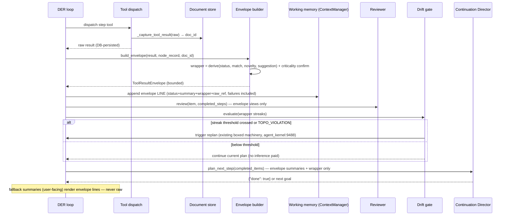

# Design: Tool-Result Envelope & Drift-Gated Coordination

## Context
Conv-99 exposed the same root pattern three ways: mechanism-without-consumer. Raw crawl payloads re-enter the loop through four surfaces (working memory append, planning prompt full-thread render, continuation OUTPUT block, user-facing fallback evidence), driving conversation context to 71.5k/64k chars. A prior proposal (render-time caps, "D1–D5") was rejected as surface-level: the user's locked principle is that the ENVELOPE — not the renderer — is the fix. Every tool result must arrive in the loop already shaped: bounded digest, durable raw pointer, and decision-useful wrapper labels in words. The envelope is reporter-only: it NEVER mints hashes, NEVER walks the graph, NEVER scores recall — it stamps joinable identity so `specs/wormhole-aperture/` lands later with zero rework. The Director/Reviewer/Executor structure already exists here (planner = `_plan_task`/`_der_plan_next_step`, reviewer = `Reviewer.review` gate, executor = step dispatch) — what is missing is the wrapper schema and where it plugs in.

Constraints that bound the design:
- One write-time computation; no per-consumer re-derivation; no extra LLM calls anywhere in the envelope or streak-gate path.
- Existing durable stores are REUSED, not duplicated: document store (raw payloads, `_capture_tool_result` agent_kernel.py:4791) and NodeRecord (coordinate/outcome record, der_loop.py:74).
- Reporter-only: no hash minting, no graph walk, no recall scoring, no per-step encodes — coords pass through verbatim; wormhole/aperture owns everything graph-shaped.
- Pre-existing failures untouched; the twins+loop-bounds suite (39 pass / 6 pre-existing `_FakeKernel._router` fails) is the regression baseline.

## Architecture Overview

```mermaid
flowchart LR
    subgraph WRAP["Write time (once)"]
        TR[Tool result] --> CAP[_capture_tool_result: raw → document store, doc_id]
        TR --> ENV[ToolResultEnvelope build]
        CAP -->|doc_id only| ENV
        NR[NodeRecord finalize: outcome, expected_output, fraction, mediator, coords pair, turn memory] --> WRAP[wrapper derive: status/match/novelty/suggestion + criticality confirm — deterministic O(1)]
        WRAP --> ENV
        ENV --> QI[QueueItem.envelope]
        ENV --> WM[Working memory: envelope LINE only, failures included]
    end
    subgraph READ["Role views (read time)"]
        QI -->|status + wrapper + summary| RV[Reviewer gate]
        QI -->|summary + wrapper only| DIR[Continuation Director _der_plan_next_step]
        QI -->|raw_ref on demand| EX[Executor step]
        ENV --> FB[User-facing fallback summaries: envelope lines]
    end
    subgraph GATE["Streak gate (between steps)"]
        QI --> ACC[accumulate wrapper streaks]
        ACC -->|stuck streak / TOPO override| REPLAN[existing replan machinery]
        ACC -->|below threshold| CONT[continue current plan]
    end
    subgraph GUARD["Pre-dispatch guard (before paying for a tool call)"]
        MEM[turn memory + wall ledger] -->|repeat/walled → block + read via raw_ref| DISP[dispatch]
    end
    end
    WARM[main.py lifespan: background encode warmup] -.-> SVC[EmbeddingService singleton]
    TX[transport.py _nonstream: Empty → same-payload retry] -.-> TR
```

## Sequence / Data Flow



## Data Models

```python
# backend/agent/tool_envelope.py (new, stdlib-only dataclass module)
@dataclass
class ToolResultEnvelope:
    status: str                 # "success" | "error" | "partial"
    summary: str                # ≤300 chars, ≤2 lines — the only text consumers get by default
    raw_ref: dict               # {"doc_id": str} — doc store ONLY (Pacman filing is async;
                                #  chunk ids are never available at wrap time and never waited on)
    match: str                  # "matched" | "mismatched" | "unclear" — vs the step's
                                #  expected_output under that TOOL FAMILY's bar (REQ-3 AC3.1)
    novelty: str                # "new" | "repeat_of_<step_id>" | "empty" — vs turn memory
    suggestion: str             # "proceed" | "retry_same" | "try_different" | "stop"
    stuck_shape: str            # "none" | "circling" | "dry_well" | "wrong_package"
                                # | "flat_tire" | "idling" (REQ-3 AC3.2)
    coords_from: str            # VERBATIM passthrough for future wormhole hashing — never
    coords_to: str              #  arithmetized here (empty + basis "none" when unavailable)
    criticality: str            # "load-bearing" | "supporting" | "cosmetic"
    criticality_source: str     # "declared" (planner) | "confirmed" (consumption, AC1.6)
    card_id: str = ""           # join keys for aperture/chains later (reporter stamps them,
    step_id: str = ""           #  graph layers read them — envelope never scores them)
    session_id: str = ""
    turn_id: str = ""
    error_type: str = ""        # populated when status != success (from tool_errors.py shape)
    recovery_hint: str = ""     # populated when status != success
    created_at: float = field(default_factory=time.time)

    def line(self) -> str:
        """The single bounded sentence that may enter working memory / prompts / cards.
        Words, not numbers: e.g. 'Step 2: success, mismatched (asked Parakeet, got
        whisper.cpp), repeat of Step 1 — try_different, read doc <id> instead.'"""

# QueueItem (der_loop.py:232 area) gains:
    envelope: Optional[ToolResultEnvelope] = None
# PlanStep / planner schema gains: criticality declaration per step (T5).
# NodeRecord unchanged — the envelope STAMPS from it, never replaces it.

# Streak + grade constants (der_constants.py — constants-only tuning per REQ-7):
STUCK_STREAK_N = 2           # consecutive repeat/empty/mismatch before the gate fires
IDLE_STREAK_N = 2            # consecutive success+new+matched with unmoved verified_fraction
LOAD_BEARING_VETO = True     # any load-bearing match!=matched caps the run below full pass
```

Envelope construction functions (pure, deterministic, unit-testable — NO I/O, NO encodes):
```python
def build_envelope(result_text, step_success, expected_output, tool_family, verified_fraction, node_record, raw_ref, coords_from, coords_to, turn_memory, error=None, declared_criticality="supporting") -> ToolResultEnvelope
def derive_wrapper(status, match_inputs, novelty_inputs) -> dict  # stuck shape + suggestion per hierarchy C
def confirm_criticality(declared, consuming_steps) -> tuple[str, str]  # option C
def evaluate_streak(wrappers: list[dict], stuck_n, idle_n) -> tuple[bool, str]  # TOPO rec forces fire
```

## Key Decisions

**KD-1: Envelope at write time, not caps at render time.**
Default (rejected): cap every render site (my prior D1–D5). Why rejected (user-locked): render-time shaping leaves the raw blob as the source of truth in the loop, caps each of 4+ sites independently, and every future consumer re-invents the bound. Write-time envelope = one computation, four consumers, bounded by construction. Alternatives considered: (a) DCP text-zone pruner on ContextManager — rejected: treats symptoms in the store, still ships raw to it, DCP's dict-shape passes no-op on text zones; (b) keep raw inline + trust provider windows — rejected: 71.5k/64k live evidence, provider-empty disease correlates with bloated prompts (conv-98/99).

**KD-2: raw_ref rides the EXISTING document store id; no second store.**
`_capture_tool_result` already persists raw and returns doc_id (agent_kernel.py:4791-4840). The envelope references it. Alternative rejected: a new "raw payload table" — duplicates a durable store that already exists with trust-routing and HAR provenance.

**KD-3: The wrapper speaks in words — the 4D physics delta is REJECTED.**
Default (rejected, user-locked session-316): component-wise 4D phase-space delta with vector-norm magnitude. Why rejected: magnitude is in Duffing wobble-space, not goal-progress units, and an LLM decider cannot feel 0.83 — a precise-looking number that steers nothing is worse than a coarse label that steers correctly. The coords stamped at finalize are still carried VERBATIM (future wormhole hashing needs them), but nothing here subtracts them. Inputs to the words: outcome + `expected_output` under the tool-family bar + `verified_fraction` transition (already continuous 0..1, der_loop.py:114) + turn memory (crawled URLs, tool+params, output overlap) + optional Caducean recommendation (der_loop.py:528-536 — TOPO_VIOLATION forces `suggestion`=stop per AC3.4). Alternatives rejected: (a) LLM-judged wrapper — violates zero-token-cost and determinism; (b) new embedding-space distance — adds the model dependency the user excluded AND duplicates Pacman's stored vectors; (c) 4D arithmetic delta — the rejected default above. Trade-off surfaced: words are coarser than geometry — accepted deliberately, because the graph layers (wormhole/aperture) own precision later and the reporter owns clarity now; tuning rides REQ-7 counters (UNVERIFIED until live).

**KD-7: The fingerprint is CUT entirely — zero encodes, zero vectors, zero counters.**
Session-316 lock (user: "I don't think we need the fingerprint at all"). Pacman ALREADY persists every DER step result as embedded chunks in `context_chunks` (fragment_and_store at agent_kernel.py:13261-13316, async serialized worker) — any per-step encode would pay ~100ms for information the store already holds durably. Timing fact that kills the middle options: Pacman's worker queue is async (pacman_fragment.py:173-208), so chunk vectors are NOT ready at wrap time and `raw_ref` is doc-id-only (AC1.3). Semantic ranking of past findings (ex-OQ-3) is CUT from this spec and lives in `specs/wormhole-aperture/` Tier-1/Tier-2 where scoring belongs. Alternatives rejected: (a) in-memory fingerprint per envelope — rent with no tenant (no consumer until a deferred experiment); (b) persist via context_chunks — double-storage, user-rejected twice; (c) pool Pacman embeddings at wrap — couples the hot path to queue lag.

**KD-4: Replan gate reuses existing machinery; Caducean recs override streaks.**
The streak gate is a THIN predicate in front of the existing replan entry (`_replan`, agent_kernel.py:9488, already budget-boxed). Where a phase recommendation exists (TOPO_VIOLATION = rec 3 already "stops the line", der_loop.py:536), it forces the gate regardless of streak arithmetic. Anything graph-scoring shaped (hyperedge posteriors, aperture policy arms) belongs to wormhole/aperture, never here. Alternatives rejected: (a) replan every iteration — user-locked against, noisy + expensive; (b) timer-based replan — user-locked against; (c) new physics detector — violates reuse-the-existing-detection principle.

**KD-8: Hierarchy C — two hard rules, everything else suggests (locked session-316).**
WALLED + CIRCLING block deterministically: the pre-dispatch guard (T6B) refuses to re-execute a repeat (reroutes to read the original `doc_id`) and refuses walled retries — no LLM override, because re-paying a known-dead call is harm, not judgment. All other shapes SUGGEST; the Director may override with a logged reason, and override-rate is itself a counter (a suggestion overridden 90% of the time is a miscalibrated suggestion). Alternative rejected: all-hard (brittle — a mislabeled mismatch would deadlock the run) and all-soft (the conv-99 repeat would recur with better handwriting).

**KD-9: Expectation is per-family, weight is declared-then-proven (option C, locked session-316).**
One bar cannot judge a crawl and a file read: each tool family carries its own "good looks like this" inside `match` (REQ-3 AC3.1), so the grade generalizes beyond websearch to every tool call. Criticality is planner-DECLARED (intent) and consumption-CONFIRMED at finalize (proof — later steps reading my `doc_id` promote me to load-bearing); the divergence itself is logged as a tuning signal. Cost: one short field in the existing planning call + O(1) counter lookups at finalize — microseconds in, minutes back (every prevented 50s re-crawl). Alternatives rejected: (a) planner-only — intent without proof drifts; (b) derived-only — the planner never states what mattered, so nothing is auditable against; (c) LLM judge per step — a second inference bill on every step to grade the first.

**KD-10: Prevention decides, envelope testifies; aperture receives.**
The bouncer (pre-dispatch guard over turn memory + wall ledger, T6B) and the incident report (envelope line, T7) are deliberately split: the guard must work even for steps whose envelope never gets built, and the label must exist even when the guard somehow missed. The aperture contract is one-directional — envelope stamps identity, graph layers read it. If a future aperture needs a field the envelope lacks, THAT is a wormhole-side amendment with its own triplet, never a silent envelope widening.

**KD-5: Warm-at-boot is a fire-and-forget background task, not a startup barrier.**
Lifespan currently does heavy init inline (main.py:169-249). Embedding warm must NOT delay readiness (sidecar cold-load can take seconds). Alternative rejected: synchronous warm before `app.state.ready = True` — couples backend readiness to a GPU/CPU model load; rejected on latency layer. Timing note: warm lands async; if first real traffic arrives before warm completes, that first encode may still pay budget once — acceptable, and the breaker remains the safety net (existing behavior).

**KD-6: Transport Empty-retry lives INSIDE `_nonstream`'s existing attempt loop.**
The loop (transport.py:773-824) already retries 3× for HTTP exceptions and 429s; the Empty check (:839) simply sits after it. Moving the extraction+empty check into the loop = one retry site covers all four downstream Empty call sites (step-result processing, final synthesis, decision box, sub-loop). Alternative rejected: retry at each downstream call site — four patches instead of one, and downstream lacks the payload to retry with.

## Ripple-Effect Map (MANDATORY)

| Area / File | Change? | Classification | Why / Evidence (file:line) |
|---|---|---|---|
| `backend/agent/tool_envelope.py` | Yes — NEW | CHANGE NEEDED | Envelope dataclass + builder + wrapper derive + stuck-shape classify + criticality confirm + streak evaluate (pure functions, zero I/O, zero encodes, zero LLM) |
| `backend/agent/der_loop.py` | Yes | CHANGE NEEDED | QueueItem gains `envelope` field (der_loop.py:232 area); NodeRecord untouched |
| `backend/agent/agent_kernel.py` — planner step schema | Yes | CHANGE NEEDED | PlanStep/`_plan_task` declares `criticality` (load-bearing\|supporting\|cosmetic) per step at plan time — one short field inside the existing planning call, no extra inference (T5; KD-9) |
| `backend/agent/agent_kernel.py` — pre-dispatch guard | Yes | CHANGE NEEDED | NEW hard-rule block before dispatch (T6B): repeat (tool+params+URLs ⊆ turn memory) → reroute to read original `doc_id`; walled (via existing `is_walled`) → refuse retry. Reads turn memory + wall ledger only; CT-10 |
| `backend/agent/agent_kernel.py` — tool result site | Yes | CHANGE NEEDED | Build envelope once at the finalize site alongside node-record stamping (:14054-14100 — outcome/expected_output/fraction/mediator/coords all in scope there); raw_ref = doc_id from `_capture_tool_result` (:4791) ONLY (Pacman chunk ids async-unavailable, never waited on); criticality confirmed from `raw_ref` consumption (AC1.6) |
| `backend/agent/agent_kernel.py` — working memory append | Yes | CHANGE NEEDED | :13382-13396 append envelope LINE (status+summary+wrapper+raw_ref) for EVERY settled step INCLUDING failures (fixes the :13387 silent-skip that guarantees repeats) instead of `_smart_excerpt(step_result, cap)` |
| `backend/agent/agent_kernel.py` — `_der_plan_next_step` | Yes | CHANGE NEEDED | :14557-14572 OUTPUT block renders envelope summaries + wrapper labels with BOTH halves bounded (the full-`i.result` done_summary half capped to envelope lines like the outputs block); reports `done + grade` per AC5.6, never bare `done` (Director view) |
| `backend/agent/agent_kernel.py` — deterministic fallback summaries | Yes | CHANGE NEEDED | :11626-11692 render envelope lines (fix 7; kill the 8000-char gather window in user-facing output, :11463-11468) |
| `backend/agent/agent_kernel.py` — `_der_node_record_evidence` | No | NO CHANGE (deferred OQ-2) | :11463-11468 keeps its 8000-char gather window for the SYNTHESIS prompt only; user-facing/loop surfaces are envelope lines. Verified present; change deferred to live evidence |
| `backend/agent/agent_kernel.py` — reviewer gate | Yes | CHANGE NEEDED | :8319-8326 pass envelope views (status+wrapper+summary) into review inputs; ReviewVerdict semantics LOCKED (AC4.4) |
| `backend/agent/agent_kernel.py` — streak gate | Yes | CHANGE NEEDED | New gate call between steps, in front of existing `_replan` (:9488); TOPO_VIOLATION forces fire per AC3.4; hard rules live pre-dispatch (T6B), this gate is streak-only |
| `backend/agent/agent_kernel.py` — `_build_planning_prompt` | No | NO CHANGE (verified) | :5239-5249 renders ConversationMemory messages; those messages will now CONTAIN envelope lines (via working-memory append change) — planning code itself needs no edit. Contract test CT-2 pins no-raw-in-history |
| `backend/agent/agent_kernel.py` — `_run_step_direct` | No | NO CHANGE (verified) | :11943 wm cap 6000 already applied; wm content becomes envelope lines via the append change; P3 shrunk-retry (:11996-12010) untouched |
| `backend/agent/der_constants.py` | Yes | CHANGE NEEDED | Streak + grade constants (see Data Models: STUCK_STREAK_N, IDLE_STREAK_N, LOAD_BEARING_VETO) — constants-only tuning per REQ-7 |
| `backend/agent/inference/transport.py` | Yes | CHANGE NEEDED | `_nonstream` :773-843: move extraction+empty check inside attempt loop (fix 6b) |
| `backend/main.py` | Yes | CHANGE NEEDED | lifespan :169+: background embed warm task (fix 6a) |
| `backend/crawler/rerank.py` | No | NO CHANGE (verified) | Breaker logic :160-182 unchanged — warm-at-boot prevents the cold-budget burn upstream; breaker stays as safety net |
| `backend/memory/embedding.py` | No | NO CHANGE (verified) | `get_embedding_service()` singleton :957 + lazy load :791-793 already support warm-up; the envelope performs NO encodes (fingerprint cut) — warm-at-boot is the only consumer |
| `backend/memory/working.py` (ContextManager) | No | NO CHANGE (verified) | append() :99-139 zone mechanics unchanged — the CONTENT appended becomes envelope lines incl. failures (caller-side change only) |
| `backend/memory/episodic.py` (Pacman store) | No | NO CHANGE (verified) | fragment_and_store :750-879 + retrieve_context_chunks :881+ unchanged — Pacman keeps filing exactly as today; the envelope references doc ids only, reads NO chunk ids, waits on NO queue (`pacman_fragment.py:173-208` async worker — envelope never blocks on it). ex-OQ-3 (semantic selection) CUT to wormhole-aperture |
| `backend/agent/dcp.py` | No | NO CHANGE (verified) | Envelope supersedes (KD-1); existing call sites untouched per Non-Requirements |
| `backend/agent/tool_errors.py` | No | CONTRACT LOCK | Structured error shape feeds `error_type`/`recovery_hint` — shape must not drift; CT-4 |
| Frontend (hooks/useIRISWebSocket.ts, useTaskProgress.ts, cards) | No | NO CHANGE (verified) | Envelope is backend-internal; result_summary/resultPreview hydration (session-312) already renders bounded summaries; no event-shape change |
| `IRISStreamEvent` shapes (event_bus.py) | No | CONTRACT LOCK | No new/changed event types; envelope observability rides existing log stream, not new events |
| Task cards + der_execution_ledger (application memory) | No | NO CHANGE (verified) | Cards hold structured step state (UI + recall), ledger holds execution records — envelope adds no fourth store; it is the pointer layer connecting doc store + chunks + cards. CT-6 guards the gather gate they depend on |
| Twins + loop-bounds suite (backend/tests) | Yes | CHANGE NEEDED | Existing suites must stay green (39/6 baseline); envelope units added to existing contract/behavioral layout per Testing Strategy — NO new root-level twin files |
| Gather gate + URL turn memory (session-312) | No | CONTRACT LOCK | :12151 gate + `_der_crawled_urls` must survive refactor untouched; CT-6 |

## Error Handling
- Envelope build failure → minimal envelope (AC1.4), loud_error logged, loop proceeds (never crash a step for shaping).
- Streak-gate failure → treated as "below threshold" (continue plan) + warning log — a broken gate must not change loop semantics (same advisory-gate principle as `_der_findings_sufficient`, agent_kernel.py:11398-11400).
- Suggestion override → logged with reason (AC3.3); hard-rule block (repeat/walled) → logged + rerouted, never overridable in-run.
- raw_ref resolution failure → "[source unavailable]" bounded marker (AC2.5 edge).
- Embed warm failure → log + continue (AC6.2); breaker path unchanged.
- Transport retry exhaustion → existing error, existing downstream handling (AC6.3/6.4).

## Testing Strategy
Organized per the standing CDD standard:
```
tests/unit/         build_envelope (wrapper labels per tool family; stuck-shape classification
                    incl. all 5 shapes; criticality confirm incl. declared-vs-consumed divergence;
                    minimal-degrade per AC1.4),
                    evaluate_streak (repeat/empty/mismatch streaks, idling streak, nominal
                    run blocks; TOPO_VIOLATION-rec override fires regardless — AC3.4;
                    hard-rule predicate: repeat/walled ALWAYS blocks — AC3.3).
                    Zero I/O, zero encodes, zero LLM — the gate's O(n) arithmetic pinned here.
tests/contract/     CT-1 envelope shape on QueueItem (fields + bounds: summary ≤300, ≤2 lines,
                    NO fingerprint field anywhere, raw_ref = {doc_id} only, coords verbatim,
                    criticality + source present, step identity present)
                    CT-2 no-raw-in-prompt: planning + step + continuation prompts contain no raw
                    gather payload text (assembles real prompts from recorded conv-99-shaped
                    fixtures and asserts absence — BOTH continuation halves, incl. the
                    full-`i.result` done_summary half)
                    CT-3 ReviewVerdict semantics unchanged (reviewer input change, output contract
                    locked — PASS/REFINE/VETO mapping identical on fixed fixtures)
                    CT-4 tool_errors.py shape → error_type/recovery_hint mapping locked
                    CT-5 no new IRISStreamEvent types; envelope observability rides logs only
                    CT-6 gather gate + _der_crawled_urls behavior unchanged post-refactor
                    (prevention guard EXTENDS the gate path — it never weakens the filter)
                    CT-7 transport: empty-then-content retries same payload; exhaustion raises
                    "Empty response from API"; RateLimitedError path untouched
                    CT-8 warm-at-boot: lifespan calls background warm; failure never blocks ready
                    CT-9 no-new-persistence: envelope construction performs NO DB writes
                    and reads NO chunk stores (Pacman filing count/rows unchanged by envelope
                    build — asserts against a recording episodic store)
                    CT-10 hard rules hold: a repeat step is NEVER re-dispatched (blocked
                    pre-dispatch + rerouted to read), a walled tool is NEVER retried in-run;
                    suggestion overrides are logged with reasons (fixtures: repeat crawl,
                    walled domain, mismatch override)
tests/behavioral/   BT-1 full 3-step research-shaped task through the real loop: working memory,
                    continuation prompt, and fallback report contain ONLY envelope lines
                    (failure lines included); run reports done + grade; a seeded
                    load-bearing mismatch caps the grade below pass (emergent property:
                    no 71.5k possible, no low-bar pass possible)
                    BT-2 streak gate: repeat/empty/mismatch streaks fire the gate
                    (TOPO_VIOLATION rec forces fire regardless of streaks); nominal run
                    blocks it (counter-verified); replan machinery invoked exactly at threshold,
                    never before; hard-rule blocks need NO gate (proven in CT-10)
                    BT-3 embed warm: cold sidecar → warm task runs, breaker stays closed through
                    a rerank-bearing step
scripts/            live gate rides the standing comparison probe (session-312 handoff pin):
                    context pill <50% window, no URL re-crawl, honest UNVERIFIED, <4min,
                    breaker closed, zero Empty failures
```
Intertwined: every behavioral gap found decomposes into the contract test that would have caught it (e.g. BT-1 finding raw in the continuation prompt's done_summary half → CT-2 extension; a repeat re-dispatched → CT-10 extension). Physics-aware: BT-2 injects Caducean rec states (TOPO_VIOLATION forces gate fire regardless of streak arithmetic — KD-4). Baseline to hold: twins+loop-bounds 39 pass / 6 pre-existing fails; contract 1478-1485 pass / 30 pre-existing (session-310-verified).

**Live-verification gate:** the success-criteria targets (context <50% window, breaker closed, zero Empty, <4min turn) are validated ONLY by the live comparison probe on the restarted backend — unit/contract green is not done.
