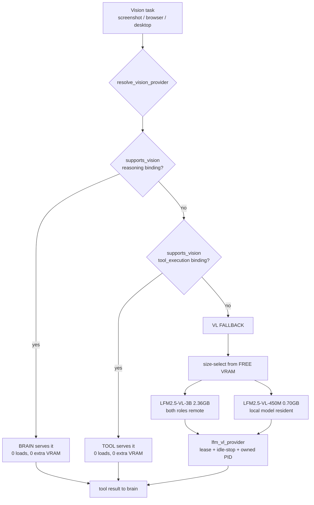
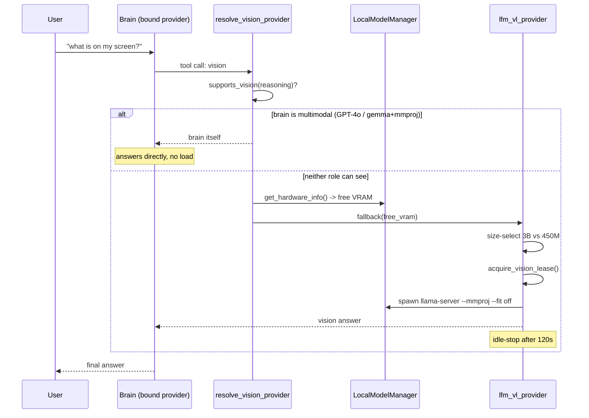

# Design: Unified Vision Capability Routing

## Context
An 8GB RTX 3070 holds exactly one substantial local model. Today every vision task
spawns a dedicated LFM2.5-VL llama-server regardless of what is already loaded, so
a multimodal brain that could answer the question itself is ignored while a second
model competes for the same VRAM.

The constraint that shapes everything: **folding vision into the brain costs ~5x
generation speed** (LFM2.5-8B-A1B 224.2 tok/s with no vision, vs gemma-4-E4B 42.1
tok/s with its projector). So the design must never force a multimodal brain - it
must detect one and take advantage when the user has chosen it.

A correction that materially shaped this design: `lfm_vl_provider.py` is NOT a
naive server launcher. It already implements vision leases with deadlines, a 120s
idle-stop with lazy restart, owned-PID tracking so it never kills a user's own
server, and a `_VISION_VRAM_RESERVE_GB` margin. An earlier plan to delete it was
wrong. It is kept and becomes tier 3.

## Architecture Overview



`supports_vision` is the only new concept. Everything below tier 3 already exists.

## Sequence / Data Flow



## Data Models

```python
# New — capability resolution
VisionResolution = {
    "tier": str,          # "brain" | "tool" | "fallback"
    "provider_id": str,
    "requires_load": bool,
    "free_vram_gb": float,
    "model_path": str | None,     # fallback only
    "mmproj_path": str | None,
}

# Extended — scan_models entry (REQ-5)
ModelEntry += {
    "has_vision": bool,
    "mmproj_path": str | None,
    "mmproj_size_gb": float,
}

# Extended — load plan (REQ-4)
LoadPlan += {
    "with_projector": bool,
    "projector_cost_note": str,   # measured: -35% gen, +1.2GB
}

# Extended — ProviderInstance (REQ-1 AC3/AC4)
ProviderInstance += {
    "vision_loaded": bool,        # projector was actually attached at load
}
```

## Key Decisions

| Decision | Rationale | Rejected alternative |
|---|---|---|
| Capability lookup, not a service | A multimodal brain already paid for vision; loading a second model wastes the only free VRAM | Always route vision to a dedicated server (today's behavior) |
| Keep `lfm_vl_provider.py` | It already has leases, idle-stop, owned-PID, VRAM reserve - all non-trivial and correct | Delete it and fold everything into the main loader |
| Size-select the fallback from free VRAM | The user's "3B only when both roles are remote" falls out of arithmetic and generalizes to other hardware | Hardcode 450M, or hardcode 3B (today) |
| No VL model pinned resident | When brain/tool can see, tier 3 never fires; a pinned model is pure waste | Pin the 450M permanently for instant vision |
| Attach `--mmproj` by default, surface the cost | It is why one picks a multimodal brain; hiding a 35% tax is worse than showing it | Never attach (vision impossible); always attach silently (hidden tax) |
| `vision_loaded` on the instance, not disk presence | A projector on disk says nothing about whether the RUNNING server can see | Infer capability from a sibling file |

## Ripple-Effect Map

| Area / File | Change? | Classification | Why / Evidence |
|---|---|---|---|
| `backend/tools/lfm_vl_provider.py` | Yes | CHANGE NEEDED | Size-select instead of unconditional 3B preference (`:277-299`); add `--fit off` to spawn (REQ-6) |
| `backend/agent/local_model_manager.py` `_build_server_cmd` | Yes | CHANGE NEEDED | `grep -c mmproj` == 0; must pass `--mmproj` (REQ-4) |
| `backend/agent/local_model_manager.py` `scan_models` | Yes | CHANGE NEEDED | Live `/api/models` returned 3 projector rows as loadable (REQ-5) |
| `backend/agent/local_model_manager.py` `plan_load` / `estimate_vram_gb` | Yes | CHANGE NEEDED | Projector size must enter the weights term (REQ-3 AC2, REQ-4 AC3) |
| `backend/agent/inference/router.py` | Yes | CHANGE NEEDED | Host `supports_vision` + `resolve_vision_provider` beside `resolve()` |
| `backend/agent/inference/provider.py` | Yes | CHANGE NEEDED | `vision_loaded` field on `ProviderInstance` (`:26`) |
| `backend/iris_config.py:382` | Yes | CHANGE NEEDED | Hardcoded `8081` for a LOCAL_OPENAI entry vs `PORT` 8082 (REQ-8) |
| `hooks/useIRISWebSocket.ts` + dashboard seeding | Yes | CHANGE NEEDED | Badge unfixed on reload (REQ-7); WS bucket already fixed in e9d2fc89 |
| `components/dashboard/ModelBrowserPanel.tsx` | Yes | CHANGE NEEDED | Show vision capability + projector cost (REQ-4 AC5, REQ-5 AC3) |
| `backend/automation/vision.py` | No | NO CHANGE (verified) | Consumes `LFMVLProvider` at `:57,:79,:108` - a consumer of the resolved endpoint, not the resolver |
| `backend/agent/vision_guided_operator.py` | No | NO CHANGE (verified) | Consumes `screenshot_to_bytes` / `LFMVLProvider` at `:45,:59` - same |
| Vision lease / idle-stop lifecycle | No code | CONTRACT LOCK | `acquire_vision_lease` / `should_idle_stop` / `_stop_owned_vision_server` semantics must survive tier-3 changes - CT-3 |
| `local_model_status` WS event shape | No code | CONTRACT LOCK | Badge depends on it; already broke once by writing the wrong section key - CT-4 |
| `load_local_model` WS payload | No code | CONTRACT LOCK | Adding `with_projector` must not break existing senders - CT-5 |
| `--fit off` in the main loader | No | NO CHANGE (verified) | Landed in e9d2fc89, `local_model_manager.py` `cmd += ["--fit", "off"]` |
| `purpose` inference | No | NO CHANGE (verified) | `iris_gateway._infer_local_purpose` landed e9d2fc89; verified live `purpose=tool` |

## Error Handling

| Failure | Response |
|---|---|
| `resolve()` raises for a role | IF a role cannot resolve THEN THE SYSTEM SHALL treat it as no-vision and continue down the hierarchy |
| No VL model fits free VRAM | IF nothing fits THEN THE SYSTEM SHALL fail naming free VRAM and the smallest requirement - never CPU fallback |
| Projector missing for a base model | IF absent THEN THE SYSTEM SHALL load text-only and report `has_vision: false` |
| Vision server fails to start | IF the process exits THEN THE SYSTEM SHALL surface its last stderr rather than a generic timeout |
| Config claims loaded, nothing listening | IF reconciliation fails THEN THE SYSTEM SHALL display UNLOADED |
| VRAM query unreadable | IF free VRAM is unknown THEN THE SYSTEM SHALL choose the most conservative candidate |

## Testing Strategy

```
tests/unit/         pure logic - the capability table, size-selection arithmetic
tests/contract/     boundary pins - CT-1..CT-5
tests/behavioral/   full-loop drives - tier selection end to end
```

**Unit**
- `supports_vision` for each ProviderKind, including the unknown-model -> False path.
- Size-selection: given free VRAM X and a candidate ladder, assert the chosen model
  and that the projector size entered the estimate.

**Contract**
- **CT-1** `supports_vision` returns bool for every `ProviderKind` member - a new
  kind must not raise.
- **CT-2** `scan_models` never emits an entry whose filename starts with `mmproj-`,
  and every `has_vision: true` entry carries a readable `mmproj_path`.
- **CT-3** vision lease/idle contract: acquiring a lease prevents idle-stop;
  releasing re-arms it; `_stop_owned_vision_server` never kills an unowned PID.
- **CT-4** `local_model_status` payload shape, and that the badge's section key
  (`local-model-card`) is the one written - the exact break seen live.
- **CT-5** `load_local_model` accepts a payload WITHOUT `with_projector` (back-compat).

**Behavioral**
- Brain = multimodal API -> vision task completes, assert **no** llama-server spawn
  and free VRAM unchanged.
- Brain = Cohere (no vision), tool = LFM2.5-8B-A1B (no vision) -> assert fallback
  fires and selects the **450M**, because a local model is resident.
- Both roles remote -> assert fallback selects the **3B**.
- Local model loaded WITH projector -> assert tier 1 answers and no fallback spawns.
- Reload the page with a model loaded -> badge reads LOADED (REQ-7).

**Intertwined:** each behavioral gap decomposes into the contract test that would
have caught it. The badge failure found live is exactly CT-4; the projector-as-model
bug is exactly CT-2.

**Standing CDD harness:** extend the `scripts/validate_der_*.py` family with a
vision-routing replay that drives all four tier permutations on every run, so a
future edit cannot silently collapse the hierarchy back to "always spawn the server".
