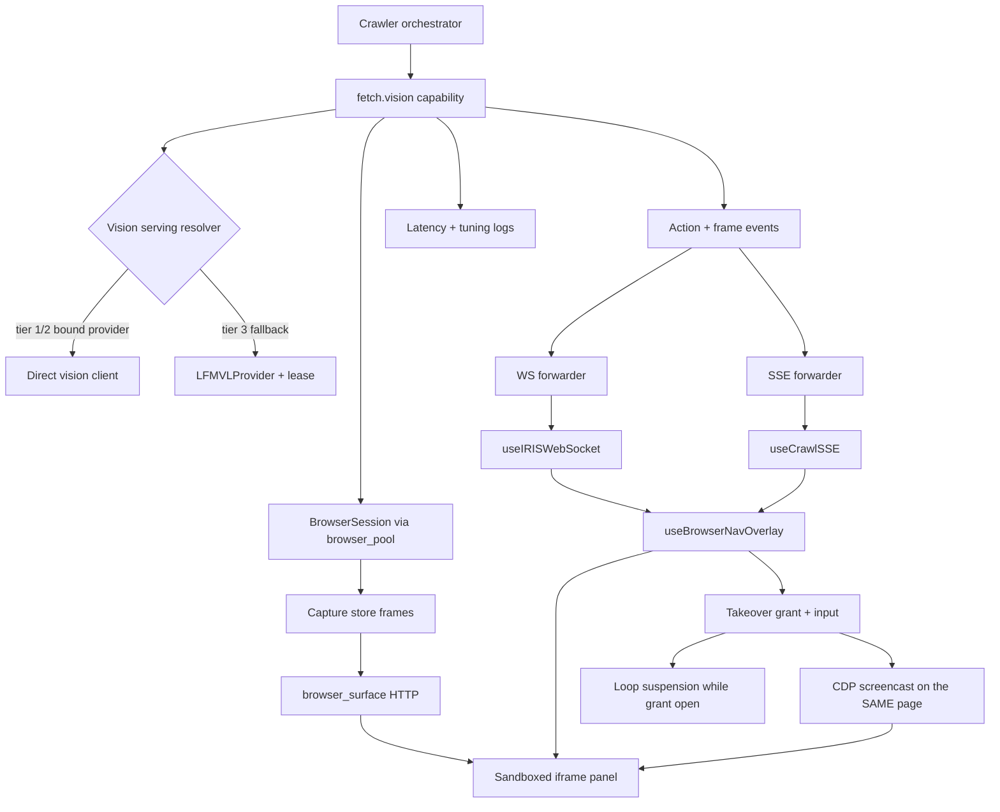
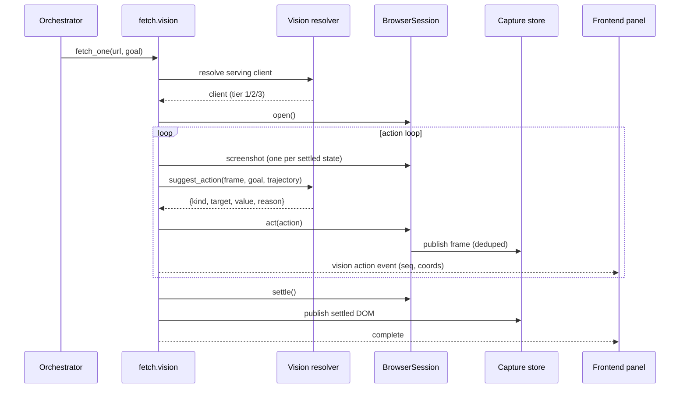
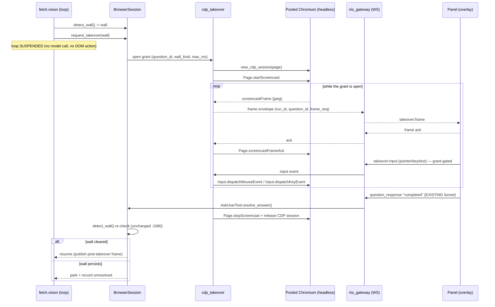

# Design: Vision–Browser E2E Reliability & Performance

## Context

The vision path drives a real server-side browser (`backend/vision/browser_session.py`)
through a pooled Playwright/Chromium (`backend/vision/browser_pool.py`), asks a
vision model for the next action (`backend/tools/lfm_vl_provider.py`,
`backend/agent/inference/router.py`), extracts content
(`backend/vision/frame_extraction.py`), publishes frames to a capture store
(`backend/crawler/capture_store.py`) served by `backend/api/browser_surface.py`,
and mirrors that into the in-app panel (`components/dark-glass-dashboard.tsx`,
`hooks/useBrowserNavOverlay.ts`, `hooks/useViewProtocol.ts`). Events flow over WS
(`hooks/useIRISWebSocket.ts`) and SSE (`hooks/useCrawlSSE.ts`,
`backend/api/crawl_stream.py`).

Constraints that bound the design:
- The iframe is sandboxed to an opaque origin (no `allow-same-origin`) and can
  never be the vision source or a direct control surface.
- Heavy imports (Playwright) stay lazy; capabilities must degrade, never raise.
- The provider hierarchy (`specs/unified-vision-routing`) and its guard test are
  existing contracts.
- No artificial latency; machine speed is the goal.

## Architecture Overview



## Sequence / Data Flow



## Takeover Sequence (CDP screencast — new 2026-09-17)



## Data Models

- `VisionAction(kind, target, value, reason)` — already exists; `value` is the
  `type` payload, `target` is a resolvable handle.
- `TrajectoryStep(action, target, params, outcome, visual_delta)` — exists;
  its window must reach the prompt.
- `FrameObservation(seq, scroll_top, frame_bytes, triage_verdict, text)` — NEW
  cached per settled state so one frame serves triage + extraction + suggestion.
- `VisionActionEvent(run_id, seq, kind, action_index, total, x, y, scroll_y,
  scroll_height, viewport_w, viewport_h, escalated)` — one canonical shape.
- `StageTiming(run_id, stage, duration_ms)` — NEW per-stage instrumentation.
- `TakeoverGrant(grant_id, run_id, question_id, wall_kind, opened_at, max_ms,
  owner)` — NEW; the authority token. Input is accepted only while a grant is
  open, and the grant is the arbiter that keeps ONE writer on the page.
- `ScreencastFrame(run_id, question_id, seq, frame_seq, ts, viewport_w,
  viewport_h, format, bytes)` — NEW; the canonical frame envelope (REQ-16 AC1).
  `bytes` is a base64 payload (D9); `seq` is the takeover's event sequence and
  `frame_seq` its frame sequence.
- `TakeoverInput(kind, seq, x?, y?, button?, key?, text?)` — NEW; page-level
  events only (pointer, wheel, key, text). Browser-level and navigation commands
  are not representable (REQ-14 AC3).
- `FrameStreamStats(sent, dropped, gaps, last_frame_seq)` — NEW; the counters that
  make bounded delivery visible (REQ-16 AC3).
- `CredentialApplication(grant_id, secret_ref, field_handle, applied_at, outcome)`
  — NEW; the audit record for REQ-14 AC5/AC6. Holds a REFERENCE id, never the
  value, so the record is auditable but not recoverable.
- `ConsentRecord(host, kind, granted_at, revoked_at)` — NEW; the revocable consent
  for persisting post-takeover session cookies (REQ-15 AC5).

## Key Decisions

**D1 — Resolver, not direct construction (REQ-1).**
- Default/obvious: keep `get_lfm_vl_provider()` at the browser consumers.
- Why it exists: the tier-3 singleton was the original only vision source.
- Alternatives: (a) leave as-is; (b) call the resolver; (c) new browser-specific
  resolver.
- Chosen: (b). Reuses the existing, tested hierarchy and the existing guard test.
  Rejected (c) as needless divergence; rejected (a) as the confirmed defect.

**D2 — Stable handles instead of free-text targets (REQ-2).**
- Default: model returns a description; executor treats it as a CSS selector.
- Why: the executor needs a real selector; the model cannot reliably emit one.
- Alternatives: (a) keep free text; (b) model emits role+name, executor resolves;
  (c) model emits a numeric index into an enumerated element list.
- Chosen: (b) with (c) as a fallback, because it matches the allowlist's existing
  role/name vocabulary (`backend/vision/action_allowlist.py`) and degrades well.
  Trade-off: adds a bounded resolution step; acceptable because it prevents failed
  actions and wasted model rounds.

**D3 — Feed trajectory back (REQ-3).** Default: prompt only has the goal.
Alternatives: (a) leave; (b) include sliding window + no-repeat constraint.
Chosen: (b) — the data is already recorded; wiring it is near-zero cost and
directly reduces looping.

**D4 — Progress-based termination (REQ-4).** Default: stop after 3 repeated
action kinds. Why: it approximated "stuck". Alternatives: (a) keep; (b) stop on
measured visual delta; (c) hybrid. Chosen: (b), keeping hard bounds as an outer
limit. Rejected (a) because repeated kind ≠ no progress (a long page is legitimately
scroll-dominated).

**D5 — Takeover drives the SESSION over CDP (REQ-5, REQ-13; AMENDED 2026-09-17).**
- Default/obvious: banner + replay iframe, or open the URL in the user's own
  browser.
- Why the iframe exists: isolation (opaque origin, no control surface).
- Alternatives: (a) make the iframe same-origin; (b) CDP screencast
  (`Page.startScreencast`) + input forwarding (`Input.dispatchMouseEvent` /
  `Input.dispatchKeyEvent`) into the SAME Playwright context; (c) user-initiated
  "open the real browser" affordance + resume signal; (d) headless→headful
  relaunch with `storage_state()` handover.
- Chosen: **(b)**. (a) stays rejected — it breaks isolation for every run to fix
  one rare state. (c) is REJECTED, and the rejection is arithmetic, not taste: the
  pooled Chromium runs `headless=True` (`browser_pool.py:285-290`), each context
  carries a spoofed user agent (`browser_session.py:111-131`), and wall clearance
  (a CAPTCHA token bound to UA+IP, a pending 2FA, a login session) lives in the
  session that must be cleared. A separate browser cannot deliver that state back,
  so **REQ-5 AC3 is unreachable through (c)**. (d) is rejected because Chromium
  cannot switch headless→headful in place, and a wall page has no handover state
  to give.
- Trade-off accepted: a new authority boundary (UI input into an autonomous
  browser) and a new push transport. Both are bounded by REQ-14 (grant-gated,
  page-scoped, ephemeral input) and REQ-16 (bounded, droppable frame stream).
- Evidence: `pin_b6d4658a903c`. Owner decision recorded 2026-09-17.
- CONTRACT NOTE (RESOLVED 2026-09-17): this amendment collided with
  `specs/vision-browser-stage` REQ-14 AC1/AC2 (pinned by
  `backend/tests/contract/test_non_interference_contract.py` CT-6/CT-7) — both
  guards PASS literally while their intent inverts. The owner authorised the
  amendment: that spec's REQ-14 AC1/AC2 are NARROWED, AC4/AC5 are ADDED, its
  Decisions Locked 8 and read-only Non-Requirement are amended, and the narrowed
  guards CT-6b/CT-7b are owned THERE as its T25 in a NEW file. CT-6/CT-7 stay
  UNMODIFIED. This spec's T19 CONSUMES that guard; it does not own it.
  Evidence: `pin_54db2ac956a0`.

**D9 — One message per frame, base64 payload (REQ-16 AC1; OQ-10 proposal).**
- Alternatives: (a) two-message pairing (JSON header + binary body); (b) one JSON
  message carrying a base64 payload; (c) reuse the capture-store slot design.
- Chosen: **(b)**. The WS path is JSON-only today (`hooks/useIRISWebSocket.ts`),
  so one message stays atomic and ordered and `frame_seq` dedupes it. At ≤2 fps the
  ~33% base64 overhead costs less than a binary branch plus pairing state.
- Rejected (a) for pairing state; rejected (c) because REQ-16 AC2 forbids it.

**D10 — Ack-paced screencast, latest-wins (REQ-13 AC2; OQ-11 proposal).**
- The screencast fires on repaint and the ack is the flow-control lever.
- Chosen: ack immediately; keep at most ONE frame in flight to the panel; start at
  quality 60, maxWidth 1366, maxHeight 768, everyNthFrame 1; the ack rate caps the
  effective rate. A human solving a 2FA code needs the CURRENT state.
- Rejected: queueing frames for smoothness — it delivers a backlog of stale states
  to the one person who must act on the live one.

**D11 — Input is grant-gated, page-scoped, ephemeral (REQ-14).**
- Alternatives: (a) no input channel at all (today's state); (b) forward input
  whenever the panel is open; (c) forward only inside a time-boxed grant.
- Chosen: **(c)**. (b) turns the panel into an unattended remote control for an
  autonomous browser. A typed value is never persisted (AC4) and never echoed.

**D12 — The loop is suspended, not paused-and-polled (REQ-15).**
- The existing inline `await session.request_takeover(...)`
  (`fetch_vision.py:340-348`) already suspends the loop by construction; this spec
  makes the ownership explicit and recorded.
- Rejected: letting the loop continue in the background and "merging" user
  actions — two writers on one page, with no arbiter.

**D13 — No cookie writeback after a takeover (REQ-15; OQ-13 proposal).**
- Chosen: no writeback in v1. A successful manual login yields session cookies;
  writing them to the OS keyring is convenient and invisible, but it stores a
  session token with no consent step.
- Rejected: automatic writeback. If wanted later, it needs its own consent
  affordance and its own requirement.

**D14 — Takeover owns no lifecycle state (REQ-7 AC3, NO CHANGE).**
- The lifecycle chip reports the SERVING tier (`cold`/`spawning`/`warm`/`error`,
  `specs/vision-browser-stage` REQ-5). A takeover is not a serving-tier change, so
  the chip stays as-is and the takeover has its own surface.

**D15 — The harness is a first-class deliverable, not a script (REQ-17).**
- Default/obvious: keep verification manual (release 1 of the plan was manual and
  did not complete — the audit recorded the frontend absent and two drives timed
  out).
- Alternatives: (a) manual only; (b) loopback fixture + a machine-readable journal
  + a replayable corpus + a headless exit-code gate; (c) depend on the frontend on
  `:3000` for the observable steps.
- Chosen: **(b)**. (c) is rejected because an agent cannot reliably start the
  frontend (the `.next` junction rule) and the deterministic driver was removed.
  Rejected (a) because it already failed once.
- Trade-off: one new module + one new script + fixtures. Bounded, and it is what
  makes every other requirement checkable.

**D16 — Bound the acquire by BEHAVIOUR, set the number later (REQ-18).**
- The measured dominant cost is a **~33s cold Chromium launch**
  (`"browser acquired in 32918ms (cold pool)"`), not model load. A prior run died
  at 76.5s against a 30s budget.
- Alternatives: (a) assert a number now; (b) bound the behaviour and set the
  number from the step-10 baseline; (c) always hold the browser open.
- Chosen: **(b)** — Decis THE number stays UNVERIFIED until measured (Decisions
  Locked 4 and 13). (c) is rejected because an always-open Chromium contradicts the
  idle-memory envelope and the pool's deliberate idle-stop.
- Rejected (a) for the same reason every other number in this spec waits for a
  baseline.

**D17 — The resolver scan separates SERVING from LIFECYCLE CONTROL (OQ-18).**
- The scan is the enforcement arm of REQ-1. If it is widened without a rule it
  will fail on legitimate code (`backend/iris_gateway.py:10972-10976` is the toggle that
  MUST construct tier 3 directly; `backend/iris_gateway.py:10907-10909` is the lifecycle seed;
  `backend/inference_router.py:318-319` is a health check) and will then be disabled or
  weakened — the classic guard rot.
- Chosen: an explicit allowlist of the lifecycle/health sites, with the rest of
  `backend/` scanned, and a decision on `backend/tools/vision_mcp_server.py:49-50` (the `vision.*`
  MCP family) recorded as OQ-18 before T1 starts.
- **RESOLVED 2026-09-18 (Decision 17):** the scan runs in DEVELOPER MODE ONLY. It
  is an authoring-time guard, not a runtime gate.
- **VISION MCP SERVER — WHAT IT ACTUALLY IS (answered for the owner 2026-09-18).**
  It is NOT an external integration surface. `VisionMCPServer` is a `BuiltinServer`
  subclass registered in IRIS's OWN tool bridge (`tool_bridge.py:330-338`, key
  `"vision"`), exposing IRIS's local VL model to IRIS's own agent as five tools:
  `vision.analyze_screen`, `vision.find_ui_element`, `vision.read_text`,
  `vision.suggest_next_action`, `vision.describe_live_frame`
  (`backend/tools/vision_mcp_server.py:1-15`). It captures the DESKTOP, not a browser page, and
  it pairs with `NativeGUIOperator` (pyautogui) in
  `backend/agent/vision_guided_operator.py:22-32` — i.e. it IS the computer-use
  surface, pointed at this machine's screen and mouse. It is the DESKTOP sibling of
  the browser path, not a bypass of it. Whether its provider lookup should also go
  through the resolver (so a vision-capable cloud brain can answer desktop vision)
  is a privacy call: desktop screenshots are more sensitive than a web page.

**D18 — One explicit vision ladder (OQ-2; Decision 14).**
- Default/obvious: keep the implicit "brain → tool → VL" iteration and let each
  caller read what it finds.
- Alternatives: (a) leave implicit; (b) one documented ladder — cloud vision →
  local vision choice → warm borrowed server → unavailable — that every consumer
  follows; (c) per-consumer policy (browser vs desktop differ).
- Chosen: **(b)**, because the audit's core defect was consumers inventing their
  own preference. (c) is rejected as the same disease with better manners.
- Trade-off: cloud becomes the default whenever the brain has sight — a privacy
  consequence the owner accepted explicitly. **OQ-20 RESOLVED 2026-09-18:** cloud
  WINS when both are available; the local vision model is the fallback. The
  ladder's first rung IS the brain's own sight, and that is now a contract rather
  than an artefact of iteration order.

**D19 — No spawn-and-wait on the browser path (OQ-19; Decision 15).**
- The spawn-own path costs minutes and is wildly variable (`ttr_sec=370+`;
  samples 3.87s → >100s) and it duplicates a model the user may already have
  loaded.
- Alternatives: (a) keep spawn-and-wait; (b) never spawn, use a warm server or
  degrade; (c) spawn in the background and resume the URL later.
- Chosen: **(b)** for the browser path. Spawning stays the explicit user toggle's
  and the search-scoped prewarm's job, so a warm server is still reachable — it is
  just never a URL's blocking wait. (c) is deferred: it needs a park/resume queue
  that no requirement yet funds.

**D20 — A secret is USED, never SEEN (OQ-12; REQ-14 AC5/AC6).**
- The agent must be able to satisfy a login wall with a stored credential without
  the value reaching the model, memory, the ledger, a log, or the frame stream.
- Alternatives: (a) ask the user to type it every time; (b) put the secret in the
  prompt and let the model type it; (c) the SYSTEM applies it to the field under an
  open grant, with explicit authorisation, and the value never enters the model
  context.
- Chosen: **(c)**. (b) is rejected outright — a secret in a prompt is a secret in
  every log and trace that touches that prompt. (a) stays available as the manual
  path when no keyring entry exists.
- Note: the page's own rendering is what the frame stream shows, so a masked
  password field stays masked; the system never adds the value to a frame.

**D21 — Nothing is verified until it is digested (OQ-7; Decision 16).**
- Alternatives: (a) trust vision output on arrival; (b) force vision content into
  the untrusted zone and require the digest before use.
- Chosen: **(b)** — and it is ALREADY the behaviour
  (`agent_kernel.py:4598-4610` force-downgrades `content_origin in ("vision",
  "reconciled")` to `untrusted`; recall is zone-scoped). This spec CONSUMES it and
  must not weaken it: a target, a finding, or a latency claim from a run is not
  usable fact until the digest accepts it.

**D6 — One canonical event shape (REQ-6).** Default: two independent forwarders
with hand-maintained key tuples. Why: they evolved separately. Alternatives:
(a) keep both; (b) single source of truth forwarded whole. Chosen: (b) — this is
the exact bug class the existing tests document.

**D7 — Single observation per settled state (REQ-9).** Default: a fresh
screenshot per step. Alternatives: (a) keep; (b) cache the frame per settled
state and share it. Chosen: (b) — strictly less work, same correctness.

**D8 — Instrumentation first, targets later (REQ-8/REQ-10).** Default: assume
targets. Alternatives: (a) assert numbers; (b) measure then set targets. Chosen:
(b) — the audit produced no reliable live baseline, so all numbers are UNVERIFIED.

## Ripple-Effect Map (MANDATORY)

> **ROW CONVENTION (audited 2026-09-18).** A file may appear in more than one row
> ONLY when a specific AREA of it carries a different classification than the file
> as a whole; the area is named in a parenthetical suffix, e.g.
> `` `backend/vision/browser_session.py` (corpse retry) ``. An UNSUFFIXED row is the
> file's OVERALL verdict. No two rows may disagree about the same file AND the same
> area. A file is never listed twice with the same verdict and the same area.

| Area / File | Change? | Classification | Why / Evidence |
|---|---|---|---|
| `backend/vision/fetch_vision.py` | Yes | CHANGE NEEDED | `_get_provider` bypass (`:513-526`); trajectory never used (`:326`); repeat-kind stop (`:325-365`); per-step screenshot (`:533`). |
| `backend/vision/search_discovery.py` | Yes | CHANGE NEEDED | `_get_provider` bypass (`:366-375`); synchronous provider call in async fallback (`:482-490`). |
| `backend/tools/lfm_vl_provider.py` | Yes | CHANGE NEEDED | `suggest_action` prompt asks for free-text target (`:2226-2260`); add trajectory + handle contract. |
| `backend/agent/inference/router.py` | Yes | CHANGE NEEDED | `_DirectVisionClient.suggest_action` prompt (`:1257-1263`) must match the same contract. |
| `backend/vision/browser_session.py` | Yes | CHANGE NEEDED | `act()` target resolution + observation reuse + `value` handling; takeover wiring (`:1070-1095`); instrumentation. |
| `backend/vision/session_vision_adapter.py` | Yes | CHANGE NEEDED | Share one frame between triage and extraction (REQ-9). |
| `backend/vision/frame_extraction.py` | Yes | CHANGE NEEDED | Consume the shared observation instead of re-capturing (REQ-9). |
| `backend/vision/action_allowlist.py` | No | NO CHANGE (verified); ORDER CONTRACT-LOCKED ELSEWHERE | Already exposes the role/name vocabulary the resolver fallback uses (`:310-332`, `:343+`). The `TaskGuardrails` → `ActionAllowlist` ORDER is owned by `specs/vision-goal-directed-search` REQ-20 AC20.1 and must not be re-ordered; CDP input is the HUMAN's input and does not enter that chain, while the agent's post-takeover actions still do. |
| `backend/vision/browser_pool.py` | No code | CONTRACT LOCK | Pooled launch + lease correct; corpse detection via `is_connected()` EXISTS (`:311-332`) and is pinned by `test_browser_pool_contract.py:184`. Pin the SELF-HEAL contract with CT-5 (REQ-11). |
| `backend/vision/browser_session.py` (corpse retry) | No code | CONTRACT LOCK | `'NoneType'...'send'` reset+retry EXISTS (`:486-510`) but is UNTESTED. Pin with CT-5 (REQ-11 AC2/AC3). |
| `backend/vision/search_discovery.py` click helper | No | NO CHANGE (verified) | `click_discovered_result` already degrades (`:378-391`). |
| `backend/crawler/capture_store.py` | No | NO CHANGE (verified) | Slot stride + dedupe already correct (`CAPTURE_SLOT_STRIDE`, `:45`). |
| `backend/crawler/orchestrator.py` | No | CONTRACT LOCK | `_vision_fetch` / `_on_action` payload contract (`:1908-1930`); pin with CT-x. |
| `backend/agent/tool_bridge.py` | Yes | CHANGE NEEDED | `_UI_EVENT_DEFAULTS` / `_crawl_ui_emitter` becomes the single shape source (`:3562-3589`). |
| `backend/iris_gateway.py` | Yes | CHANGE NEEDED | `_on_progress` hand-written key tuple for `CRAWLER_VISION_ACTION` (`:11128`) must forward the canonical shape. |
| `backend/crawler/ux_map.py` | No | CONTRACT LOCK | msg_type mapping (`:47`) must stay stable; pin with CT-x. |
| `backend/api/browser_surface.py` | No | NO CHANGE (verified) | Serves captures + CSP correctly; takeover uses a command channel, not this. |
| `backend/api/crawl_stream.py` | No | CONTRACT LOCK | SSE replay + `Last-Event-ID`; add seq field only (REQ-6 AC4). |
| `hooks/useIRISWebSocket.ts` | Yes | CHANGE NEEDED | `vision_status` + crawler cases (`:1274`, `:1600+`) must handle seq + canonical fields. |
| `hooks/useCrawlSSE.ts` | Yes | CHANGE NEEDED | Re-dispatch must carry the same seq/fields (REQ-6). |
| `hooks/useBrowserNavOverlay.ts` | Yes | CHANGE NEEDED | Consume seq; progress/step/total; takeover state (`:160-260`). |
| `hooks/useViewProtocol.ts` | No | NO CHANGE (verified) | Parent-side validation is correct (`:1-60`); takeover is a separate channel. |
| `components/dark-glass-dashboard.tsx` | Yes | CHANGE NEEDED | Takeover affordance + resume signal (`:605-660`). |
| `components/iris/browser/BrowserNavigationOverlay.tsx` | Yes | CHANGE NEEDED | Takeover banner already exists (`:1774+`); wire the resume action. |
| `components/iris/browser/VisionLifecycleChip.tsx` | No | NO CHANGE (verified) | Already consumes `iris:vision_status` states. |
| `components/iris/AmbientCrawlTier.tsx` | No | NO CHANGE (verified) | Consumes `CrawlProvider` + `useTaskProgress`; unaffected by shape change. |
| `backend/tests/contract/test_no_direct_lfm_vl_provider_bypass.py` | Yes | CHANGE NEEDED | Extend the AST scan to cover `backend/vision/` (REQ-1 AC1 proof). |
| `backend/tests/contract/test_vision_action_fields_reach_the_panel.py` | No | CONTRACT LOCK | Already pins the two-forwarder shape (`:1-30`); becomes the regression guard. |
| `backend/tests/contract/test_fetch_vision_contract.py` | Yes | CHANGE NEEDED | Extend to assert resolver use + trajectory-in-prompt + progress termination. |
| `scripts/validate_der_vision_routing.py` | Yes | CHANGE NEEDED | Add browser-consumer wiring assertion (the class of regression it exists for). |
| `backend/vision/cdp_takeover.py` (NEW) | Yes | NEW FILE | The takeover transport ONLY: CDP session, screencast pump, ack pacing, frame envelope, input mapping, grant. One purpose — no plugin layer, no second implementation. |
| `backend/vision/browser_session.py` (takeover) | Yes | CHANGE NEEDED | Start/stop the screencast inside `request_takeover` (`:1017`); open/close the grant; release CDP + stop frames on timeout, close, or cancel (`:1073-1097`). MUST NOT gain any `FastAPI`/`WebSocket`/`APIRouter` string — CT-7 fails on a mention even in a comment. |
| `backend/iris_gateway.py` (WS) | Yes | CHANGE NEEDED | Add the inbound `takeover:input` branch (grant-gated, REQ-14) and the outbound frame relay. The existing `question_response` funnel (`:6220-6246`) is REUSED UNCHANGED (Decision 8). |
| `backend/agent/ws_event_bridge.py` | Yes | CHANGE NEEDED | Map the frame and grant events onto the existing `IRISStreamEvent` bridge (additive). |
| `backend/agent/event_bus.py` | Yes | CHANGE NEEDED | Additive event kinds for the frame + grant open/closed (no shape change to existing kinds). |
| `backend/vision/fetch_vision.py` (takeover) | Yes | CHANGE NEEDED | Keep the loop suspended around `request_takeover` (`:340-348`) and record the handoff (REQ-15 AC4). |
| `hooks/useIRISWebSocket.ts` | Yes | CHANGE NEEDED | Consume `takeover:frame` (base64 → image) and expose a grant-gated input sender alongside the existing `sendMessage`. |
| `hooks/useBrowserNavOverlay.ts` | Yes | CHANGE NEEDED | Extend the takeover state (`:105-109`) with the live frame, `frame_seq`, gap detection, and grant state. |
| `components/iris/browser/BrowserNavigationOverlay.tsx` | Yes | CHANGE NEEDED | Turn the display-only banner (`:1781-1807`) into the live takeover surface: canvas + input capture WHILE the grant is open only. Must keep `pointer-events-none` on the root and on the canvas, and must not add `<button`, `<input`, or `<a href` (CT-6). |
| `components/dark-glass-dashboard.tsx` | Yes | CHANGE NEEDED | Swap the reading surface (`:2380` iframe) to the live takeover view while the grant is open, then restore. |
| `backend/tests/contract/test_non_interference_contract.py` | No code | CONTRACT LOCK + RED-GUARD FIX | vision-browser-stage REQ-14 AC1/AC2 pin "no pointer events, ever" and "no inbound control channel". CDP inverts that INTENT while the guards pass literally (they are string-shaped), so the owning spec was AMENDED (AC1/AC2 narrowed, AC4/AC5 added) and the NARROWER guards CT-6b/CT-7b are owned THERE as T25. **AUDIT 2026-09-18 — CT-7 WAS RED AT HEAD:** `browser_session.py:1039` contained the token `WebSocket` in a docstring, so `test_ct7_browser_session_has_no_inbound_control_channel` was FAILING in committed code and nothing reported it. Fixed the CODE (reworded the docstring), not the test. CT-6 and CT-7 now verify true. This guard file itself is never edited. Evidence: `pin_54db2ac956a0`, `pin_f659183fd764`. |
| `components/iris/browser/VisionLifecycleChip.tsx` | No | NO CHANGE (verified) | Consumes `iris:vision_status` only; a takeover is not a serving-tier change (D14). |
| `components/iris/AmbientCrawlTier.tsx` | No | NO CHANGE (verified) | Already renders the takeover question (`specs/vision-goal-directed-search` REQ-10 AC10.2); the frame stream never reaches it. |
| `backend/crawler/capture_store.py` | No | NO CHANGE (verified) | Live frames are not captures; the slot stride is untouched (REQ-16 AC2). |
| `backend/api/browser_surface.py` | No | NO CHANGE (verified) | The frame stream does not ride the capture/proxy surface. |
| `backend/agent/tools/screenshot_page_tool.py` | Yes | CHANGE NEEDED (acquire accounting only) | Builds `BrowserSession(max_actions=0, max_wall_ms=25_000)` directly at `:90` — a FOURTH browser path, outside the crawler, sharing the pool and paying the same acquire cost. Its session CONSTRUCTION stays as-is; what changes is that this path must record cold/warm acquire (REQ-18 AC1) or the hot-path split is wrong. Pin with CT-x that it keeps sharing the pool. |
| `backend/crawler/orchestrator.py` (prewarm) | Yes | CHANGE NEEDED (was MISSING from the map) | Plan-time prewarm at `:1779` (`acquire_browser()` in 90s timeout, fail-open) is the mitigation for the ~33s cold launch and has NO test. REQ-18 AC3/AC4 add the announcement + hard bound; REQ-18 AC2 holds warmth per run. Pin the prewarm with CT-x. |
| `scripts/validate_vision_browser_e2e.py` (agent gate) | Yes | CHANGE NEEDED | REQ-17 AC4: headless, exit-code gate naming the offending invariant. |
| `scripts/record_vision_trajectory.py` (NEW) | Yes | NEW FILE | REQ-17 AC3: record a trajectory (fixture or live) and replay it through the harness. Mirrors `validate_websearch_trajectory.py`'s shape. |
| `scripts/fixtures/vision_pages/` (NEW) | Yes | NEW FILES | REQ-17 AC1: deterministic loopback fixture pages including one wall page. |
| `backend/vision/run_journal.py` (NEW) | Yes | NEW FILE | REQ-17 AC2: bounded JSONL run-scoped event journal writer. ONE purpose. |

### Files this spec REFERENCES but does not previously classify (audit 2026-09-18)

> Added so that every source file named anywhere in this triplet carries a
> verdict. A reference-only file still needs a verdict, or a later editor cannot
> tell whether it was considered or forgotten.

| Area / File | Change? | Classification | Why / Evidence |
|---|---|---|---|
| `backend/agent/inference/keyring.py` | Yes | CHANGE NEEDED (additive) | T23 READS a secret through it; REQ-15 AC5 needs the WRITE/revoke side for consented cookie persistence. Existing read path unchanged. |
| `backend/agent/tools/ask_user_tool.py` | Yes | CHANGE NEEDED (additive) | T23 needs a secret-AUTHORISATION ask and T24 needs an uncertain-continuation ask. Existing kinds (`choice`, `browser_takeover`) keep their behaviour; new kinds are additive. |
| `backend/tools/vision_mcp_server.py` | No code (decision deferred) | CONTRACT LOCK — DECISION DEFERRED | The `vision.*` MCP family is IRIS's own DESKTOP eye (`:1-15`), registered in IRIS's own tool bridge (`tool_bridge.py:330-338`), paired with pyautogui (`vision_guided_operator.py:22-32`). It constructs tier 3 directly at `:49-50`. This spec's scope is the BROWSER path, so the file is locked here; whether it should also route through the resolver (letting a cloud brain answer DESKTOP vision) is a PRIVACY decision recorded in D17 and left to a future amendment. NOT forgotten — deferred with a reason. |
| `backend/agent/vision_guided_operator.py` | No | NO CHANGE (verified) | The desktop computer-use pairing (VisionMCPServer + NativeGUIOperator). Out of this spec's browser scope; named only to identify what the MCP family is. |
| `backend/inference_router.py` | No | CONTRACT LOCK | `:318-319` calls `get_lfm_vl_provider().health_check()` — HEALTH, not serving. The REQ-1 scan MUST allowlist it (OQ-18), or the guard fires on legitimate code and gets disabled. |
| `backend/tests/contract/test_browser_pool_contract.py` | No | CONTRACT LOCK | Existing pin for the idle/lease semantics (`:251-293`) and the corpse restart (`:184`). T20 adds the acquire accounting ON TOP; these tests are not modified. |
| `backend/tests/contract/test_takeover_input_authority_contract.py` | Owned elsewhere | CONSUMED (NEW FILE, not ours) | The narrowed guards CT-6b/CT-7b, owned by `specs/vision-browser-stage` **T25**. This spec CONSUMES it (T19) and must not re-own, duplicate, or edit it. |
| `components/chat/QuestionCard.tsx` | No | NO CHANGE (verified) | Renders question kinds generically (options + answered state), proven by the existing `browser_takeover` kind. A new ask kind needs no card change. |
| `scripts/measure_vision_latency.py` | Yes | NEW FILE | REQ-8 AC4's live measurement gate; consumes the run journal (REQ-17 AC2). |
| `scripts/validate_websearch_trajectory.py` | No | NO CHANGE (verified) | The shape T22's recorder mirrors (redacted, schema v1). Reference implementation only. |

## Error Handling

- IF the resolver is unavailable THEN degrade to the existing "vision unavailable"
  observation; never raise (REQ-1 AC3).
- IF a target does not resolve THEN record a `last_error` observation and continue
  (REQ-2 AC2).
- IF trajectory formatting fails THEN use the baseline prompt (REQ-3 AC4).
- IF a takeover is unanswered THEN time out and degrade (REQ-5 AC4).
- IF `new_context()` raises the corpse signature THEN reset the pool, re-acquire,
  retry ONCE; if the retry fails, mark unavailable (REQ-11 AC2/AC3).
- IF instrumentation fails THEN the session proceeds unaffected (REQ-8 AC3).
- IF CDP is unavailable or the protocol errors THEN stop the screencast, close the
  grant, fall back to the replay mirror plus the request/answer path, and continue
  the run (REQ-13 AC4).
- IF the panel stops acknowledging frames THEN keep at most one frame in flight and
  drop latest-wins; never queue without a bound (REQ-16 AC3).
- IF input arrives with no open grant, or after the grant closed THEN reject it,
  count it, and apply nothing (REQ-14 AC1).
- IF the takeover times out or the panel disconnects THEN close the grant, stop the
  screencast, release the CDP session, and park the wall (REQ-15 AC3).
- IF the run is cancelled mid-takeover THEN release the vision lease and the browser
  context so no orphan Chromium remains (REQ-15 edge).
- IF the wall survives the takeover THEN record the unresolved state and park —
  never retry silently in a loop (existing REQ-5 AC3 semantics).
- IF the run journal cannot be written THEN the run proceeds and the harness
  reports the journal unavailable; a verification aid never fails a live run
  (REQ-17 edge).
- IF the acquire times out THEN fail open: the session degrades to unavailable and
  the pool start lock is never pinned (REQ-18 AC4).
- IF the browser was cold-launched THEN announce it and keep the launch OUT of the
  action/`max_actions` budget (REQ-18 AC3).
- IF the tier-3 server in use is BORROWED — an already-running server we did not
  start (e.g. the local model the auto-loader loaded) THEN the idle-stop and
  disable paths MUST leave it alone. Vision must NEVER unload the user's
  auto-loaded local model (REQ-1 AC4, amended 2026-09-17).

## Testing Strategy

```
tests/unit/         (repo path: `backend/tests/unit/`) visual_delta math, trajectory window, no-progress predicate,
                    handle-resolution parser, seq dedupe reducer,
                    grant lifecycle (open/expire/reject), frame-drop policy math,
                    journal bounding (cap + truncation marker), acquire
                    cold/warm classification predicate
tests/contract/     (repo path: `backend/tests/contract/`) provider-resolution shape (extended AST scan),
                    canonical vision-action event shape (WS == SSE),
                    takeover request/response shape,
                    frame envelope shape + frame_seq monotonicity,
                    input-event allowlist shape (page-level only),
                    grant gating (no input without an open grant),
                    non-interference NARROWED guard (REQ-14 successor, not a
                    replacement of CT-6/CT-7),
                    orchestrator._on_action contract lock (CT-x),
                    ux_map msg_type lock (CT-x)
tests/behavioral/   (repo path: `backend/tests/behavioral/`) full loop with a fake session+provider: asserts one inference
                    per settled state, trajectory in prompt, progress-based
                    termination (long scroll session NOT stopped), takeover resume,
                    loop SUSPENDED while the grant is open (no model call, no DOM
                    action), frame stream stops at the terminal event, panel state
                    after a run
scripts/validate_vision_browser_e2e.py   STANDING CDD HARNESS — replays recorded
                    trajectories through the FULL stack; asserts contracts +
                    behaviors + latency instrumentation + the takeover frame/grant
                    invariants EVERY run
scripts/measure_vision_latency.py        LIVE measurement gate for REQ-8 targets
```

Contract tests pin every boundary (backend→frontend event shape, takeover shape).
Behavioral tests drive a FULL session with fakes and assert emergent properties
(no wasted inference, no false "stuck", takeover clears the wall). The harness
replays recorded trajectories through the real stack. A live-measurement script
validates latency targets against the running system.

## Verification Plan (DATED, EXECUTABLE — audit could not complete it)

The audit established: backend up (`:8090` → 200), frontend NOT listening (`:3000`
closed), both browser drives timed out. Therefore live E2E is UNVERIFIED. Steps,
in order, each with its own observable result:

1. **Synthetic HTML over loopback HTTP (no model, no external site).** Serve a
   local fixture page on `127.0.0.1:<port>`, open it in the real `BrowserSession`,
   assert `screenshot()` returns PNG bytes and `detect_wall()` is `None`.
   *Result: PASS/FAIL recorded.*
2. **Action contract.** On the fixture, assert a `click` with a role/name handle
   resolves and changes the DOM; assert a `type` action carries `value` separately.
3. **One-observation-per-state.** Assert exactly one model call for two identical
   settled frames (fake provider counting calls).
4. **Progress termination.** Drive a scroll-dominated fake session that changes
   content each step; assert it is NOT stopped by the repeat-kind heuristic.
5. **Event contract.** Capture WS and SSE for the same run; assert identical
   `type` + fields + seq.
6. **Panel reflection.** With the frontend running, drive one run; assert the
   overlay shows scroll/action/step and the lifecycle chip state.
7. **Takeover transport (live frames).** Force a wall on the fixture; assert a
   screencast starts, frames arrive in order with a strictly increasing
   `frame_seq`, the panel renders the LIVE page (not a capture address), and NO
   frame arrives after the terminal event for that question id. *Result: PASS/FAIL
   recorded.*
8. **Takeover input clears the wall IN THE SESSION.** Over the input channel, type
   into the fixture's field and submit; assert (a) input outside an open grant is
   rejected and counted, (b) `detect_wall()` finds no wall, (c) the loop resumes on
   the SAME context (same cookies, same user agent), (d) the typed value appears in
   no log line, no ledger row, and no frame echo. *Result: PASS/FAIL recorded.*
9. **Takeover degrade + no leak.** Kill the CDP session mid-takeover; assert the
   panel falls back to the replay mirror, the grant closes, the run continues, and
   no orphan Chromium and no unreleased vision lease remain. *Result: PASS/FAIL
   recorded.*
10. **Latency baseline.** Run `scripts/measure_vision_latency.py`; record per-stage
   numbers INCLUDING the cold/warm acquire split (REQ-18 AC1); THEN set REQ-8 and
   REQ-18 targets.
11. **Agent gate.** Run `scripts/validate_vision_browser_e2e.py --agent`: fixture
   steps 1–5 and 7–9 run with no network and no external model, the run journal is
   written and diffed against the contract, and the harness exits non-zero naming
   the offending invariant on any break (REQ-17). *Result: PASS/FAIL + exit code
   recorded.*

Each step names its observable and its pass/fail; none is inferred from a unit
test alone. This plan now has ELEVEN steps; tasks T14 and gate TG-5 reference 1–11.
Steps 1–5 and 7–9 are AGENT-DRIVEABLE (loopback fixture, no network); step 6 needs
a live frontend on `:3000`; step 10 needs the real stack.
