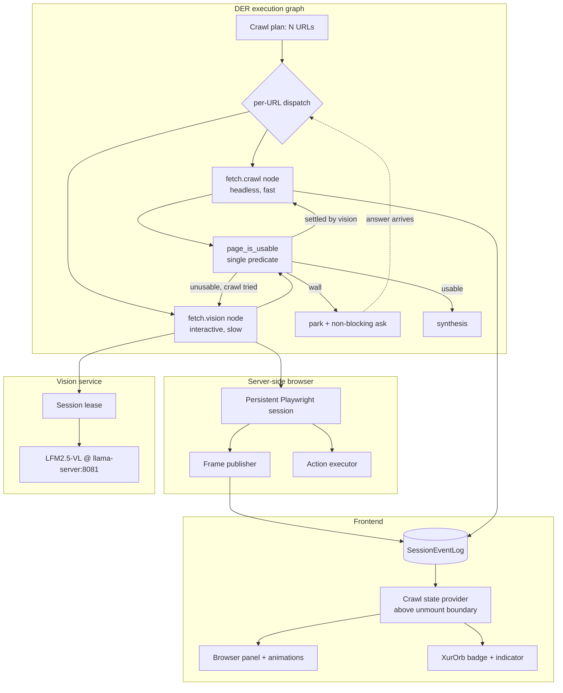

# Design: Vision-Driven Interactive Browser Websearch

## Context

This design was derived from a live failure trace, not from a blueprint. On 2026-08-09
22:00:35 a websearch for Palworld boss-tower builds fetched three URLs, retrieved zero
usable content, and answered from model knowledge while the UI displayed a research card.
Every recovery mechanism that should have fired was present in the code and inert.

Three constraints bound the design:

1. **The browser panel iframe is sandboxed without `allow-same-origin`**
   (`backend/api/browser_surface.py`). Its opaque origin means the parent page cannot read
   its DOM or pixels. This is deliberate and load-bearing — the CSP comments record that
   each directive was verified in a real browser and lists what broke when they were
   "tightened". Therefore vision cannot look at the rendered iframe, and the real browser
   must live server-side with the iframe as a mirror.
2. **This codebase reliably builds mechanisms and reliably fails to connect them.** The
   investigation found thirteen instances of declared-never-wired code, four of them
   directly in this feature's path (`rerank` re-query, `_STEALTH_EXTRA_HEADERS`,
   `fuzzy_match_answer`, `useCrawl`). Every one had passing tests, because each tested the
   mechanism in isolation. The testing strategy below is shaped around that failure mode:
   **contract tests that assert a mechanism has a caller**, not merely that it works.
3. **The existing animation surface is a product requirement, not decoration.** No visual
   redesign; new signal rides on existing event types and existing components.

## Architecture Overview



The two arrows that do not exist today and define this feature: `JUDGE → VISION`
(escalation) and `JUDGE → CRAWL` after vision settles a page (reversal). Both are edges in
the DER graph, evaluated by one predicate, which is why REQ-1 must land first.

## Sequence / Data Flow

```mermaid
sequenceDiagram
    participant U as User
    participant K as AgentKernel (DER)
    participant O as CrawlOrchestrator
    participant C as fetch.crawl
    participant V as fetch.vision
    participant B as Browser session
    participant L as SessionEventLog
    participant F as Frontend

    U->>K: "websearch ..."
    K->>O: research(query)
    O->>C: fetch(url A, B, C) concurrently
    C-->>O: pages + usability verdicts
    Note over O: page_is_usable — one predicate
    alt all unusable
        O->>O: broaden query, retry once (REQ-2)
    end
    alt still unusable
        O->>V: escalate url A (REQ-6)
        V->>V: acquire vision lease (REQ-8)
        V->>B: open session, navigate
        loop bounded actions
            B-->>V: frame
            V->>L: CRAWLER_VISION_ACTION
            V->>B: scroll / click / dismiss
        end
        alt page settled
            V->>C: hand settled DOM back (REQ-6 AC5)
            C-->>O: usable page
        else wall (CAPTCHA / login)
            V->>K: park source + non-blocking ask (REQ-13)
            Note over K: run continues, never waits
        end
        V->>V: release lease
    end
    O->>L: per-URL outcomes + reasons
    L-->>F: replay / live events
    F->>F: panel animates; orb shows progress
    O-->>K: result + honest success flag (REQ-15)
    K-->>U: answer, sourced or explicitly unsourced
```

Parked-source resumption runs off the main sequence: an answer arriving by card click or
by voice re-enters at `DISPATCH` for that URL alone.

## Data Models

```python
# backend/crawler/usability.py  (NEW — the single source of truth, REQ-1)
class UsabilityReason(str, Enum):
    OK              = "ok"
    EMPTY           = "empty"          # no markdown at all
    TOO_SHORT       = "too_short"      # below MIN_CONTENT_CHARS
    CHALLENGE       = "challenge"      # bot interstitial (REQ-4)
    TRANSPORT_ERROR = "transport_error"

@dataclass(frozen=True)
class UsabilityVerdict:
    usable: bool
    reason: UsabilityReason
    detail: str = ""          # e.g. "status=403", "markdown len=0"

def page_is_usable(page: PageData) -> UsabilityVerdict: ...


# backend/crawler/capabilities.py  (NEW — REQ-6)
class FetchCapability(Protocol):
    name: str                                  # "fetch.crawl" | "fetch.vision"
    async def available(self) -> bool: ...
    async def fetch_one(self, url: str, goal: str, job_id: str) -> "FetchOutcome": ...

@dataclass
class FetchOutcome:
    url: str
    capability: str
    page: Optional[PageData]
    verdict: UsabilityVerdict
    settled_dom: Optional[str] = None   # vision hands this to crawl (REQ-6 AC5)
    wall: Optional["WallKind"] = None   # CAPTCHA | LOGIN | PAYWALL | UNKNOWN
    actions_taken: int = 0
    duration_ms: int = 0


# backend/vision/browser_session.py  (NEW — REQ-7)
@dataclass
class VisionAction:
    kind: Literal["navigate","reload","back","forward","scroll","click","type","wait"]
    target: Optional[str] = None       # selector or NL description for click/type
    value: Optional[str] = None
    reason: str = ""                   # model's stated justification, for REQ-16

@dataclass
class SessionBounds:
    max_actions: int = 12
    max_wall_ms: int = 60_000
    max_extractions: int = 8          # REQ-17 AC8


# backend/vision/frame_extraction.py  (NEW — REQ-17)
class ContentOrigin(str, Enum):
    CRAWL       = "crawl"       # DOM-derived markdown
    VISION      = "vision"      # VLM-derived from a rendered frame
    RECONCILED  = "reconciled"  # both agreed / merged

@dataclass
class FrameExtraction:
    scroll_top: int
    text: str
    triage_verdict: Literal["new_content", "no_new_content", "challenge"]
    extraction_ms: int

@dataclass
class EvidenceRecord:                 # one per URL, REQ-17 AC3/AC4
    url: str
    origin: ContentOrigin
    crawl_text: Optional[str]
    vision_text: Optional[str]
    merged_text: str
    disagreement: Optional[str] = None   # REQ-17 AC5 — the diagnostic signal
    frames: list[FrameExtraction] = field(default_factory=list)


# backend/agent/tools/ask_user_tool.py  (EXTENDED — REQ-13)
@dataclass
class ParkedSource:
    url: str
    question_id: str
    wall: WallKind
    run_id: str
    raised_at: float
```

Event payloads reuse existing crawl event types. Two new ones are added to the same
channel so the panel needs no new transport:

| Event | Payload | Consumer |
|---|---|---|
| `crawler_vision_action` | `{job_id, url, kind, reason, action_index, total}` | panel annotation (REQ-11 AC4) |
| `crawler_source_parked` | `{job_id, url, wall, question_id}` | panel + orb badge |

## Key Decisions

**D1 — Server-side Playwright, iframe mirrors it.** Rejected extending `view_agent`'s
postMessage protocol to drive the existing iframe. The sandbox has no `allow-same-origin`,
so vision cannot see the frame and the backend cannot capture it. Driving the user's own
browser would give excellent bot resistance (real profile, real cookies) but blinds the
vision model, which contradicts the core requirement. Server-side also delivers REQ-12 for
free: the work is not in the UI, so unmounting the UI cannot stop it.

**D2 — One predicate, three call sites.** The three-way disagreement between
`crawl_runner.py:347`, `orchestrator.py:204`, and `rerank.py:141` is the root cause of
both silent-failure defects. Introducing a fourth judgement would repeat the mistake.
`page_is_usable` is the only judge, and REQ-1 is a hard prerequisite for REQ-2, REQ-3, and
REQ-6.

**D3 — Escalation, not replacement.** Vision costs a browser launch plus model latency on
every page. Making it the default would tax every cheap query to fix a minority of hard
ones. The trigger is the same signal the broken gates were supposed to produce, which
means fixing them is a prerequisite rather than parallel work.

**D4 — Capabilities as DER node types, not a bespoke state machine.** Reuses existing
node records and edges (`_der_finalize_step`) so traversal, evidence, and coordinate
stamping stay in one system. A second execution model beside DER would be a second thing
to keep honest.

**D5 — Non-blocking ask.** `wait_for_answer` blocks for 120s. Rather than converting the
DER loop to suspend/resume — the control-flow change `pin_1bb97f28e137` and pin V5
deliberately deferred inside a 12,291-line file — parking is modelled as data. Nothing
suspends, so nothing needs to resume. This is a materially smaller change with the same
user-visible behaviour.

**D6 — Vision resolves walls by asking, never by defeating.** CAPTCHA solving and
credential entry are out of scope by design, not by omission. The park-and-ask path is the
sanctioned resolution.

**D8 — Triage before extraction.** Running a full VLM extraction on every scroll frame
would be the dominant cost of the feature. `describe_live_frame` is documented as a fast
single-sentence call and is used as the triage tier: it answers "is there new content
here?" for pennies, and only frames that pass get `read_text` / `analyze_screen`. This is
what makes REQ-17 AC7 affordable — vision extraction can run opportunistically on a page
whose crawl looked nominally usable but suspiciously thin, without taxing every query.

**D9 — Reconcile, never overwrite.** Where crawl and vision both produce content for a
URL, both are kept on the `EvidenceRecord` and a merged view is derived. The disagreement
field is the point: crawl-has-text-but-vision-sees-a-challenge and
vision-has-text-but-crawl-empty are opposite diagnoses that would be erased by picking a
winner. This is also the guard against OCR noise silently entering evidence as fact.

**D10 — Vision joins the persistence spine; it does not fork it.** HAR feeds
`SourceRegistry.penalize_url`, the document store carries trust and provenance for
rehydration, and pacman fragments into trust-zoned memory. A second content path that
skipped them would silently degrade source scoring and memory. Vision-derived content
therefore writes through the *same* `_store_document_data` and pacman paths, carrying
`ContentOrigin` so trust scoring can tell it apart — and never at a higher trust than
equivalent crawled web content.

**D7 — Crawl state moves above the unmount boundary; `useCrawl` becomes its home.**
Rather than write new state management, adopt the already-written, already-tested hook
that has no consumers, hoist it into a provider above the panel, and delete the duplicated
inline listeners from `dark-glass-dashboard.tsx`. This converts dead code into the fix.

## Ripple-Effect Map

| Area / File | Change? | Classification | Why / Evidence |
|---|---|---|---|
| `backend/crawler/usability.py` | Yes | CHANGE NEEDED | NEW module; the single predicate (REQ-1). |
| `backend/crawler/crawl_runner.py:347` | Yes | CHANGE NEEDED | Replace local `if p.markdown` with `page_is_usable`. Correct today but must not remain a second judge. |
| `backend/crawler/crawl_runner.py:453,515` | Yes | CHANGE NEEDED | `_is_challenge_page` must be reachable from the primary path, not only the fallback (REQ-4). |
| `backend/crawler/crawler_engine.py` | Yes | CHANGE NEEDED | Add challenge detection (currently `grep -c challenge` = 0); apply `_STEALTH_EXTRA_HEADERS` defined at `:50` but deliberately unused per `:48`; cookie jar + jitter (REQ-5). |
| `backend/crawler/orchestrator.py:204-205` | Yes | CHANGE NEEDED | Retry gate must read `page_is_usable` (REQ-2). This single line is why retry has fired 0 times. |
| `backend/crawler/orchestrator.py:250-263` | Yes | CHANGE NEEDED | Act on rerank's re-query state instead of falling through to `extract_and_cite` at `:257` (REQ-3). |
| `backend/crawler/rerank.py:141-146` | Yes | CHANGE NEEDED | Return a distinguishable state rather than a bare `[]` whose meaning is carried only in a comment. |
| `backend/crawler/capabilities.py` | Yes | CHANGE NEEDED | NEW; the two fetch nodes (REQ-6). |
| `backend/vision/browser_session.py` | Yes | CHANGE NEEDED | NEW; persistent Playwright session + action executor + frame publisher (REQ-7, REQ-11). |
| `backend/tools/lfm_vl_provider.py:41,99-107,221-296` | Yes | CHANGE NEEDED | Add counted lease with hard expiry (REQ-8). Auto-start, PID-tracked stop, and idle callback already correct — do not rewrite them. |
| `backend/tools/lfm_vl_provider.py:298` | No | NO CHANGE (verified) | `screenshot_to_bytes` stays desktop-scoped for its existing non-websearch callers; websearch gets a separate browser-frame path (REQ-9 AC4). |
| `backend/crawler/capture_store.py:53-112` | No | NO CHANGE (verified) | `save`/`load`/`has` already provide exactly what frame publication needs; the mirror reuses it (REQ-11 AC2). |
| `backend/api/browser_surface.py` | No | CONTRACT LOCK | CSP and sandbox directives are load-bearing and documented as verified-in-browser. Pin with CT-6 so a future edit cannot re-tighten `frame-ancestors`, `base-uri`, or `script-src`. |
| `backend/proxy/view_agent.py` | No | CONTRACT LOCK | Protocol stays at 2 commands. D1 rejects extending it. CT-7 pins the message shapes. |
| `backend/crawler/event_log.py:63-96` | No | NO CHANGE (verified) | `append`/`replay(after_seq)`/`snapshot`/`sync_required` already implement REQ-12 AC3 and AC6 server-side. Only the client side is missing. |
| `backend/crawler/robots_checker.py` | No | CONTRACT LOCK | REQ-5 AC3 forbids weakening it. CT-8 asserts a disallowed URL is still refused after stealth changes. |
| `backend/agent/tools/ask_user_tool.py:67,105,148-171` | Yes | CHANGE NEEDED | Add non-blocking mode + parked-source registry (REQ-13). `ask()` at `:67` already returns immediately — build on it; leave `wait_for_answer` intact for existing callers (REQ-13 AC5). |
| `backend/agent/tools/ask_user_tool.py:183` | Yes | CHANGE NEEDED | `fuzzy_match_answer` needs its first production caller (REQ-14). Implementation is correct and tested — wire it, do not rewrite it. |
| `backend/agent/tool_bridge.py:939-965` | Yes | CHANGE NEEDED | Route to non-blocking mode for the park path; preserve blocking mode elsewhere. |
| `backend/agent/tool_decision.py` (TOOL_DISPATCH) | Yes | CHANGE NEEDED | `success=True error_type=permanent` on a zero-content crawl must become impossible (REQ-15 AC1/AC2). |
| `backend/iris_gateway.py:5035-5045` | Yes | CHANGE NEEDED | `question_response` stays; add the STT resolution path alongside it (REQ-14). Both must funnel to one resolution point so first-wins holds (REQ-14 AC5). |
| `backend/agent/agent_kernel.py` (DER synthesis) | Yes | CHANGE NEEDED | Honest unsourced-answer wording (REQ-15 AC3). Keep the T36 web-mode gate and `_empty_der_fallback_message` behaviour from `pin_cd839f4b2a97` — extend, do not replace. |
| `hooks/useCrawl.ts` | Yes | CHANGE NEEDED | Dead code with zero consumers; becomes the crawl-state home and gains `crawler_progress` / `crawler_phase` / `crawler_vision_action` listeners (REQ-11 AC4, REQ-12 AC2). |
| `hooks/useCrawlSSE.ts:19` | No | NO CHANGE (verified) | Already emits the same CustomEvents as the WS path, so hoisting `useCrawl` inherits the fallback unchanged. |
| `components/dark-glass-dashboard.tsx:628,797,1026-1029` | Yes | CHANGE NEEDED | Remove duplicated inline crawl listeners; consume the hoisted provider. Visual layer untouched (REQ-11 AC3). |
| `hooks/useIRISWebSocket.ts:1245-1298` | Yes | CHANGE NEEDED | Add dispatch for the two new event types. Existing `crawler_*` dispatches are correct and stay. |
| `components/iris/XurOrb.tsx:81-82,141-148,479-493` | No | NO CHANGE (verified) | Already consumes `useTaskProgress` + `useAgentQuestion` and renders `OrbWorkingIndicator` + `OrbBadge` with a `question` variant. REQ-12 AC4 is satisfied by feeding those existing hooks. |
| `hooks/useAgentQuestion.ts:23-32` | No | NO CHANGE (verified) | Listens for `iris:question_*` and exposes `hasPendingQuestion`. A voice-resolved question emits the same events (REQ-14 AC3), so the orb badge clears with no frontend change. |
| `components/chat/QuestionCard.tsx` | No | NO CHANGE (verified) | Card rendering and click-to-answer are unchanged; non-blocking mode changes only what the backend does after raising it. |
| Audio / STT pipeline | Yes | CHANGE NEEDED | Needs pending-question awareness before routing a transcript to the command path (REQ-14 AC1, AC6). |
| `backend/vision/frame_extraction.py` | Yes | CHANGE NEEDED | NEW; triage + extract + reconcile (REQ-17). |
| `backend/tools/vision_mcp_server.py:5-11` | No | NO CHANGE (verified) | `read_text`, `analyze_screen`, `describe_live_frame` already provide the extraction and triage tiers REQ-17 needs. Call them; do not add new vision tools. |
| `backend/crawler/orchestrator.py:451-470` | Yes | CHANGE NEEDED | `_apply_har_penalties` logic is correct and stays; vision-session requests must contribute HAR entries so it scores those domains too (REQ-18 AC1). |
| `backend/crawler/orchestrator.py:271-272` | Yes | CHANGE NEEDED | `citation_index = {p.chunk_id: p.url}` must cover vision-derived passages so they stay attributable (REQ-18 AC4). |
| `backend/agent/document_store.py:29` | No | CONTRACT LOCK | Schema unchanged — `trust` and provenance columns already carry what REQ-18 AC2 needs. CT-10 pins that vision content is stored with a trust value no higher than crawled web content. |
| `backend/agent/agent_kernel.py:3398 _store_document_data` | Yes | CHANGE NEEDED | Accepts vision-derived documents carrying `ContentOrigin`; existing `source_document_id` / `sources` / `har_path` persistence at `:3476-3527` unchanged. |
| `backend/agent/mcm_protocol/actions/pacman_fragment.py` | Yes | CHANGE NEEDED | Fragment vision content with a trust zone consistent with provenance; reuse the REQ-22 untrusted-web scoring already forwarded at `agent_kernel.py:10039` (REQ-18 AC3). |
| `backend/crawler/source_registry.py` | No | NO CHANGE (verified) | `penalize_url` already consumes HAR-derived outcomes; vision domains reach it via AC1 with no new report method — matching the "no new report method is invented" note at `orchestrator.py:454-456`. |

## Error Handling

| Failure | Response |
|---|---|
| Vision server will not start | IF the vision server cannot start THEN THE SYSTEM SHALL mark `fetch.vision` unavailable and complete the run with `fetch.crawl` alone. |
| Playwright session crashes mid-action | IF the session dies THEN THE SYSTEM SHALL record the URL unusable with `transport_error`, release the lease, and continue other URLs. |
| Lease leaked by a crashed holder | Leases carry a hard expiry; the watchdog reclaims them and resumes normal idle-stop. |
| Frame publication fails | Best-effort. IF publication fails THEN THE SYSTEM SHALL continue the session and let the panel show its existing "capture unavailable" state. |
| Event-log eviction before replay | IF events were evicted THEN THE SYSTEM SHALL emit `crawler_sync_required` and the client SHALL take a full snapshot instead of trusting partial replay. |
| Answer arrives after run completion | Discard, log with resolution source `run-ended`. Never resurrect a finished run. |
| Voice answer below match threshold | Leave pending, ask the user to repeat, and let the transcript fall through to the normal command path. |
| Both raced capabilities win | Prefer the crawl result; log that the race was unnecessary. |
| Logging failure | Never propagates. Instrumentation is off the critical path (REQ-16 AC7). |

## Testing Strategy

Organised per the project standard. The decisive addition for this codebase is the
**wiring assertion**: four of this feature's modules were fully implemented, unit-tested,
and had no callers. A test that a function works is not evidence that it runs.

```
tests/unit/         pure logic only
tests/contract/     boundary pins, including caller-existence pins
tests/behavioral/   full-loop drives against the real orchestrator
scripts/validate_websearch_trajectory.py    standing CDD harness
```

**Contract tests (CT):**

| ID | Pins |
|---|---|
| CT-1 | `page_is_usable` is the only usability judge — no layer computes its own verdict. Asserts by call-graph, so a reintroduced local predicate fails the build. |
| CT-2 | Rerank's re-query state is consumed by the orchestrator; asserts `extract_and_cite` is never reached with an empty passage set. |
| CT-3 | `crawler_vision_action` / `crawler_source_parked` event shapes, backend emit → frontend dispatch. |
| CT-4 | Card-click and voice resolution funnel to one resolution point; first-wins. |
| CT-5 | A zero-usable-content research call cannot produce `success=True`. |
| CT-6 | `browser_surface` CSP directives (`frame-ancestors`, `base-uri`, `script-src` nonce) unchanged — extends the existing `test_browser_surface_headers.py`. |
| CT-7 | `view_agent` postMessage protocol remains exactly 2 in / 2 out commands. |
| CT-8 | A robots.txt-disallowed URL is still refused after stealth changes. |
| CT-9 | **Caller-existence pins** for `fuzzy_match_answer`, the rerank re-query state, `_STEALTH_EXTRA_HEADERS`, and `useCrawl` — each must have at least one production caller. This is the direct guard against the 13-instance pattern. |
| CT-10 | Vision-derived content is stored with a trust value no higher than equivalent crawled web content, and carries `ContentOrigin` provenance (REQ-18 AC2/AC3). |
| CT-11 | Vision-visited domains produce HAR entries reaching `SourceRegistry.penalize_url`, and every vision-derived passage has a `chunk_id → url` citation entry (REQ-18 AC1/AC4). |

**Behavioral tests (BT):** drive a full websearch through the real loop and assert
emergent properties.

| ID | Asserts |
|---|---|
| BT-1 | All-URLs-dead run: broaden-and-retry fires exactly once, then escalates to vision. Regression guard for the 0-fires-in-401MB baseline. |
| BT-2 | Cloudflare-interstitial fixture on the primary path: labelled `challenge`, not extracted, not stored to the capture store. |
| BT-3 | Zero usable content: answer is explicitly unsourced in both display and speech, spoken ⊆ visible, and every attempted source is listed with its reason. |
| BT-4 | Panel unmount mid-run: run completes, orb shows progress throughout, remount restores state from the event log without re-crawling. |
| BT-5 | Wall encountered: source parked, question raised, run continues to synthesis without blocking; a later answer resumes only the parked source. |
| BT-6 | Voice answer with wake word resolves a pending card and clears the orb badge via the existing `iris:question_answered` event. |
| BT-7 | Vision settles a page and hands the DOM back to crawl; the reversal edge produces usable content. |
| BT-8 | Image-heavy page whose DOM text is near-empty: vision extraction produces usable content, it is marked `vision`-origin, and it reaches the document store and pacman with correct trust. |
| BT-9 | Crawl extracted a challenge page as "content" while vision sees the real page: the disagreement is recorded and the challenge text does not win the merge. |
| BT-10 | Triage rejects unchanged scroll frames — extraction call count stays below the frame count on a static page (guards the cost model behind D8). |

**Intertwined:** every behavioral gap decomposes into a contract test. BT-1's failure mode
is CT-1's predicate disagreement; BT-3's is CT-5; BT-6's is CT-9's caller pin. Fixtures are
shared — the Cloudflare fixture backing BT-2 is the same one CT-1 uses for the `challenge`
verdict.

**Physics-aware:** inject u/ξ trajectory states around escalation so the graph's behaviour
under oscillation is asserted at system level, consistent with the project's existing DER
tests.

**Standing CDD harness:** `scripts/validate_websearch_trajectory.py` replays the recorded
2026-08-09 Palworld trajectory — three URLs (DNS failure, 403 challenge, empty extraction)
— through the full stack on every run, and asserts the escalation fires, the answer is
honest, and the panel receives a coherent event sequence. That trajectory is the spec's
reference failure; it must never pass silently again.
