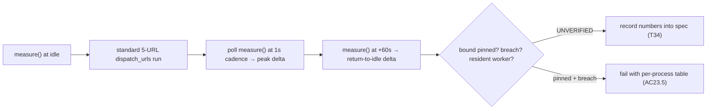

# Design: Vision Goal-Directed Search, Turn-Aware Context, DAG Batch Execution & Hybrid Fetching

## Context

Current browser automation and websearch in IRIS operate across two interconnected worlds:
1. **Curated Frontend Browser UX:**
   - `BrowserNavigationOverlay.tsx`: 3-shell epitrochoid particle engine, 76px orb, 40px particle-trail cursor, 16px panel border radius, perimeter comets (`TRAIL_FRAC = 0.18`), lap pacing calibrated to live page interval, black-and-white escalation "notice" beat (`NOTICE_SOFT_WHITE`, `NOTICE_DURATION_MS = 2600`), and hex-mesh wavefront sweep.
   - `useBrowserNavOverlay.ts`: State machine choreography (`loading` $\rightarrow$ `dispersing` $\rightarrow$ `crawling` $\rightarrow$ `complete` / `error`).
   - `VisionLifecycleChip.tsx`: Real-time VLM state chip (`cold`, `spawning`, `warm`, `error`) in the browser header.
   - `AmbientCrawlTier.tsx`: Replaced `OrbBadge` as the wing-independent working indicator, displaying `unifiedProgress` across task steps and crawl pages, swallowing the orb when wings open.
   - `CaptureStore` Address Space: Reserved capture slots (`slot_capture_offset(idx)`: offset+1 for crawl HTML, offset+2..N for vision frames) rendered into the Live Reading iframe without horizontal scrollbars.
2. **Backend Execution & Automation Mechanics:**
   - The speed-critical hybrid fetching pipeline in `backend/crawler/orchestrator.py` (`_dispatch_one`, `_race_url`, fresh-failure escalation).
   - `BrowserSession` and `fetch_vision.py` which drive headless Chromium via Playwright.

This design implements **intelligent, adaptive architecture** to integrate **8 world-class capabilities** into the existing architecture with optimal code clarity and real-time responsiveness:
1. *Hybrid Adversarial SEO & Affiliate Filtering* in `search_discovery.py`.
2. *Contextual Human-in-the-Loop Takeover* via `AskUserQuestion` for checkpoints and 2FA.
3. *Semantic Cross-Source Fact & Price Verification Gate* across independent domains in `der_loop.py`.
4. *Secure Session & Cookie Injection* via OS Keyring with HAR data sanitization.
5. *Dynamic Real-Time Multi-Angle Query Synthesis & Adaptation* in `der_loop.py`.
6. *Semantic Temporal Snapshot Diffing* comparing captures via `document_store.py` and `CaptureStore`.
7. *Native PDF & Technical Document Deep Extraction* via dedicated `FetchPDFCapability` (`fetch.pdf`).
8. *Dynamic Cost & Latency Tiering* managed by the Brain agent across Tier 0 (HTTP), Tier 1 (Local VLM), and Tier 2 (Cloud Multimodal).

---

## Architecture Overview

```mermaid
graph TB
    subgraph BRAIN["Brain Model (Model-Agnostic Director)"]
        USER_REQ["User Request / Voice Turn"] --> ROUTER["inference_router.py"]
        ROUTER --> BRAIN_MODEL{"Brain Model Capabilities"}
        BRAIN_MODEL --> DYNAMIC_QUERY["Dynamic Multi-Angle Query Synthesizer<br/>(Analyzes Intent -> 2-4 Orthogonal Facets)"]
        DYNAMIC_QUERY --> GOAL_SYNTH["Goal Synthesizer & Real-Time Reviser<br/>(Templates A–H)"]
        GOAL_SYNTH --> COST_TIERING["Dynamic Cost & Latency Router<br/>(Tier 0: HTTP / Tier 1: Local VLM / Tier 2: Cloud)"]
        COST_TIERING --> GOAL_OBJ["GoalAnatomy (7-Part Dataclass)"]
        
        %% Real-Time In-Flight Feedback Loop
        KNOWLEDGE_GAP["Identified Knowledge Gaps / Missing Fields"] -.->|Real-Time Adaptation| DYNAMIC_QUERY
    end

    subgraph DISCOVERY["Intelligent Search Discovery (search_discovery.py)"]
        GOAL_OBJ --> SERP_HARVEST["Search Engine Harvest"]
        SERP_HARVEST --> SEO_FILTER{"Hybrid Adversarial SEO Filter<br/>(Heuristic Regex + Semantic Parasite Scoring)"}
        SEO_FILTER --> RE_RANK["Dynamic Authority Re-ranker"]
    end

    subgraph DAG["DER DAG Execution Engine (der_loop.py)"]
        RE_RANK --> PLAN["ExecutionPlan (core_models.py)"]
        PLAN --> DAG_SCHED{"DAG Scheduler<br/>(Single Step vs BatchToolCall)"}
        DAG_SCHED -->|Batch Group| BATCH_POOL["Concurrent Batch Pool<br/>(asyncio.gather + Semaphore)"]
        BATCH_POOL --> CONCURRENCY_GOV["Resource & Host Governance<br/>(Global: 10, Host: 2, Local VLM: 1-2, Brain-Vis: 4)"]
        CONCURRENCY_GOV --> HOST_CB{"Host Circuit Breaker<br/>(429 / 503 backoff with jitter)"}
    end

    subgraph HYBRID_FETCH["Enhanced Hybrid URL Fetching (orchestrator.py)"]
        HOST_CB --> ROUTE_TYPE{"Target Content Type?"}
        ROUTE_TYPE -->|PDF Document| FAST_PDF["fetch.pdf (FetchPDFCapability)<br/>Fast Binary Text + Targeted Page Crops"]
        ROUTE_TYPE -->|Web Page| DISPATCH_ONE{"_dispatch_one(url, GoalAnatomy)"}
        
        DISPATCH_ONE -->|Clean Domain| CRAWL_FAST["Tier 0: fetch.crawl (headless HTTP)"]
        DISPATCH_ONE -->|Recorded History| RACE_GATE{"Tier 1 Race: _race_url()"}
        DISPATCH_ONE -->|Challenge / Empty| ESCALATE["Tier 1 Settle: fetch.vision"]
        
        RACE_GATE --> RACE_CRAWL["fetch.crawl (fast)"]
        RACE_GATE --> RACE_VISION["fetch.vision (interactive)"]
        RACE_CRAWL & RACE_VISION --> FIRST_USABLE{"First Usable Wins"}
        
        CRAWL_FAST & FIRST_USABLE & ESCALATE & FAST_PDF --> SCHEMA_EVAL{"Required Fields Satisfied?"}
        SCHEMA_EVAL -->|Yes| EARLY_TERM["Cancel Remaining Racers / URLs"]
        SCHEMA_EVAL -->|Partial Gap| KNOWLEDGE_GAP
        SCHEMA_EVAL -->|No| NEXT_PAGE["Fetch Next Page"]
    end

    subgraph RESILIENT_SESSION["Resilient Machine-Speed Session (browser_session.py)"]
        RACE_VISION & ESCALATE --> KEYRING_INJECT["Secure Cookie Injection<br/>(OS Keyring via keyring module)"]
        KEYRING_INJECT --> BS_OPEN["BrowserSession.open() (Pooled Chromium)"]
        BS_OPEN --> POPUP_WATCH["context.on('page') (Auto-Adopt Popups / Tabs)"]
        POPUP_WATCH --> SCREENSHOT["Targeted Viewport Screenshot<br/>(GoalAnatomy.target element crop)"]
        SCREENSHOT --> SUGGEST["suggest_action() (Local VLM or Brain)"]
        SUGGEST --> TG{"TaskGuardrails Check<br/>(NO_PURCHASE, DOMAIN_BOUND)"}
        
        TG -->|Unsolvable Wall / 2FA| USER_TAKEOVER["AskUserQuestion(kind='browser_takeover')<br/>Contextual Guidance + Panel Unlock"]
        USER_TAKEOVER -->|User Solves & Clicks Done| RESUME_SESSION["Verify Settle & Resume Automation"]
        
        TG -->|Safe| PRE_ACTION["Action Execution:"]
        PRE_ACTION --> OVERLAY_CHECK{"Click Intercepted?<br/>(Modal / Cookie Banner)"}
        OVERLAY_CHECK -->|Intercepted| MODAL_DISMISS["Auto-Dismiss Modal (Esc / Accept / Hide)"]
        MODAL_DISMISS --> INSTANT_ACT
        OVERLAY_CHECK -->|Clear| INSTANT_ACT["Execute at Machine Speed:<br/>- Instant Teleport: scroll_into_view_if_needed()<br/>- Instant Fill: locator.fill() in 1ms<br/>- Immediate Click: locator.click()"]
        
        INSTANT_ACT --> PUBLISH_FRAME["Publish Frame to CaptureStore<br/>(/capture/job/offset+2.html)"]
    end

    subgraph VERIFICATION_DIFF["Cross-Verification & Temporal Memory Subsystem"]
        SCHEMA_EVAL --> VERIFY_GATE{"Semantic Cross-Source Verification Gate<br/>(Reconcile bundles, currency, conditions across >= 2 domains)"}
        VERIFY_GATE --> TEMPORAL_DIFF{"Previous Snapshot in document_store?<br/>(/capture/job/ vs document_data)"}
        TEMPORAL_DIFF -->|Yes| DIFF_CALC["Compute Semantic Deltas<br/>(Price dropped, section updated, policy changed)"]
        TEMPORAL_DIFF -->|No| SAVE_CANON["Store Canonical Document Snapshot"]
        DIFF_CALC --> ATOMIC_COMMIT["Atomic Batch Commit to memory.db"]
        SAVE_CANON --> ATOMIC_COMMIT
    end

    subgraph ZERO_DELAY_SYNC["Zero-Delay Real-Time Event Pipeline (tool_bridge.py / ws_gateway)"]
        HYBRID_FETCH & INSTANT_ACT & PUBLISH_FRAME --> EV_DISPATCH{"Zero-Buffering Event Dispatcher"}
        
        %% Browser Panel Events
        EV_DISPATCH -->|iris:crawler_started| OVERLAY_START["Overlay: loading state<br/>AmbientTier: [0/N] pages"]
        EV_DISPATCH -->|iris:crawler_page_fetched| OVERLAY_PAGE["Overlay: dispersing -> crawling<br/>AmbientTier: progress ring"]
        EV_DISPATCH -->|iris:crawler_vision_action| OVERLAY_ACT["Overlay: 40px Saccadic Cursor (x, y)<br/>Live Iframe: Mirror scroll_y (px)<br/>Notice Beat: if escalated=True"]
        EV_DISPATCH -->|iris:vision_status| CHIP["VisionLifecycleChip: warm / spawning"]
        EV_DISPATCH -->|iris:crawler_complete| OVERLAY_DONE["Overlay: complete ring & fade<br/>AmbientTier: settle"]

        %% Chat & Progress Events
        EV_DISPATCH -->|iris:task_update| MODULE_STORE["hooks/useTaskProgress.ts<br/>(Module-Level Card Store)"]
        MODULE_STORE -->|Personal Mode| LIQUID_INK["TaskListCard.tsx<br/>(Liquid Ink, Rotating Verbs, Subtitle URL)"]
        MODULE_STORE -->|Developer Mode| CLI_MATRIX["terminalScrollback.ts<br/>(Blueprint Matrix & Goal Inspector)"]
    end
```



---

## Detailed Component Specifications (Intelligent, Adaptive & Real-Time)

### 1. Dynamic Real-Time Multi-Angle Query Synthesis & Adaptation
- **Module:** `backend/agent/der_loop.py` and `backend/crawler/crawl_planner.py`
- **Dynamic Reasoning (Not Static Templates):**
  - The Brain agent analyzes the specific user intent, domain requirements, and temporal constraints to synthesize 2–4 orthogonal query facets dynamically:
    - *Example (Hardware Query):* `"RTX 5090 launch MSRP official retail"`, `"RTX 5090 4K gaming benchmarks TechPowerUp"`, `"RTX 5090 12V-2x6 power connector issues overheating"`
    - *Example (Legal / Policy Query):* `"California SB 1047 AI bill text official legislature"`, `"SB 1047 amendments compliance requirements"`, `"industry opposition criticism open source SB 1047"`
- **In-Flight Adaptation Feedback Loop:**
  - As URLs are fetched and parsed into `StepFindingsAccumulator`, the accumulator tracks missing or low-confidence schema fields (e.g. `price` found, but `benchmarks` missing).
  - The Brain agent evaluates the partial findings: if a critical knowledge gap remains, it synthesizes targeted follow-up queries in real time and enqueues them into the DAG without restarting execution!

### 2. Hybrid Adversarial SEO & Affiliate Trap Filtering
- **Module:** `backend/vision/search_discovery.py`
- **Two-Tier Architecture:**
  - *Tier A (Fast Heuristic Rejection):* Drops candidate URLs matching affiliate tracking params (`aff_id`, `tag`, `click_id`, `ref`, `subid`, `afftrack`), redirect paths (`/out.php`, `/go/`), or spam TLDs.
  - *Tier B (Semantic Relevancy & Parasite Detection):* Analyzes title and SERP snippet keyword distribution. Rejects doorway pages, AI content mills, and parasite SEO (e.g. Forbes Advisor hosting VPN reviews) by evaluating content-to-keyword density and domain reputation.

### 3. Contextual Human-in-the-Loop Takeover (`AskUserQuestion`)
- **Module:** `backend/agent/tools/ask_user_tool.py` and `backend/vision/browser_session.py`
- **Data Model:**
  ```python
  @dataclass
  class Question:
      # existing fields preserved...
      kind: str = "choice"  # "choice" | "browser_takeover"
      takeover_url: Optional[str] = None
      reason: Optional[str] = None
  ```
- **Lifecycle Flow:**
  1. `BrowserSession` hits an unresolvable 2FA, SMS code, or captcha wall.
  2. Brain agent inspects the page state and generates a contextual explanation: *"Cloudflare Turnstile challenge detected on [Site Name]. Please solve it in the browser panel."*
  3. Dispatches `ask_user_tool.ask(Question(kind="browser_takeover", takeover_url=self._page.url, reason=reason, timeout_seconds=180))`.
  4. Dispatches `iris:browser_takeover_requested`.
  5. `BrowserNavigationOverlay.tsx` sets `pointer-events: auto` on the browser container.
  6. `QuestionCard.tsx` renders the contextual reason and button *"I've Completed It"*.
  7. On click, `submit_answer(question_id, "completed")` resolves the question.
  8. `BrowserSession` re-arms `pointer-events: none` on the overlay, evaluates whether the challenge is resolved, captures the new frame, and resumes automation.

### 4. Semantic Cross-Source Fact & Price Verification Gate
- **Module:** `backend/agent/der_loop.py` (`StepFindingsAccumulator`)
- **Semantic Reconciliation:**
  - Goes beyond naive character matching:
    - Normalizes currencies using standard exchange rates.
    - Context-aware condition reconciliation: accounts for product condition (New vs Refurbished) and package types (Standalone MSRP vs Bundles).
  - Verification: Requires corroboration across $\ge 2$ independent authoritative domains.
  - If a discrepancy is genuine (e.g. Official Store: \$1,999 vs Third-Party Scalper: \$2,499), records both claims with source citations and notes the spread in the task card.

### 5. Semantic Temporal Snapshot Diffing via `document_store.py`
- **Module:** `backend/agent/document_store.py` and `components/chat/TaskListCard.tsx`
- **Semantic Delta Analysis:**
  - Retrieves previous snapshot text and schema from `document_data`.
  - Compares the current extracted schema against the past snapshot to generate natural-language delta statements:
    - *"Price decreased by $200 (10% drop)"*
    - *"Availability changed: In Stock $\rightarrow$ Pre-order Only"*
    - *"Warranty policy updated from 1 Year to 2 Years"*
  - Renders visual temporal change pills in `TaskListCard.tsx`.

### 6. Secure Session & Cookie Injection via OS Keyring
- **Module:** `backend/vision/browser_session.py` and `backend/crawler/crawl_runner.py`
- **Keyring Storage:**
  - Service: `"iris_voice_sessions"`
  - Key: `netloc` (e.g. `"github.com"`)
  - Value: Encrypted JSON-serialized cookie list.
- **Injection:** Injected into Playwright context via `await self._context.add_cookies(cookies)` prior to page load.
- **HAR & Log Sanitization:** In `_write_har_file()`, redacts headers matching `(?i)^(cookie|set-cookie|authorization|x-auth-token)$` to `"[REDACTED]"`.

### 7. Native PDF & Technical Document Deep Extraction (`fetch.pdf`)
- **Module:** `backend/crawler/capabilities.py`
- **Interface:** Implements `FetchCapability` Protocol:
  - When URL ends in `.pdf` or returns `application/pdf`, routes to `FetchPDFCapability`.
  - Uses `fitz` (PyMuPDF) to extract layout-aware text and tables in $< 1.5$ seconds for up to 100 pages with zero browser memory overhead.
  - Targeted page rendering: If visual inspection of a specific diagram/chart is required, renders *only that page* as a high-res PNG for the VLM.

### 8. Dynamic Cost & Latency Tiering (Brain-Managed Routing)
- **Module:** `backend/inference_router.py`
- **Tiering Policy:**
  - **Tier 0 (Fastest / Free, ~100ms):** Headless HTTP parse (`fetch.crawl`) handles clean informational pages.
  - **Tier 1 (Local VLM, ~400ms):** `LFM2.5-VL` handles interactive bot-settling, micro-clicks, and form navigation.
  - **Tier 2 (Cloud Multimodal, ~1.5s):** Cloud Brain model invoked *only* for high-ambiguity visual reasoning or complex multi-page synthesis.
  - Slashes cloud multimodal token costs by up to 80% while maximizing execution speed.

### 9. Websearch System-Memory Baseline (REQ-23, additive — no change to sections 1–8)
- **Why:** A live report says websearch spikes system memory; the suspected source (crawl workers) is unproven. Per the spec skill's Measurement rule, no numeric bound is written from assumption — T34 measures first, T35 attributes, T36 pins the bound. Target direction (locked 2026-09-06): little-to-no sustained spike, return to near-idle.
- **Live outcome (2026-09-06, recorded — bound PINNED, see AC23.3):** 5 clean URLs x2, 5/5 usable, ~3s/iter. IRIS backend +0.0MB peak/return (no resident `crawl_worker --serve` before/after — AC23.4 holds; crawl-worker suspicion EXONERATED for the resident case). Driver +292MB first-touch import commit, ~0MB incremental per repeat. T35 classification: (a) orchestrator semaphore/race — NO CHANGE verified (`orchestrator.py:869, 1496-1500`, ceiling `:81`); (b) browser_pool 180s shutdown — CANNOT VERIFY contribution (Tier-1 run launched no browser; code present `browser_pool.py:55`); (c) capture_store — BY DESIGN exonerated (file-backed, bounded `capture_store.py:79-80`); (d) accumulator/screenshots — CANNOT VERIFY via this run (vision path unexercised; REQ-8 bounds are token memory anyway). REAL GAP (import-time, follow-up spec material): first touch of `backend.crawler.capabilities` → `backend.agent.tool_registry` commits ~+315MB private per fresh process — free in the long-lived backend (paid at boot), paid PER SEARCH by one-shot `crawl_worker` processes. Out-of-scope observation: backend idle sits at 3.74GB (over the 2.5GB idle gate) — tts_worker 2.28GB resident + main 1.46GB + llama-server ~345MB RSS; belongs to the memory-optimization spec, not this one.
- **Module:** `backend/scripts/benchmark_websearch_memory.py` (NEW) reusing `scripts/measure_memory.py:67-84` (`measure()` — psutil Private Bytes on win32, RSS fallback; `_IRIS_MARKERS` already covers `crawl_worker` + `browser_pool`).
- **Standard run:** 5 URLs through `CrawlOrchestrator.dispatch_urls` at default `CRAWL_CONCURRENCY=3` (`backend/crawler/orchestrator.py:61`), including ≥1 clean-domain fetch; the harness logs which URLs raced and which capability won (loser cancelled — `orchestrator.py:1496-1500`) so race cost is visible.
- **Three-phase sampling (out-of-process, zero hot-path instrumentation):** `measure()` snapshot at idle → poll peak during the run (1s cadence) → snapshot 60s after completion (directional; full `browser_pool` 180s shutdown reported separately — `backend/vision/browser_pool.py:55`). Output: per-process table (PID, name, private MB, working-set MB) + JSON + peak-delta and return-to-idle-delta. Assertion flag (e.g. `--assert-websearch`) fails on bound breach or on a resident `crawl_worker --serve` outliving the run.
- **Diagnosis surface (T35, read-only):** four suspects enumerated with file:line — (a) orchestrator concurrency: semaphore `orchestrator.py:869`, race loser cancel `:1496-1500`, run ceiling 150s `:81`; (b) `browser_pool` lease lifetime vs 180s idle shutdown; (c) `capture_store` — file-backed, bounded 100 pages/256MB (`capture_store.py:79-80`), expected NOT to move RSS (verify, don't assume); (d) `StepFindingsAccumulator` + screenshots — REQ-8 context bounds are token memory, not RSS; viewport crops (`fetch_vision.py`) release per page (verify). Each classified REAL GAP / ALREADY FIXED / BY DESIGN with evidence; any code fix is a follow-up, not this spec.
- **Alternatives considered (Design Deliberation):**
  - *Default (chosen): psutil delta sampling via `measure()`.* Rationale: portable (win32 Private Bytes + RSS fallback already handled), zero hot-path cost, consistent with the proven idle ≤2.5GB gate precedent. Rejected nothing load-bearing.
  - *Alt A (rejected): `tracemalloc` Python allocation tracking.* Rejected: measures CPython allocations only — blind to Chromium C-level memory, Playwright subprocesses, and GPU/CUDA allocators, which are exactly the suspected contributors; also adds overhead inside the measured path.
  - *Alt B (rejected): OS perf counters / ETW per-thread CPU profiling as the primary gate.* Rejected: platform-specific complexity for a portable repo; CPU% is kept as informational context (`psutil.cpu_percent` per process in the JSON), not the pass/fail gate — RSS delta is the precise metric for a "memory bloat" claim.
- **Measurement flow:**


---

## Contract Locks (CRITICAL)

### CT-1: `CRAWLER_VISION_ACTION` Wire Shape
Dispatched by `tool_bridge.py` and consumed by `useBrowserNavOverlay.ts`:
```typescript
interface CrawlerVisionActionPayload {
  job_id: string
  url: string
  kind: "click" | "type" | "scroll" | "navigate" | "wait"
  action_index: number
  total: number
  x?: number               // normalized 0..1 fraction of viewport width
  y?: number               // normalized 0..1 fraction of viewport height
  scroll_y?: number        // absolute scroll top in px
  scroll_height?: number   // total document scroll height in px
  viewport_w?: number      // source viewport width in px
  viewport_h?: number      // source viewport height in px
  escalated?: boolean      // true if taking over from a failed crawl
}
```

### CT-2: `iris:vision_status` Wire Shape
Consumed by `VisionLifecycleChip.tsx`:
```typescript
interface VisionStatusPayload {
  status: "lifecycle"
  state: "cold" | "spawning" | "warm" | "error"
  reason?: string
}
```

### CT-3: Capture Store Reserved Slot Offsets
Guaranteed by `backend/crawler/capture_store.py:slot_capture_offset`:
- For URL index `i`:
  - `offset + 1`: Crawl HTML page (`/capture/<job>/<offset+1>.html`)
  - `offset + 2 .. N`: Vision settled frames (`/capture/<job>/<offset+2>.html`)

### CT-4: Memory-Accounting Process Markers (REQ-23)
Guaranteed by `scripts/measure_memory.py:27-36` (`_IRIS_MARKERS`) and reused by `backend/scripts/benchmark_websearch_memory.py`:
- The marker set SHALL cover `crawl_worker` and `browser_pool` (plus `uvicorn`, `parakeet`, `tts_worker`, `main.py`). If a worker is renamed or a new backend subprocess is added, the markers MUST be extended in the same change — otherwise the process silently drops out of every memory assertion (idle gate included) and bloat goes unmeasured. Pinned by `test_measure_markers_contract.py` (T36).

---

## Ripple-Effect Map (MANDATORY)

| Area / File | Change? | Classification | Why / Evidence (file:line) |
|---|---|---|---|
| `backend/vision/browser_session.py` | Yes | CHANGE NEEDED | Implement instant teleports, instant fill, modal auto-dismissal (`OverlayDismissal`), popup adoption (`context.on("page")`), secure cookie injection, and takeover pausing (`browser_session.py:462-580`). |
| `backend/crawler/orchestrator.py` | Yes | CHANGE NEEDED | Propagate `GoalAnatomy`; implement early termination; add per-host concurrency bounding (max 2 per host); wire PDF routing to `fetch.pdf` (`orchestrator.py:840-900, 1470-1530`). |
| `backend/vision/search_discovery.py` | Yes | CHANGE NEEDED | Implement Hybrid Adversarial SEO and affiliate link filtering (`search_discovery.py:172-250`). |
| `backend/agent/tools/ask_user_tool.py` | Yes | CHANGE NEEDED | Support `kind="browser_takeover"` with `takeover_url` and contextual `reason` (`ask_user_tool.py:41-60`). |
| `backend/agent/document_store.py` | Yes | CHANGE NEEDED | Implement semantic temporal snapshot comparison and delta extraction (`document_store.py:28-40`). |
| `backend/crawler/capabilities.py` | Yes | CHANGE NEEDED | Add `fetch.pdf` capability with PyMuPDF/pdfplumber fast extraction (`capabilities.py:409-450`). |
| `backend/agent/tool_bridge.py` | Yes | CHANGE NEEDED | Ensure immediate, zero-delay emission of browser overlay events (`CRAWLER_PAGE_FETCHED`, `CRAWLER_VISION_ACTION`) AND chat card events (`TASK_PROGRESS`) (`tool_bridge.py:3000-3070`). |
| `components/iris/browser/BrowserNavigationOverlay.tsx` | Yes | CHANGE NEEDED | Add saccadic cursor acceleration when actions arrive rapidly; support temporary pointer-events unlock on takeover (`BrowserNavigationOverlay.tsx:75-85`). |
| `hooks/useBrowserNavOverlay.ts` | No code | CONTRACT LOCK (CT-1) | Consumes `iris:crawler_vision_action` with `x`, `y`, `scroll_y`, `escalated` (`useBrowserNavOverlay.ts:186-238`). |
| `components/iris/browser/VisionLifecycleChip.tsx` | No code | CONTRACT LOCK (CT-2) | Renders VLM lifecycle status chip (`VisionLifecycleChip.tsx:33-47`). |
| `components/iris/AmbientCrawlTier.tsx` | No code | CONTRACT LOCK | Computes `unifiedProgress` across task steps and crawl pages (`AmbientCrawlTier.tsx:100-123`). |
| `hooks/useTaskProgress.ts` | Yes | CHANGE NEEDED | Extend `TaskStep` and `TaskCard` models with `goalSnippet`, `extractedSchema`, `batchMetrics`, and temporal diffs (`useTaskProgress.ts:17-188, 800-1150`). |
| `backend/core_models.py` | Yes | CHANGE NEEDED | Add `target_anchor`, `BatchToolCall`, `BatchOutcome`, `TemporalDelta` (`core_models.py:710-743`). |
| `backend/agent/der_loop.py` | Yes | CHANGE NEEDED | Implement Dynamic Real-Time Multi-Angle Query Synthesis & Adaptation; support `BatchToolCall` scheduling with per-host throttling; wire `StepFindingsAccumulator` with strict schema projection and semantic cross-verification gate (`der_loop.py:198-238, 546-591`). |
| `backend/memory/db.py` & `card_footprint.py` | Yes | CHANGE NEEDED | Add `batch_records` tables; implement atomic `save_batch_footprint` transaction (`memory/db.py`, `memory/card_footprint.py:37-60`). |
| `backend/scripts/benchmark_websearch_memory.py` | Yes (new) | CHANGE NEEDED | New REQ-23 harness reusing `scripts/measure_memory.py:67-84` (`measure()`); 3-phase sampling + `--assert-websearch` flag (AC23.1–23.3, AC23.5). Out-of-process sampler — touches no crawl hot path. |
| `backend/crawler/orchestrator.py` dispatch + `_race_url` | No | NO CHANGE (verified) | Concurrency already bounded: semaphore `orchestrator.py:869` (default 3, `:61`), race loser cancelled + awaited `:1496-1500`, run ceiling 150s `:81`. T35 profiles before ANY change — no code change in this spec. |
| `scripts/measure_memory.py` | No code | CONTRACT LOCK (CT-4) | `measure()` / `_IRIS_MARKERS` pattern reused by the new harness (`measure_memory.py:27-36, 67-84`); marker coverage pinned by `test_measure_markers_contract.py` so renames can't silently drop workers from accounting. |
| `backend/vision/browser_pool.py` | No | NO CHANGE (verified) | Idle auto-shutdown `IRIS_BROWSER_IDLE_TIMEOUT=180` (`browser_pool.py:55`); T35 verifies lease release vs shutdown timing read-only — no code change in this spec. |
| `backend/crawler/capture_store.py` | No | NO CHANGE (verified) | File-backed `data/captures`, bounded 100 pages / 256MB (`capture_store.py:79-80`); expected NOT to move RSS — T35 verifies rather than assumes. |

---

## Error Handling Matrix

| Fault Condition | Detection Mechanism | System Response (EARS) |
| :--- | :--- | :--- |
| **Modal / Banner Interception** | Playwright `ElementClickInterceptedError` | THE SYSTEM SHALL trigger `OverlayDismissal` (send `Escape`, click common accept/close locators, or hide backdrop) and retry click. |
| **Unsolvable Bot Wall / 2FA** | Vision loop detects persistent challenge or auth gate | THE SYSTEM SHALL emit `AskUserQuestion(kind="browser_takeover")` with contextual reason, unlock in-app browser panel, and await user completion. |
| **Popup / New Window Trigger** | `context.on("page")` event fires | THE SYSTEM SHALL adopt the new page, close the prior tab if external bounce, and publish frame to the next reserved capture slot. |
| **Host Rate Limit (429/503)** | HTTP status 429 / 503 on batch fetch | THE SYSTEM SHALL pause domain requests with $2\text{s} \pm 500\text{ms}$ exponential jitter; if persistent, mark items `rate_limited`. |
| **Rapid Action Burst** | Incoming `CRAWLER_VISION_ACTION` while cursor transit active | THE SYSTEM SHALL apply saccadic acceleration ($\le 180\text{ms}$ transit or particle burst snap) to keep cursor synchronized. |
| **Memory Saturation** | Accumulated step findings exceed 32KB | THE SYSTEM SHALL apply strict schema projection and hierarchical summarization to bound context to $\le 5\text{KB}$ per item. |
| **Knowledge Gap Detected** | Partial batch extractions leave required schema fields null | THE SYSTEM SHALL dynamically synthesize targeted follow-up queries and enqueue them into the active execution DAG without restart. |
| **PDF Document Encountered** | URL ends in `.pdf` or Content-Type is PDF | THE SYSTEM SHALL route to `fetch.pdf` for binary text extraction in $<1.5\text{s}$, bypassing browser scrolling loops. |
| **Harness finds no IRIS processes** | `measure()` returns empty (backend down) | THE SYSTEM SHALL report "no processes" and exit non-zero when an assertion flag is passed (same convention as `measure_memory.py --assert-idle`). |
| **Measured spike exceeds pinned bound** | `--assert-websearch` run over bound, or resident `crawl_worker --serve` outlives the run | THE SYSTEM SHALL fail with the per-process table (PID, name, private MB, working-set MB) identifying the dominant contributor (AC23.5 / AC23.4). |

---

## Testing Strategy

### Contract Tests
- **`CT-1` (`test_crawler_vision_action_shape_contract.py`):** Asserts `CRAWLER_VISION_ACTION` carries `x`, `y`, `scroll_y`, `scroll_height`, `viewport_w`, `viewport_h`, and `escalated`.
- **`CT-2` (`test_vision_lifecycle_chip_contract.py`):** Pins `iris:vision_status` wire shape (`cold`, `spawning`, `warm`, `error`).
- **`CT-3` (`test_capture_store_slot_offset_contract.py`):** Asserts URL slot address reservations prevent capture collisions.

### Behavioral Tests
- **`BT-1` (`test_browser_overlay_choreography_behavior.py`):** Drives hybrid crawl; asserts overlay transitions without lag.
- **`BT-2` (`test_saccadic_cursor_acceleration_behavior.py`):** Injects 5 actions in 500ms; asserts saccadic acceleration keeps cursor within 100ms of latest target.
- **`BT-3` (`test_modal_overlay_auto_dismissal_behavior.py`):** Injects intercepting cookie modal; asserts overlay dismissal clears backdrop.
- **`BT-4` (`test_popup_window_auto_adoption_behavior.py`):** Clicks link with `target="_blank"`; asserts `BrowserSession` adopts new page.
- **`BT-5` (`test_user_takeover_mode_behavior.py`):** Emits takeover request; asserts browser unlocks, waits for user resolution, and resumes.
- **`BT-6` (`test_cross_source_verification_behavior.py`):** Asserts prices verified across 2 domains are marked verified, and conflicting numbers are flagged with context notes.
- **`BT-7` (`test_temporal_snapshot_diffing_behavior.py`):** Cites past capture in `document_store`; asserts semantic price and availability changes are detected and highlighted.
- **`BT-8` (`test_native_pdf_extraction_behavior.py`):** Fetches PDF URL; asserts `fetch.pdf` extracts full text in $<1.5\text{s}$.
- **`BT-9` (`test_adversarial_seo_filtering_behavior.py`):** Injects search results with affiliate tags and content farms; asserts spam links are filtered out.
- **`BT-10` (`test_dynamic_query_adaptation_behavior.py`):** Injects partial batch findings with missing fields; asserts Brain dynamically synthesizes targeted follow-up queries into the active DAG.
- **`CT-4` (`test_measure_markers_contract.py`, T36):** Asserts `measure_memory._IRIS_MARKERS` covers `crawl_worker` and `browser_pool` (plus `uvicorn`, `parakeet`, `tts_worker`, `main.py`) so the REQ-23 harness and the idle gate can never silently lose a worker to a rename.

### Behavioral Tests (REQ-23)
- **`BT-11` (`test_websearch_memory_baseline_behavior.py`, T36):** Runs the REQ-23 harness against the standardized 5-URL run (fakes where the backend is down); asserts per-process table + JSON output, non-zero exit on bound breach, and failure when a resident crawl worker outlives the run. The numeric bound itself stays UNVERIFIED until T34 live measurement pins it — the test asserts harness behavior, not the number.
