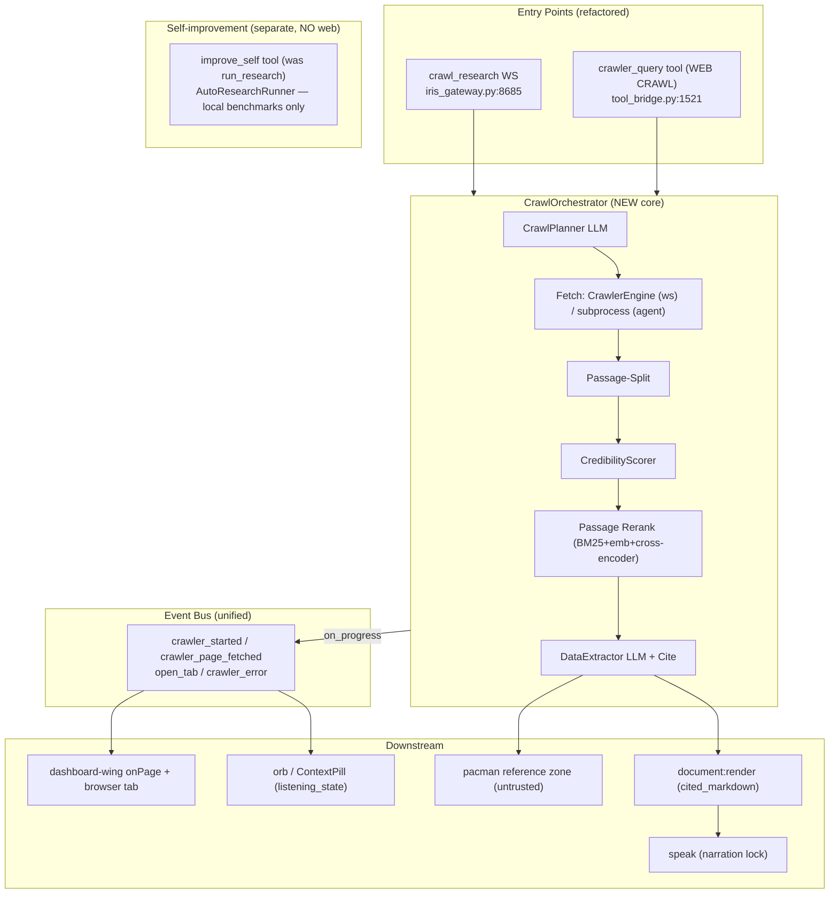
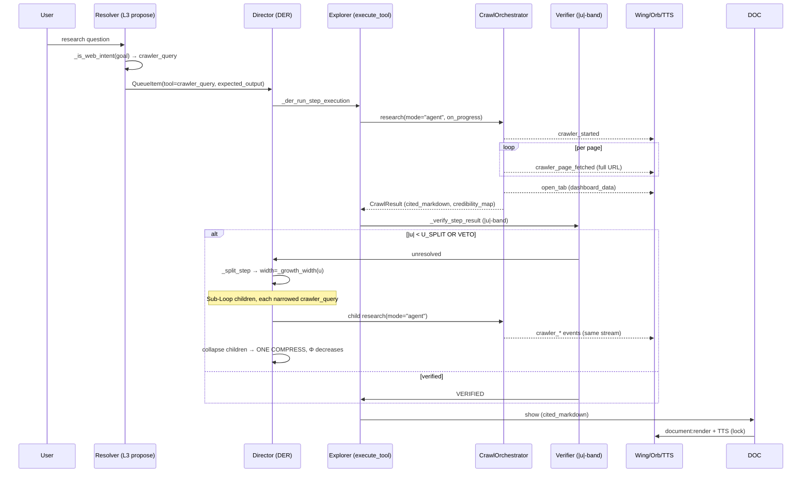
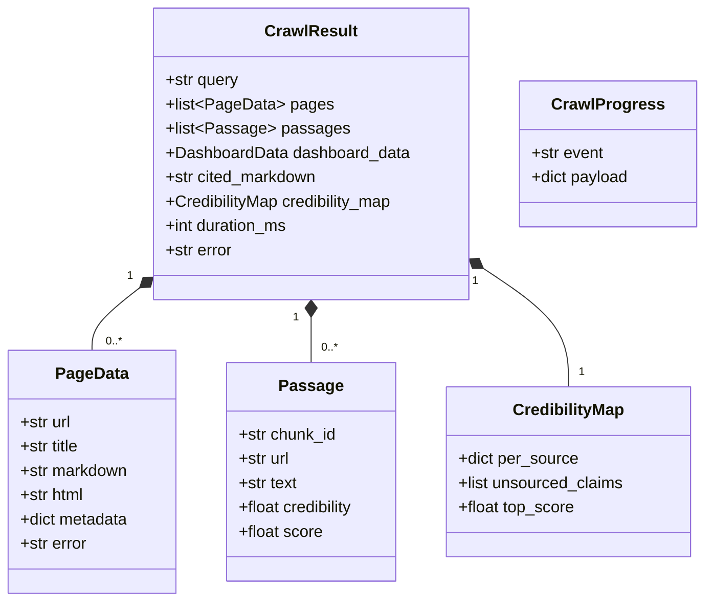
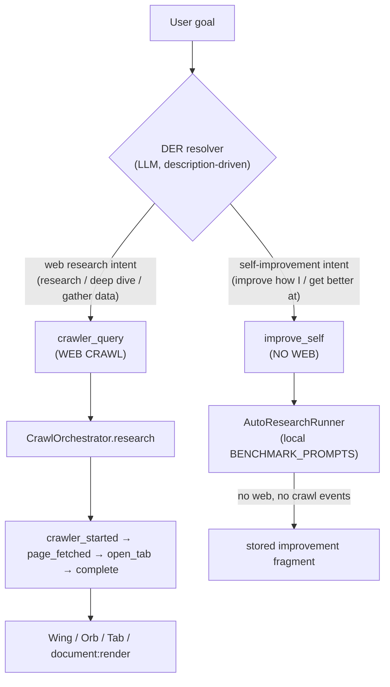
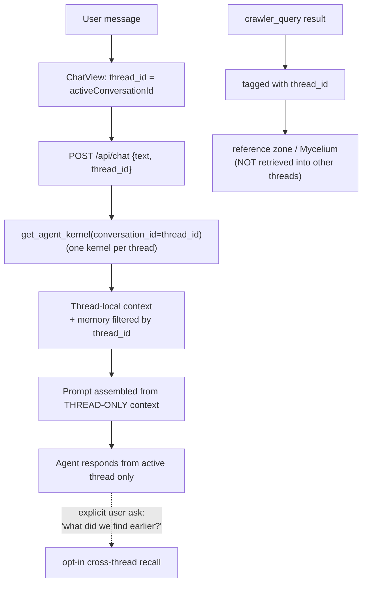

# Design: Unified Web-Search Architecture (Crawl Core + DER-Driven Research)

IRISVOICE · July 2026

---

## Context

IRIS Voice has two web-search paths that should be one:

| | `crawl_research` (WS, `iris_gateway.py:8685`) | Agent `crawler_query` (`tool_bridge.py:1521`) |
|---|---|---|
| Engine | `CrawlerEngine` in-process | `run_crawl_subprocess` (isolated) |
| Planning | `CrawlPlanner` LLM | same `CrawlPlanner` |
| Extraction | `DataExtractor` LLM → DashboardData | same → DashboardData |
| Progress | `crawler_started` + `crawler_page_fetched` (URL) | `TASK_PROGRESS` (host-only) + low `speak` |
| Result | `open_tab` + `text_response` | dict → agent `show`/`speak` → `document:render` |
| Trust | none (bypasses pacman) | `trust:"untrusted"` → pacman `reference` zone |

**Root cause of UI inconsistency:** the WS path streams `crawler_page_fetched`
(full URL) + opens a dashboard tab; the agent path only overwrites a
`task:progress` step. Same crawl family, but the agent path never opens a tab or
streams URLs to the wing.

**Hard constraints (from DER blueprint + der_constants.py):**
- ONE recursive operator, physics-driven (`u/ξ`), sharing `W0`. No mode-driven
  fan-out, no web-regex override.
- `ExecutionMode` is display-only. Step shape from `_split_step`/`_growth_width`.
- Steps are physics-based hard rules: split WIDE when `|u| < 0.5`, atomic
  mid-band (`0.5 ≤ |u| < 0.85`, LLM rubric), atomic-deterministic when
  `|u| ≥ 0.85`. Termination via `work_units`, `MAX_DEPTH=3`, `DER_MAX_GRAFTS=3`,
  `DER_MAX_CYCLES=40`.
- Narration serialized through `_NARRATION_PLAYBACK_LOCK`.

---

## Architecture Overview



---

## Sequence — Agent-Driven Deep Research (physics fan-out)



---

## Data Models



**Event payloads (unified, both modes):**

| Event | Payload |
|---|---|
| `CRAWLER_STARTED` | `{query, url_count}` |
| `CRAWLER_PAGE_FETCHED` | `{url, page_number, total, host}` |
| `OPEN_TAB` | `{tab_type:"dashboard", id, title, data}` |
| `CRAWLER_ERROR` | `{message}` |

---

## Key Decisions

| # | Decision | Rationale | Rejected alternative |
|---|---|---|---|
| D1 | New `CrawlOrchestrator` shared by both paths | Single source of truth; kills divergence | Keep two engines (divergence persists) |
| D2 | WS in-process, agent isolated subprocess | WS speed; agent crash-isolation | Force both subprocess (slower WS) / both in-process (backend death risk) |
| D3 | Full Perplexity-grade (credibility + rerank + citations) | User chose "Full Perplexity-grade" | Lean / events-only (insufficient quality) |
| D4 | `crawler_query` = ONE atomic DER tool | Honors DER single-operator invariant; loop is emergent from `u/ξ` | Tool-internal research loop (violates invariant) |
| D5 | Fan-out via `_split_step` (`u/ξ`), not mode | `ExecutionMode` is display-only; physics drives shape | "research mode" triggers fan-out (forbidden) |
| D6 | Verify web steps via `|u|`-band path | No special-case web logic; consistent with all steps | Separate web verifier (duplication) |
| D7 | Deprecate `TASK_PROGRESS` "Reading host" overwrite | One source of truth for search progress | Keep both streams (inconsistent UI) |
| D8 | Subprocess fetch behind swappable `FetchBackend`; process-TREE kill + concurrency cap | Crash-isolation + background reliability now; daemon-promotable later | Thread pool (shares crash domain) / in-process only (backend death risk) |
| D9 | Single event→component→state UX map (REQ-30) | One owner per layer; audio+visual never contradict | Per-component ad-hoc search UI (divergence) |
| D10 | `run_research` (legacy AutoResearch self-improvement loop) renamed to **`improve_self`** and explicitly marked "no web access" | Removes the "research" name collision that let the DER resolver pick the wrong tool for web-research goals; `crawler_query` is the ONLY web-crawl tool | Leave two tools both named "research" (DER picks wrong one → no crawl events, no UI feedback) |

---

## Tool Routing Boundary (web research vs. self-improvement)

There are TWO tools whose names/descriptions could be confused by the LLM-driven
DER resolver. They are **fundamentally different** and must never be conflated:

| Tool | Purpose | Accesses web? | Emits crawl events? | Handler |
|---|---|---|---|---|
| **`crawler_query`** | Deep web research crawl (the spec's ONE atomic DER web tool, REQ-19) | YES | YES — `crawler_started` / `crawler_page_fetched` / `open_tab` / `crawler_complete` | `CrawlOrchestrator.research` |
| **`improve_self`** (was `run_research`) | AutoResearch self-improvement benchmark loop — improves the agent's own skills/variants via locally stored `BENCHMARK_PROMPTS` | **NO** | NO | `AutoResearchRunner` |

**Invariant (enforced by tool description + name):**
- A user request to *fetch real-world data / research a topic or company from the
  internet* resolves to **`crawler_query`** and produces live crawl events the UI
  renders.
- `improve_self` is reachable only for *"improve how I do X" / "get better at Y"*
  self-improvement requests. Its description states it cannot access the web, so the
  resolver cannot mistake it for web research.
- The frontend never references either tool by name; it only consumes the crawl
  WebSocket events emitted by `crawler_query`.



> **Why this matters (post-implementation finding):** an earlier build left the
> legacy loop named `run_research` with a generic "research anything" description.
> The DER resolver then selected `run_research` for a web-research goal; that tool
> returns status without crawling and emits **no** crawl events, so the UI showed no
> search feedback while the orb kept spinning. Renaming to `improve_self` + the
> explicit "no web" description closes the collision. A Tier-4 behavioral test now
> drives the resolver with a web goal and asserts it selects `crawler_query`.

---

## Per-Thread Conversation Scoping (REQ-32)

Conversation threading exists at the routing layer (`POST /api/chat` accepts
`thread_id`; `get_agent_kernel(conversation_id=thread_id)` returns one kernel per
thread). The leak observed in practice: the agent referenced a *previous* web search
inside a *new* thread. Root cause is **not** the thread router — it is that web-search
findings are persisted to **global** memory (Mycelium semantic/episodic store + the
`reference`-zone credibility map / citation index) and retrieved into the prompt
regardless of thread, plus `activeConversationId` is restored from `localStorage`
across sessions so a stale thread id can be reused.

**Fix shape:** tag every crawl result / credibility map / citation index with the
originating `thread_id`; retrieve memory into a thread's prompt only after filtering by
that `thread_id`; create a fresh thread id for each new chat/session (do not auto-reuse
a restored `activeConversationId`).



> **Invariant:** the agent responds from the active thread's own context unless the
> user explicitly requests cross-thread recall. Global memory is opt-in, never default.


---

## Background Reliability (subprocess design)

The subprocess is the crash-isolation boundary, but reliability needs more:

```mermaid
flowchart LR
    A[CrawlOrchestrator.research] --> B{FetchBackend}
    B -->|mode=ws| C[InProcessBackend<br/>CrawlerEngine]
    B -->|mode=agent| D[SubprocessBackend<br/>crawl_worker]
    D --> E[spawn process GROUP]
    E --> F[per-batch timeout 90s]
    F -->|timeout| G[KILL process TREE<br/>job object / pgid]
    F -->|done| H[CrawlResult]
    I[concurrency cap=2] --> D
    R[(Job Registry<br/>ONE shared)] --> D
    R --> C2[WS crawl_research]
    J[WS disconnect] -->|agent| K[continue + persist pacman]
    J -->|ws mid-crawl| M[HAND OFF to Job Registry<br/>continue + persist, NEVER cancel]
    N[user new utterance] -->|while crawl runs| O[agent handles other work<br/>orb reflects new state]
    ```

- **Process-tree kill:** on Windows, Chromium spawns child processes; timeout MUST
  kill the job object / process group, not just the parent PID (REQ-17 AC2).
- **Concurrency cap (default 2):** bounds parallel DER Sub-Loop children so the
  host cannot OOM from N simultaneous Chromium processes (REQ-17 AC5).
- **Swappable backend:** `FetchBackend` interface lets a future long-lived
  crawl-worker DAEMON replace the per-job subprocess with zero funnel changes
  (REQ-17 AC4).
- **ONE shared Job Registry:** both the WS `crawl_research` handler and the agent
  `crawler_query` tool register crawls as background jobs with a stable job id.
  There is exactly ONE completion + persist path (REQ-29 AC5).
- **WS disconnect → always hand off, never cancel:** if the WS client drops while
  `crawl_research` is mid-crawl, the handler transfers the in-flight crawl to the
  shared Job Registry and it runs to completion + persists. No "cancel clean"
  escape hatch (REQ-29 AC2).
- **Talk while it researches:** a crawl is a background job; the agent accepts and
  processes a NEW user utterance during the crawl, and the orb/ContextPill reflect
  the new utterance's state — the user can do other work and gets the crawled
  result + tab when it finishes (REQ-29 AC4).
- **Reconnect replay:** results surface on next connect via pending-result queue
  (REQ-29 AC3).

---

## UX / UI / Audio Layer Map

Single source of truth: every event maps to exactly one component + state. Both
WS and agent paths use this map (REQ-30 AC4).

| Event / State | Component | Visual state | Audio |
|---|---|---|---|
| `listening_state=processing_tool` | Orb, XurOrb, OrbWorkingIndicator, ContextPill | "researching" indicator (reduced-motion aware) | step narration (lock) |
| `crawler_started` | ContextPill / TaskListCard | "Researching… <query>" step | — |
| `crawler_page_fetched` | dashboard-wing `onPage` (URL list), TaskListCard (progress N/M) | URL appended; progress advances | "fetched page N of M" (lock) |
| `open_tab` | dark-glass-dashboard browser tab strip | new tab, ordered by arrival | — |
| `document:render` | RichDocument | cited_markdown + unverified badge + clickable citations | final answer `speak` (lock) |
| `crawler_error` | error toast (dark-glass-dashboard / chat-view) | non-blocking toast | error cue (optional) |
| `_maybe_escalate_web_format` | QuestionCard | format options pills | — |
| completion | Orb / ContextPill | return to idle/listening | — |

**Invariant (REQ-30 AC2):** audio and visual never contradict — narration
"Researching…" co-occurs with `processing_tool` + wing URL N; final answer speech
follows only after orb idle + document rendered.

---

## Resilient Transport (widget-safe, REQ-31)

The widget's WebSocket drops often (background/suspend). Raw WS is not guaranteed
(browser WS has no auto-reconnect). The fix is **not "fix WS"** — it is a
**resumable server-side event log + SSE fallback**, because the frontend is
overwhelmingly server→client push.

```mermaid
flowchart TB
    BE[Backend emits unified events] --> LOG[(Session Event Log<br/>seq-numbered, TTL)]
    LOG --> WS[WebSocket push<br/>when connected]
    LOG --> SSE[SSE endpoint<br/>EventSource auto-reconnect + Last-Event-ID]
    WS --> W[Widget]
    SSE --> W
    W -->|heartbeat ping/pong| WS
    W -->|reconnect: last_seq| LOG
    LOG -->|replay seq>last_seq| W
    CMD[Client commands<br/>utterance / set_web_mode] -->|HTTP POST (always)| BE
    CMD -->|WS (when up)| BE
    BE --> JOB[(Job Registry REQ-29)]
    JOB --> LOG
```

- **Event log (AC1/AC2):** every event buffered per session with monotonic `seq`;
  client tracks `last_seq`; on reconnect it sends `last_seq` and the server replays
  `seq > last_seq` (deduped). Missed orb/wing/tab/document updates are recovered.
- **SSE fallback (AC3):** `text/event-stream` streams the SAME events using native
  `EventSource` auto-reconnect + `Last-Event-ID` — resilient push for the flaky
  widget, no custom reconnect code.
- **WS = command channel + push-when-up (AC4):** bidirectional for commands; SSE is
  the authoritative resumable push; both read the one log.
- **Heartbeat + backoff+jitter (AC5):** detect half-open sockets; avoid reconnect
  storms on server restart.
- **Commands independent of push (AC6/AC7):** utterances/set_web_mode go over HTTP
  POST (and WS when up); processed even if push is down; results buffered for
  replay. Background crawls (REQ-29) never block on transport.
- **TTL + snapshot (edge):** old events evict → client gets `sync_required` and
  fetches a full state snapshot instead of a partial replay.

---

## Error Handling

| Failure | EARS-style response |
|---|---|
| Planner returns 0 URLs | emit `crawler_error` "no candidate urls"; return `CrawlResult(pages=[])` |
| Page fetch fails | set `PageData.error`; continue; partial results allowed |
| All pages error | emit `crawler_error`; no `open_tab` |
| Subprocess crash/timeout | kill process TREE (job/pgid); return `CrawlResult.error` set (never raise); agent `success:False` |
| Concurrency exceeded | queue or degrade to fewer pages; never spawn > cap Chromium processes |
| WS client disconnect (agent) | continue crawl + persist pacman; no events to dead socket |
| WS client disconnect (ws) | cancel clean or hand to background; no raise in `on_progress` |
| Web gate closed | no fetch; agent `success:False` "web access disabled"; no events |
| Verifier VETO storm | `_split_step` bounded by `DER_MAX_GRAFTS` + `work_units`; `DER_MAX_CYCLES=40` hard cap |
| Reranker/embeddings unavailable | fall back to BM25-only / hybrid score |
| Citation hallucinated `chunk_id` | drop citation; flag claim unsourced |

---

## Verification Strategy (4 tiers — isolated layers + cross-layer seams)

The feature is a stack of SEPARATE layers that ALSO interact. Testing must prove
both: each layer in isolation (Tiers 1–2) AND the seams between them (Tiers 3–4).
A contract test that emits an event the consumer ignores MUST FAIL — it proves the
seam, not just the emitter. Repo convention: real instance + stubbed collaborator +
event-bus subscription asserting emitted events, anchored to a PiN
(see `backend/tests/contract/test_document_render_contract.py`).

### Tier 1 — Unit (layer-internal, collaborators stubbed)
| Layer | Test | Verifies |
|---|---|---|
| Orchestrator | `research` funnel order Plan→Fetch→Split→Score→Rerank→Cite→Return | REQ-1 AC5 |
| Credibility | `CredibilityScorer` type classification + monotonicity (primary_official > forum) | REQ-5/6 |
| Rerank | passage threshold drop + re-query-on-low-score | REQ-7 |
| Cite | `cited_markdown` binding completeness (every sentence has `chunk_id`) | REQ-8 |
| Fetch | `FetchBackend` swap (subprocess ↔ in-process) | REQ-17 AC4 |
| Transport | heartbeat + backoff-with-jitter reconnect logic | REQ-31 AC5 |

### Tier 2 — Contract (layer PUBLIC boundary, stubbed neighbors, event-bus assert)
| Contract | Test | Verifies |
|---|---|---|
| Event parity | WS & agent emit identical `crawler_started`→`page_fetched`→`open_tab`→`error` | REQ-10–13 |
| DER tool | web goal → `crawler_query` returns `CrawlResult`, verifier consumes via `\|u\|`-band | REQ-19/21 |
| DER routing | web goal → resolver selects `crawler_query` (NOT `improve_self`); `improve_self` selected only for self-improvement intent | REQ-19 (routing boundary) |
| PacMan | fragment lands `reference` zone, `trust:"untrusted"`, `credibility_map` | REQ-22 |
| Transport | event log replays `seq>last_seq`; SSE streams same events | REQ-31 AC1/AC3 |
| UX map | event→component→state parity (both paths); audio/visual non-contradiction | REQ-30 |
| Web gate | gate closed → no fetch, `success:False` | REQ-18 |

### Tier 3 — Integration (cross-layer, in-process, mock fetch — NO live web)
| Seam | Test | Verifies |
|---|---|---|
| Orchestrator→Bus→Consumer | `crawler_page_fetched`/`open_tab` received by fake wing/tab | REQ-11/12 |
| DER→tool→PacMan | VETO storm terminates within `DER_MAX_CYCLES` + persists | REQ-20/21/22/27 |
| WS→JobRegistry | mid-crawl disconnect handed off, NEVER cancelled, persists | REQ-29 AC2 |
| Command↔Push | HTTP-POST command processed while push down; result buffered | REQ-31 AC6/7 |
| Crash | process-tree kill on timeout; no orphan chromium | REQ-17 AC2 |
| Concurrency | cap ≤2 chromium processes | REQ-17 AC5 |
| Agent path | `crawler_query` → wing URL list + tab | REQ-16/25 |

### Tier 4 — Behavioral (end-to-end, LIVE backend over real WS/SSE; assert event ORDER)
| Path | Test | Verifies |
|---|---|---|
| Gate OFF | plain text → NO `crawler_started` | REQ-18 |
| Gate ON | `crawler_started` → N×`crawler_page_fetched`(full URL) → `open_tab` → `document:render` | REQ-10–13,23 |
| Resume | disconnect mid-crawl → reconnect → missed events replayed | REQ-29/31 |
| Concurrent | new utterance during crawl → processed, orb reflects new state | REQ-29 AC4/30 |
| DER routing | web goal → resolver selects `crawler_query` (emits crawl events); `improve_self` selected only for self-improvement intent, never for web research | REQ-19 (routing boundary) |
| Per-thread scope | web search in thread A; new thread B generic question → response contains NO findings from A; memory filtered by thread_id | REQ-32 |

**Rule:** ALL four tiers MUST pass before crystallization (REQ-28). Tier 2/3/4
contract tests anchored to a PiN recording the enforced contract.
