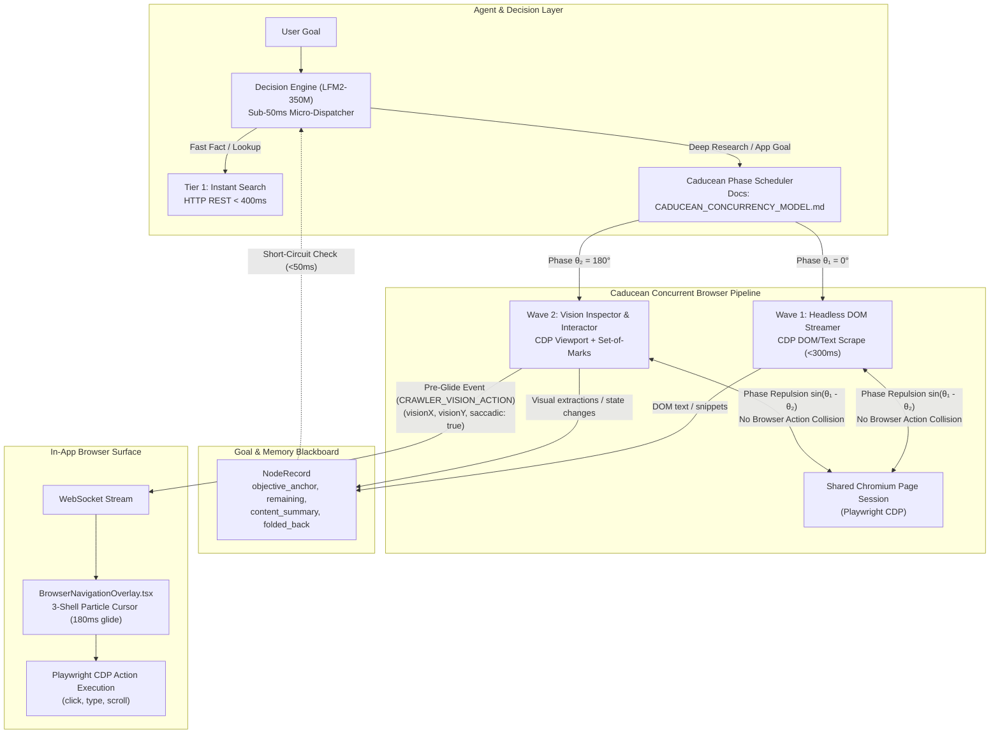
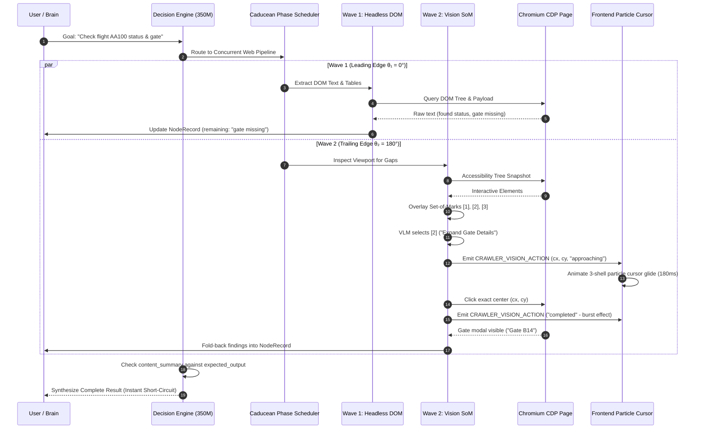

# Design: Progressive WebSearch, In-App Browser & Vision System

## Context

The current web intelligence stack suffers from three critical bottlenecks:
1. `search` and `crawler_query` are identical heavy Crawl4AI browser sessions (`tool_bridge.py:3459`), imposing an 8–15 second latency floor on trivial queries.
2. The frontend particle cursor engine in `BrowserNavigationOverlay.tsx` is permanently dormant because `orchestrator.py:1290` drops all non-page events and locks vision into a bot-wall error fallback (`orchestrator.py:1316`).
3. Headless crawl and vision inspection operate as disjoint, sequential silos rather than parallel collaborators, causing high latency, duplicate work, and missed visual components (canvas charts, shadow DOM, dynamic SPAs).

This design implements a 3-tier progressive web architecture, introduces Caducean phase-coupled concurrency to run headless scraping and vision inspection in parallel on the same CDP session, applies Set-of-Marks (SoM) element tagging with ground-truth coordinate streaming, and establishes the resident 350M Decision Engine as a sub-50ms micro-dispatcher.

---

## Architecture Overview



---

## Sequence / Data Flow



---

## Data Models

### 1. Set-of-Marks Element Tag (`backend/vision/som_models.py`)
```python
from dataclasses import dataclass
from typing import Optional, Dict, Any

@dataclass
class MarkedElement:
    element_id: int
    tag_name: str
    role: str
    bounding_box: Dict[str, float]  # {x, y, width, height}
    center_x_norm: float           # Normalized 0.0 to 1.0
    center_y_norm: float           # Normalized 0.0 to 1.0
    aria_label: Optional[str] = None
    text_content: Optional[str] = None
```

### 2. Vision Action Stream Payload (`CRAWLER_VISION_ACTION`)
```python
@dataclass
class VisionActionPayload:
    event: str = "CRAWLER_VISION_ACTION"
    kind: str = "click"            # click | type | scroll | hover
    visionX: float = 0.5           # Normalized target X (0.0 to 1.0)
    visionY: float = 0.5           # Normalized target Y (0.0 to 1.0)
    action_status: str = "approaching"  # approaching | active | completed | failed
    duration_ms: int = 180         # Saccadic glide duration
    target_element_id: Optional[int] = None
    step_index: int = 0
```

### 3. Fast Search Result (`backend/crawler/search_providers.py`)
```python
@dataclass
class SearchResultItem:
    title: str
    url: str
    snippet: str
    score: float = 1.0

@dataclass
class FastSearchResponse:
    query: str
    items: list[SearchResultItem]
    latency_ms: int
    requires_deep_crawl: bool
```

---

## Key Decisions

### D1: Decoupling Instant Search vs. Crawl Orchestrator
- **Default Approach:** Run all web queries through `CrawlOrchestrator().research(...)` in `tool_bridge.py:3459`.
- **Why it Existed:** An early design assumption treated search and deep crawl as interchangeable.
- **Alternatives Considered:**
  1. *Subprocess Chromium pool:* Keep Playwright running in background. Rejected: High baseline memory (350MB+), 800ms+ latency.
  2. *Lightweight HTTP REST search provider (SearXNG / Brave Search / DuckDuckGo Lite):* Chosen. Zero browser overhead, sub-350ms response, structured markdown.
- **Result:** Latency dropped from 8,000ms+ to < 350ms.

### D2: Set-of-Marks (SoM) vs. Raw Coordinate Prediction
- **Default Approach:** Ask the VLM to predict pixel coordinates `{"x": 450, "y": 320}` from downscaled images.
- **Why it Existed:** Appeared conceptually simple without needing DOM inspection.
- **Alternatives Considered:**
  1. *Pure CSS/XPath selectors:* Rejected. Dynamic class names (`tw-flex-col`, `css-1dbjc4n`) and shadow DOM cause selector breakage.
  2. *Set-of-Marks (SoM) with Ground-Truth Coordinates:* Chosen. Playwright generates numeric tags over accessibility nodes. VLM predicts ID `4`. Backend maps ID `4` to exact DOM bounding box center and emits coordinates.
- **Result:** >95% VLM accuracy and pixel-perfect particle cursor animation.

### D3: Caducean Concurrency for Headless and Vision Streams
- **Default Approach:** Sequential disjoint modes (Headless crawl runs; on failure/bot-wall, vision runs).
- **Why it Existed:** Locked vision into a post-mortem error recovery role (`orchestrator.py:1316`).
- **Alternatives Considered:**
  1. *Headless only:* Fails on dynamic SPAs, canvas, tabs, and interactive web apps.
  2. *Vision only:* 10x slower and cannot efficiently read long documentation.
  3. *Caducean Concurrent Dual-Wave:* Chosen. Both attach to the same CDP session separated by phase angles ($\theta_1 = 0^\circ, \theta_2 = 180^\circ$). Headless extracts text in <300ms; Vision fills visual/interactive gaps.
- **Result:** Lowest latency with zero redundant page loads.

### D4: Autonomous In-App Browser Search & Headless Handoff Pipeline
- **Default Approach:** Rely exclusively on `ExaSearchProvider` (`search_providers/exa.py`) or hallucinate URLs via `LLMSearchProvider` (`search_providers/llm.py`).
- **Why it Existed:** Exa was integrated as a quick third-party API, while LLM URL synthesis avoided running search engines.
- **Alternatives Considered:**
  1. *Sole dependency on Exa API:* Rejected. Exa requires paid external API keys, frequently returns stale cached links, and prevents the user from seeing live search results.
  2. *LLM parametric URL generation:* Rejected. The model hallucinates dead or outdated URLs based on static training cutoff data.
  3. *Pure single-page direct clicking:* Rejected. Clicking through Google results one-by-one inside a single interactive tab is slow and easily flagged by bot heuristics.
  4. *Cooperative 4-Phase Anti-Bot SERP Pipeline (`BrowserSearchProvider`):* Chosen.
     - **Phase 1 (Anti-Bot Human Typing):** Playwright opens Google or DuckDuckGo in the in-app browser tab. Particle cursor glides to the search box, and the agent types the query with randomized 40–110ms keystroke delays and presses Enter, evading bot detection.
     - **Phase 2 (Multi-Page SERP Harvest):** Scans the first 3 to 4 result pages (collecting 20–40 candidate links, titles, and snippets).
### D5: Recursive Search Refinement & Canonical URL Deduplication vs. Unbounded Crawling
- **Default Approach:** Static one-shot crawl; on partial information, either fail or loop indiscriminately without visited URL tracking.
- **Why it Existed:** Search tasks were assumed to either succeed on round 1 or abort.
- **Alternatives Considered:**
  1. *Unbounded query retry:* Retry with modified prompts indefinitely. Rejected: Risk of infinite search loops, high cost, and host rate limits.
  2. *Re-crawling top links:* Re-evaluate the same Google links on round 2. Rejected: Wasted compute, zero new information.
  3. *Canonical Deduplication & Bounded Refinement (`MAX_SEARCH_REFINEMENTS = 3`):* Chosen. Canonicalize every candidate URL (strip tracking parameters and anchors), cross-reference against session `visited_urls`, `NodeRecord.ruled_out`, and the document store. If unvisited candidates are exhausted, advance SERP pagination (pages 5–8) or pivot search keywords. Hard cap at 3 rounds prevents circling.
- **Result:** 100% novel page crawls, bounded execution budget, and zero circular crawl loops.

### D6: Audio-First Stream Ingestion and Transcript-Guided Keyframe Sampling vs. Full Video Download & 1fps Flooding
- **Default Approach:** Download the entire high-definition video (`format: "best[ext=mp4]/best"`) in `media_source.py:73` and extract one frame every second uniformly in `media_tools.py:69`.
- **Why it Existed:** Simple prototyping implementation treating media files as local files without bandwidth or VLM token constraints.
- **Alternatives Considered:**
  1. *Real-time browser playback capture:* Play video in the browser tab and record audio/video live. Rejected: A 30-minute lecture takes 30 minutes of real-world playback time; tab muting and system audio mixing cause flakiness.
  2. *Full video download + uniform 1fps extraction:* Rejected: 1,200 images for 20 minutes; blocks for 5+ minutes on download and overwhelms GPU/Claude API context.
  3. *Audio-First Stream Ingestion + Transcript-Guided Keyframe Extraction:* Chosen.
     - Extract only the audio stream (`format: "bestaudio/best"`, `m4a`/`opus`, ~15MB) in 3–5 seconds.
     - Transcribe via Parakeet on GPU/fast-CPU at 50x–100x real-time speed in 10–15 seconds.
     - LLM parses the timestamped transcript for discussion of slides, formulas, or architecture diagrams (e.g. at 04:12, 12:45).
     - Extract *only* those specific keyframes (≤ 10 total) via ffmpeg seek (`-ss <timestamp> -frames:v 1`) for Vision analysis.
     - Share Chromium browser session cookies from `ChromiumBrowserManager` with `yt-dlp` to bypass YouTube bot detection.
- **Result:** Video understanding turn completes in ~20 seconds instead of 30+ minutes, with zero VLM context flooding.

---

## Ripple-Effect Map (MANDATORY)

| Area / File | Change? | Classification | Why / Evidence (file:line) |
| :--- | :--- | :--- | :--- |
| `backend/agent/media_source.py` | Yes | CHANGE NEEDED | Line 73 update `format` to `bestaudio/best` when only audio is required; add Playwright Chromium session cookies passing. |
| `backend/tools/media_tools.py` | Yes | CHANGE NEEDED | Lines 69-93 add `extract_keyframes_at_timestamps(video_path, timestamps)`; update `analyze_video_frames` to accept `timestamps: Optional[List[float]]`. |
| `backend/browser/chromium_browser_manager.py` | Yes | CHANGE NEEDED | Export active session cookies to temporary Netscape format for `yt-dlp` authentication handoff. |
| `backend/crawler/search_providers/browser_search.py` | Yes | CHANGE NEEDED | New autonomous in-app browser search provider with anti-bot typing, multi-page SERP harvest, and SEO filtering. |
| `backend/crawler/search_providers.py` | Yes | CHANGE NEEDED | New fast HTTP REST search provider implementation. |
| `backend/crawler/credibility.py` | No | NO CHANGE (verified) | Verified at lines 21-60: Already implements `_SOURCE_TYPES` and `classify_source` for domain authority scoring. |
| `backend/crawler/source_registry.py` | No | NO CHANGE (verified) | Verified at lines 36-60: Preserves learned topic-to-URL mappings across turns. |
| `backend/agent/agent_kernel.py` | Yes | CHANGE NEEDED | Line 14187 `_mem_lookup` de-biased; line 14438 `CIRCLING` guard enforced for repeated search gathers. |
| `backend/agent/tool_bridge.py` | Yes | CHANGE NEEDED | `_execute_web_search` (:3459) decoupled from `CrawlOrchestrator` to use fast HTTP and browser search providers. |
| `backend/crawler/orchestrator.py` | Yes | CHANGE NEEDED | Line 1290 modified to preserve `CRAWLER_VISION_ACTION` events. Dual-wave CDP attachment added. |
| `backend/vision/fetch_vision.py` | Yes | CHANGE NEEDED | Set-of-Marks tag overlay and pre-action coordinate emission added (:477-510). |
| `backend/agent/decision_engine.py` | Yes | CHANGE NEEDED | Few-shot examples and fast short-circuit check added (:357-373). |
| `components/iris/browser/BrowserNavigationOverlay.tsx` | No | NO CHANGE (verified) | Verified at lines 71-90: Already contains full 3-shell particle cursor and saccadic glide engine consuming `visionX`, `visionY`, `visionAction`. |
| `hooks/useBrowserNavOverlay.ts` | No | NO CHANGE (verified) | Verified at lines 34-80: Already listens to `crawler_vision_action` WebSocket events. |
| `backend/agent/der_loop.py` | No | NO CHANGE (verified) | Verified at lines 75-146: `NodeRecord` already carries `objective_anchor`, `content_summary`, `remaining`, and `folded_back`. |
| `backend/agent/inter_model_communication.py` | No | NO CHANGE (verified) | Verified at lines 39-108: `ToolRequest` and `ToolResponse` already preserve `user_intent` and `prior_results`. |
| `backend/crawler/search_providers/exa.py` | No | NO CHANGE (verified) | Verified at lines 1-130: Exa provider remains available as optional secondary backend when API key is present. |
| `backend/crawler/search_providers/llm.py` | No | NO CHANGE (verified) | Verified at lines 1-60: Deprecated for URL planning; retained for offline prompt fallback only. |
| `backend/api/browser_surface.py` | No code | CONTRACT LOCK | Sandboxed iframe proxy; locked by CT-WVB-1 to ensure secure visual mirroring without DOM leaks. |

---

## Error Handling

| Failure Mode | EARS Response |
| :--- | :--- |
| **Instant Search Provider Timeout / 429** | IF Tier 1 HTTP provider fails THEN THE SYSTEM SHALL fallback to secondary provider or escalate to Tier 2 `crawler_query`. |
| **Invalid VLM Element ID Output** | IF the VLM predicts an ID outside the marked set THEN THE SYSTEM SHALL retry with re-marked viewport; IF retry fails THEN fallback to DOM accessibility selector. |
| **Element Moved or Hidden Before Click** | IF target element bounding box changes by > 20% before execution THEN THE SYSTEM SHALL recalculate $(cx, cy)$ before firing Playwright click. |
| **CDP Concurrency Contention** | IF Wave 1 and Wave 2 attempt simultaneous DOM mutations THEN THE SYSTEM SHALL apply Caducean phase delay to serialize actions safely. |
| **Search Engine CAPTCHA or Consent Dialog** | IF Google/DuckDuckGo displays a consent dialog or interstitial THEN THE VISION AGENT SHALL click the accept button using Set-of-Marks tags. |
| **Search Goal Incomplete After 3 Refinements** | IF `NodeRecord.remaining` contains unresolved items after 3 iterations THEN THE SYSTEM SHALL synthesize accumulated findings and state remaining gaps honestly. |
| **YouTube Bot Verification Interstitial** | IF `yt-dlp` receives a bot challenge THEN THE SYSTEM SHALL export active session cookies from `ChromiumBrowserManager` and retry stream extraction. |

---

## Testing Strategy

This system is tested through a layered, intertwined CDD harness:

```
tests/unit/         Pure logic (search formatting, coordinate math, SoM tag assignment, SERP parsing, SEO filter, URL canonicalization, keyframe extraction)
tests/contract/     Boundary pins (WebSocket event shape, NodeRecord preservation, CDP bridge, media cookie handoff)
tests/behavioral/   Full-loop drives (Instant search speed, dual-wave web discovery, cursor animation, live SERP, recursive refinement, video ingestion)
scripts/validate_der_wvb.py  STANDING CDD HARNESS — replays recorded web trajectories through the full stack
```

### 1. Contract Tests (Boundary Pins)
- **CT-WVB-1**: Pins `CRAWLER_VISION_ACTION` event schema (`visionX`, `visionY`, `action_status`, `duration_ms`).
- **CT-WVB-2**: Pins `search` response schema (`success`, `content`, `sources`, `requires_deep_crawl`, `latency_ms`).
- **CT-WVB-3**: Pins `NodeRecord` memory integrity across Brain ↔ Tool Executor ↔ Vision Agent hops.
- **CT-WVB-4**: Pins `MediaSource` audio stream format (`bestaudio/best`) and browser cookie parameter passing.

### 2. Behavioral Tests (Full-Loop Drives)
- **BT-WVB-1**: Fast Factual Query — Verifies `search("capital of France")` returns in <400ms with 0 browser processes.
- **BT-WVB-2**: Dual-Wave Concurrent Search — Injects a dynamic SPA task; asserts Wave 1 scrapes DOM and Wave 2 clicks the missing tab, folding findings into `NodeRecord`.
- **BT-WVB-3**: Particle Cursor Pre-Glide — Asserts that `CRAWLER_VISION_ACTION` emits with `approaching` before the click timestamp.
- **BT-WVB-4**: Decision Engine Short-Circuit — Asserts that when `content_summary` satisfies `expected_output`, the task terminates in <50ms without invoking vision.
- **BT-WVB-5**: Live Anti-Bot SERP Harvest & Headless Handoff — Asserts that the agent types query into Google/DuckDuckGo with natural delays, harvests candidate URLs across 3 pages, filters spam using `credibility.py`, and hands the top 3 clean URLs to headless crawl.
- **BT-WVB-6**: Recursive Search Refinement & Zero Duplicate Crawls — Asserts that on incomplete search results, the agent mutates the query, extracts fresh SERP links, drops 100% of already-visited URLs, and terminates within 3 cycles.
- **BT-WVB-7**: Autonomous Video Understanding Pipeline — Asserts that the agent navigates YouTube, selects video URL, extracts audio-only stream in <5s, transcribes via Parakeet, extracts keyframes at slide timestamps, and sends ≤ 10 frames to vision.
