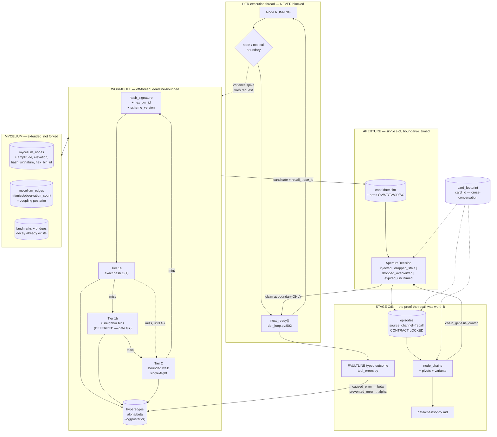
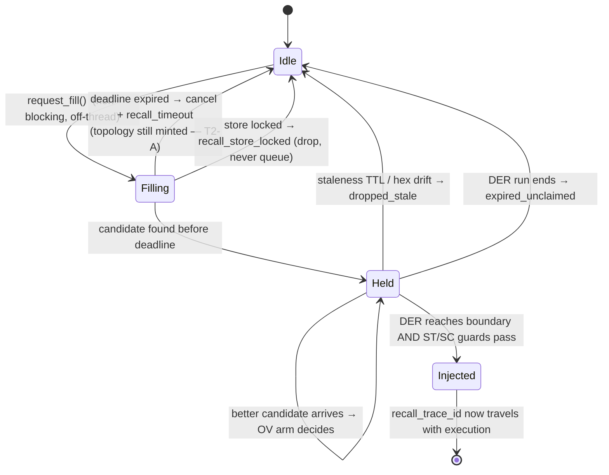

# Design: WORMHOLE + APERTURE

**Supersedes:** `specs/node-chains/design.md` (merged in as Stage C)
**Requirements:** `specs/wormhole-aperture/requirements.md`
**BLOCKED on:** `specs/der-ground-truth/` — gate G-DEP. Five of the six substrates below are
currently unwritten in production; see that spec's audit before implementing any of this.

---

## Context

Three concept documents describe one system, and each one names a constraint the other
two must respect:

- `docs/Wormhole-resonant-recall-.md` — the physics. Its binding constraint is its own
  scoping rule: *"Nothing here is a new subsystem... every mechanism below must name the
  component it reuses, and anything that cannot name one is a new subsystem in disguise."*
  It also flags one item as **UNRESOLVED AND BLOCKING** — how a mid-stream recall runs
  without becoming synchronous work on the critical path.
- `docs/Wormhole-NodeChain-Mailbox.md` — the delivery policy. Its binding constraint is
  that the aperture is delivery, not scoring, and that attribution — not retrieval — is
  the actual deliverable.
- `docs/architecture/FAULTLINE.md` — the failure taxonomy. Its binding constraint, added
  in session 247 after a live 30-minute churn incident: *"a taxonomy without a consumer
  is decoration. Every FAULTLINE dimension added from here on must name the
  dispatch/planning site that reads it."*

This design resolves the blocking item (§ Hot path), obeys the scoping rule by extending
the mycelium tables rather than forking them (§ Data models), and generalizes the
named-consumer rule into a gate that applies to every scored quantity this spec adds
(§ Gates).

### What already exists (and is therefore not built here)

| Capability the physics doc needs | Where it already lives |
|---|---|
| 4D confounder state (x, y, ξ, u) + domain tags | `CaduceanTrajectoryRecorder.get_latest_coordinate` — `backend/agent/caducean_trajectory.py:393` |
| Beta-Bernoulli-shaped posterior with diminishing alpha | `EdgeScorer.record_outcome` — `backend/memory/mycelium/scorer.py:91`; `observation_count` semantics documented at `backend/memory/db.py:219-225` |
| Region-scoped scoring precedent | `EdgeScorer.record_region_mediator_outcome` — `scorer.py:145` |
| Decay that forgets without deleting | `EdgeScorer.apply_decay` — `scorer.py:200`; `LandmarkIndex.apply_landmark_decay` — `backend/memory/mycelium/landmark.py:571` |
| Prune-from-working-set-not-from-store | `DCP.prune` — `backend/agent/dcp.py:60` |
| Landmark lifecycle, bridges, conflict resolution | `LandmarkIndex` — `landmark.py:317`, `add_bridge` `:694`, `resolve_conflict` `:486` |
| Weighted graph walk + path outcome recording | `CoordinateNavigator.navigate_all_spaces` `:208` / `record_path_outcome` `:251`; `mycelium_traversals` — `backend/memory/db.py:229` |
| Schema-rendered memory surface | `ResonanceScorer.format_context` — `backend/memory/mycelium/resonance.py:256`; `Landmark.to_context_string` — `landmark.py:86` |
| Typed failure taxonomy + growth API + boundary normalization | `backend/agent/tool_errors.py:92,247,309` |
| Domain-keyed wall ledger consulted before dispatch | `record_wall` / `is_walled` — `tool_errors.py:178,190` |
| Stable cross-conversation task identity + footprint | `_resolve_card_identity` — `backend/agent/agent_kernel.py:7948`; `save_card_footprint` / `get_card_footprint` — `backend/memory/card_footprint.py:37,105` |
| Node boundary to deliver at | `DirectorQueue.next_ready` — `backend/agent/der_loop.py:502`; live call site `backend/agent/agent_kernel.py:6932` |
| Off-critical-path telemetry pattern (and its post-mortem) | `ToolBridge._record_tool_event` — `backend/agent/tool_bridge.py:1605`, rationale `:1618-1629` |

### What genuinely does not exist

Hash signatures, hex binning, hyperedges (the edge table enforces
`UNIQUE(from_node_id, to_node_id)` — a strict pair, `backend/memory/db.py:226`), the
aperture, the busy/useful split as a read pair, per-destination hub scoring, node chains,
pivots, grafts, and a script executor (`ToolSpec.executor` supports
`internal | mcp | dev | crawler | research | memory | gui` — `backend/agent/tool_registry.py:58`).

### And one thing that exists but is dead

`RecallPhases` / `RecallDecoder` are imported by tests only. `docs/architecture/RECALL_AS_COGNITION.md`
documents four production integration points; none exist. Per Decisions Locked 11 this is
treated as clear ground, not as a migration: wormhole becomes the recall path and inherits
the episode contract. See § Stage 0.

---

## Architecture Overview



Three rules make this diagram readable at a glance:

1. **Every solid arrow into `LIVE` originates at a boundary**, never at a token. That is
   contract lock CT-APERTURE-1.
2. **The `WORM` subgraph never appears on the `LIVE` thread.** Its only contact is a
   dotted request out and a slot fill in.
3. **Scoring flows one way into `HE`.** The aperture reads posteriors; it never writes
   them. Writes happen only after outcome evidence exists.

---

## Sequence / Data Flow

### Main flow — spike to delivery to attribution

```mermaid
sequenceDiagram
    autonumber
    participant DER as DER loop (hot)
    participant AP as Aperture
    participant WH as Wormhole worker (off-thread)
    participant MY as Mycelium store
    participant TB as ToolBridge
    participant EP as episodes / chains

    DER->>DER: node completes, |u| spike detected
    DER-)AP: request_fill(state_4d, card_id)  %% fire-and-forget
    Note over DER: DER continues immediately.<br/>No await. No lock.
    AP-)WH: fill(deadline=monotonic)
    WH->>MY: Tier 1a — exact hash_signature
    alt hit
        MY-->>WH: node(s), tier=1a
    else miss
        WH->>MY: Tier 1b — 6 neighbor bins
        alt hit
            MY-->>WH: node(s), tier=1b
        else miss
            WH->>MY: Tier 2 — bounded walk (single-flight)
            MY-->>WH: node(s), tier=2 → mint signature+bin
        end
    end
    WH->>WH: rank by hyperedge posterior LOWER BOUND
    WH->>WH: SC guard (semantic collision)
    WH->>WH: wall-ledger check (is_walled)
    WH-->>AP: candidate + recall_trace_id
    alt deadline expired
        WH--xAP: cancel; emit recall_timeout
        Note over WH: T2-A arm: still MINT topology.<br/>Learning survives a missed delivery.
    end
    DER->>AP: at next boundary — claim()
    alt candidate fresh & guard passed
        AP-->>DER: injected surface (fixed schema, REQ-15)
        AP->>EP: aperture_decision{action=injected, arms, trace_id}
    else stale / overwritten / expired
        AP->>EP: aperture_decision{action=dropped_*, arms, trace_id}
    end
    DER->>TB: execute_tool(...) carrying recall_trace_id
    TB->>TB: normalize_failure()  %% FAULTLINE choke point
    TB-->>EP: typed outcome + recall_trace_id
    EP->>MY: alpha++ (prevented_error) | beta++ (caused_error)
    EP->>EP: write episodes row (source_channel='recall', CONTRACT LOCKED)
    EP->>EP: 3 attributed successes on one op pattern → chain + chain.md
```

### The hot-path resolution (the parent doc's blocking item)

The physics doc left "how the bounded query runs without becoming synchronous work on the
critical path" unresolved and blocking, noting it is *"the exact defect shape already
fixed three times in this codebase."* The fix is copied from the fourth instance, which is
documented in the code itself at `backend/agent/tool_bridge.py:1618-1629`:



Four properties make this safe, and each is a testable assertion, not an intention:

- **Monotonic deadlines.** Never wall time; a clock jump must not extend a deadline.
- **Single-flight Tier-2 per session.** An overlapping request is DROPPED, not queued —
  a queue is a lock with extra steps.
- **No write lock held while generation is active.** The aperture reads; minting is
  deferred to the boundary or to the worker's own transaction.
- **Cancel means cancel.** A late result is allowed to mint topology (T2-A) and forbidden
  to inject (REQ-12 edge case). Learning and delivery have different deadlines on purpose.

---

## Data Models

### Extensions to `mycelium_nodes` (ALTER, additive — `backend/memory/db.py:195`)

| new column | type | notes |
|---|---|---|
| `hash_signature` | TEXT NULL | REQ-1. NULL = unhashed; hashed lazily on first retrieval (REQ-10 AC3) |
| `hex_bin_id` | TEXT NULL | REQ-2. Deterministic boundary tie-break |
| `hash_scheme_version` | INTEGER DEFAULT 0 | REQ-10. `0` = never hashed |
| `amplitude` | REAL DEFAULT (birth) | REQ-5. Driven-damped oscillator energy |
| `elevation` | REAL DEFAULT 0.0 | REQ-7. Continuous 0..1, rises AND falls |
| `dormant` | INTEGER DEFAULT 0 | REQ-5 AC7. Pruned from working set, record intact |
| `card_id` | TEXT NULL | REQ-34 AC2. Cross-conversation provenance |

Indexes: `(hash_signature)`, `(hex_bin_id)`, `(hash_scheme_version)`.
`access_count` (`db.py:203`) is reused unchanged as the BUSYNESS reading (REQ-9 AC1).

> **Why ALTER and not a new table.** `mycelium_nodes` already holds coordinates,
> confidence, access_count, and timestamps for exactly these nodes. A parallel
> `wormhole_nodes` would need every one of those columns, would need to be joined on every
> read, and would drift. Decisions Locked 2.

### `mycelium_edges` — reused unchanged as the coupling substrate

No schema change. `hit_count` / `miss_count` / `observation_count` (`db.py:213-225`) ARE
the coupling posterior; `EdgeScorer.record_outcome` (`scorer.py:91`) already applies the
diminishing-alpha update REQ-6 AC2 requires. The Beta prior of REQ-6 AC1 is expressed by
SEEDING `observation_count` and the score at edge creation — the "worth about N
observations" formulation — rather than by adding prior columns.
**CONTRACT LOCK (CT-EDGE-1):** the posterior semantics at `db.py:219-225` and the
pessimism asymmetry at `scorer.py:43-48` are not modified by this spec.

### `wormhole_hyperedges` (NEW — the one genuinely new edge shape)

| field | type | notes |
|---|---|---|
| `hyperedge_id` | TEXT PK | |
| `state_hash` | TEXT NOT NULL | the live-state end |
| `landmark_node_id` | TEXT NULL | the via-point; NULL for a direct two-ended wormhole |
| `target_node_id` | TEXT NOT NULL | |
| `direction` | TEXT NOT NULL | REQ-4 AC7 — scored only in the direction travelled |
| `alpha` / `beta` | INTEGER DEFAULT 0 | REQ-4 AC2 |
| `observation_count` | INTEGER DEFAULT 0 | |
| `topic_domain` / `execution_domain` | TEXT | REQ-9 AC4 region scoping |
| `last_traversed` | REAL | |
| | | UNIQUE(state_hash, landmark_node_id, target_node_id, direction) |

Derived, never stored: `posterior_lower_bound`, `edge_cost = -log(posterior_lower_bound)`
(REQ-4 AC4/AC5), capped at a finite maximum so one bad edge cannot make a path unrankable.

### `wormhole_hub_scores` (NEW — per destination, never aggregated)

| field | type | notes |
|---|---|---|
| `connector_node_id` | TEXT | |
| `destination_hash` | TEXT | REQ-8 AC1 — the key |
| `alpha` / `beta` / `observation_count` | INTEGER | |
| `last_used` | REAL | REQ-8 AC3 decay input |
| | | PRIMARY KEY(connector_node_id, destination_hash) |

Hub standing is a VIEW over these rows (REQ-8 AC2). No aggregate column exists, so the
aggregation formula can change without a migration. Decisions Locked 6.

### `aperture_events` (NEW — the telemetry contract, REQ-35 AC1)

```json
{
  "event_type": "aperture_decision",
  "trace_id": "uuid", "session_id": "uuid",
  "card_id": "card_task_...", "der_node_id": "node_883",
  "policy_arms_used": {"overwrite":"OV-A","staleness":"ST-A","late_t2":"T2-A",
                       "cadence":"CD-A","semantic":"SC-A"},
  "shadow_arms": [{"family":"staleness","arm":"ST-B","would_have":"dropped_stale"}],
  "candidate": {"hyperedge_id":"he_992","tier":"1b",
                "posterior_lower_bound":0.74,"trigger_hex":"8812a","claim_hex":"8812b",
                "busy_useful_quadrant":"busy_useful"},
  "action_taken": "injected",
  "outcome": {"agent_used": true, "faultline_intersect": "prevented_error",
              "chain_genesis_contrib": true}
}
```

`agent_used` is tri-state — `true | false | unknown`. REQ-17 AC5: an unmeasured outcome is
recorded as `unknown`, never defaulted to `false`. Scoring an unmeasured delivery as a
failure would poison the very posteriors this system depends on.

### Stage C tables (carried from `specs/node-chains/design.md`)

`node_chains`, `pivot_events`, `chain_variants` — fields as specified there, with three
additions from this merge:

- `node_chains.provenance` gains `card_id` and `recall_trace_ids[]` (REQ-18 AC5).
- `pivot_events` gains `recall_trace_id` (REQ-21 AC6) — distinguishing a recall that
  CAUSED a pivot from one that merely coincided with it.
- `node_chains` gains `landmark_refs[]` so REQ-29 AC7 can flag a chain when a landmark it
  depends on loses elevation.

### `chain.md` projection — unchanged from the superseded spec

Frontmatter carries `chain_id` (the stable LINK). `chain_md_hash` on the record is a
STALENESS DETECTOR only, never the link. Each file is registered as a pin
(`pin_type='chain_md'`) with `ref_status` alive/stale tracking. Stored at
`data/chains/<chain_id>.md` (directory does not yet exist).

---

## Key Decisions

1. **Extend mycelium, do not fork it — pending one determination.** The parent doc's
   scoping rule is enforced mechanically: every Stage A mechanism above names the component
   it reuses, and the two that cannot (hyperedges, hex bins) are genuinely new shapes.
   Rejected: a standalone `wormhole_*` store — it would duplicate coordinates, confidence,
   decay, and landmark lifecycle and drift from them within a release.
   **CAVEAT, from the 2026-08-23 audit:** `mycelium_edges` holds **0 rows** in production
   despite a live caller at `backend/agent/agent_kernel.py:11536` — guarded by
   `if _region_node and _mediator_tool` (`:11530`) with its failure swallowed at
   `logger.debug` (`:11541`). Meanwhile `mycelium_landmark_edges` holds 6,201 rows. So the
   reuse justification currently rests on a path that has produced nothing.
   `specs/der-ground-truth/` REQ-5 determines which table is the real substrate, and this
   decision is REVISED by that answer rather than assumed correct.
2. **The aperture reads posteriors and never writes them.** This is what keeps the
   parent doc's "delivery, not scoring" rule enforceable rather than aspirational: the
   write path is physically elsewhere. Rejected: letting the aperture apply a small
   freshness bonus — that is a relevance engine with a modest name.
3. **`-log(posterior)` composition, lower bound everywhere.** Q1's correction is applied
   uniformly: the same lower bound gates drive (REQ-5 AC2), elevation (REQ-7 AC1), and hub
   standing (REQ-8). The document's original inconsistency — cautious about promotion,
   maximally generous about energy, on identical evidence — is closed by making it one
   value with one consumer rule.
4. **Beta prior instead of a sigmoid handoff.** Removes two tuned constants (`crossover`,
   `k`) and reuses `observation_count`, which already means "how much evidence do I have".
   Rejected: the sigmoid — kept only if a deliberately SHARP cutover were wanted, and it
   is not.
5. **Store fine, derive coarse (hub scoring).** Per-destination rows are the truth; any
   hub number is a view. Rejected: `min` across bridges (one weak route suppresses an
   excellent hub) and every other aggregate — all of them are fragile in some direction,
   and none of them can be un-aggregated later.
6. **Scheme version + lazy re-file.** Re-quantization stops being a one-way door without a
   migration script, downtime, or a bulk pass. Composes with dormancy: nodes that never
   get used never migrate, and those were decaying anyway.
7. **Busyness and usefulness are never averaged.** The BUSY/NOT-USEFUL quadrant is the
   only one that actively costs the agent and the only one currently invisible. An average
   would re-merge exactly what the split exists to separate.
8. **Wormhole replaces the recall protocol; the episode CONTRACT is inherited.** Because
   `RecallPhases` is orphaned there is no migration, and because Node Chains and the C3
   test read the episode row shape, that shape is contract-locked while the control flow
   above it is replaced. Rejected: reviving Phase R/A as the primary path (front-loaded and
   synchronous — the opposite of what the physics doc asks for); also rejected: inventing a
   new episode shape (it would break C3 silently).
9. **Shadow evaluation is scoped to aperture policy only.** Per the user's call:
   functionality first. The arm matrix is the one place the concept docs are honestly
   undecided; everywhere else the answer is known and a measurement harness would be
   ceremony. Gates G2 (named consumer) and G3 (hot path) still apply everywhere because
   they are structural and nearly free.
10. **The task card is the provenance spine.** `card_id` already survives conversation
    boundaries with a persisted footprint. Reusing it means a chain, a wormhole node, and
    an aperture delivery can all be traced back to a task a human can point at — without
    inventing a second identity scheme.
11. **Node Chains is the consumer, not a peer.** Merging the specs makes the dependency
    structural: Stage A produces candidates, Stage B delivers them, Stage C is the
    evidence that delivering them was worth doing. A chain that crystallizes from
    attributed deliveries IS the success metric.

---

## Ripple-Effect Map (MANDATORY)

| Area / File | Change? | Classification | Why / Evidence |
|---|---|---|---|
| `backend/memory/db.py:195` `mycelium_nodes` | Yes | CHANGE NEEDED | Additive ALTERs for hash/hex/amplitude/elevation/dormant/card_id. Idempotent, guarded like the existing ALTER path at `db.py:539` |
| `backend/memory/db.py:207` `mycelium_edges` | No | **CONTRACT LOCK (CT-EDGE-1)** — *pending GROUND TRUTH REQ-5* | Reused as the coupling posterior unchanged. Semantics `:219-225`; asymmetry `scorer.py:43-48`. **0 rows in production** — if REQ-5 determines edge state lives in `mycelium_landmark_edges`, this row and Decision 1 change |
| `backend/memory/db.py` (new tables) | Yes | CHANGE NEEDED | `wormhole_hyperedges`, `wormhole_hub_scores`, `aperture_events`, `node_chains`, `pivot_events`, `chain_variants` — all `CREATE TABLE IF NOT EXISTS`, no migration for existing DBs |
| `backend/memory/mycelium/scorer.py:91` `record_outcome` | No | NO CHANGE (verified) | Already applies `alpha=1/(1+observation_count)` posterior update — REQ-6 AC2 needs nothing more. Verified `db.py:219-225` |
| `backend/memory/mycelium/scorer.py:200` `apply_decay` | No | NO CHANGE (verified) | Already decays without touching `observation_count` (REQ-26 AC7 of the mycelium spec). Dormancy reuses it |
| `backend/memory/mycelium/landmark.py:571` `apply_landmark_decay` | No | NO CHANGE (verified) | Elevation FALL (REQ-7 AC4) rides this existing decay pass rather than adding a second one |
| `backend/memory/mycelium/landmark.py:317` `LandmarkIndex` | Yes | CHANGE NEEDED | Elevation becomes a continuous stored quantity feeding `save`/`activate`; `add_bridge` (`:694`) gains the per-destination scorecard |
| `backend/memory/mycelium/navigator.py:208,251` | Yes | CHANGE NEEDED | Tier-2 wraps `navigate_all_spaces` with a deadline + single-flight; `record_path_outcome` gains signature minting |
| `backend/memory/mycelium/resonance.py:256` `format_context` | No | **CONTRACT LOCK (CT-SURFACE-1)** | The schema-rendered surface precedent REQ-15 AC1 follows. Wormhole adds its own block; it must not reshape this one |
| `backend/agent/dcp.py:60` `DCP.prune` | No | NO CHANGE (verified) | REQ-5 AC7 explicitly reuses this pruner. Docstring/behavior already "prune from working buffer, leave record" |
| `backend/agent/caducean_trajectory.py:393` `get_latest_coordinate` | No | NO CHANGE (verified) | Returns exactly `{x,y,xi,u}`; REQ-1 AC1 consumes it as-is |
| `backend/agent/caducean_trajectory.py:293` `record_fan_trace` | Yes | CHANGE NEEDED | Gains `tool_version` (REQ-29 AC1); u/xi already present for REQ-21 AC2 |
| `backend/agent/der_loop.py:502` `next_ready` | Yes | CHANGE NEEDED | The aperture claim point. Must remain non-blocking — claim reads a slot, never awaits a fill |
| `backend/agent/der_loop.py:243` `DirectorQueue` | Yes | CHANGE NEEDED | Chain-seeded queue (REQ-23 AC1). `graft_attempts` precedent already there |
| `backend/agent/der_loop.py:70` `NodeRecord` | Yes | CHANGE NEEDED | Gains `recall_trace_id` + `context_signature`; `folded_back`/`probe`/`chosen_branch` (`:141,149,157`) already carry the pivot mechanics |
| `backend/agent/agent_kernel.py:6932` DER dispatch | Yes | CHANGE NEEDED | Spike detection → `request_fill` (fire-and-forget); boundary → `claim` |
| `backend/agent/agent_kernel.py:1535,1561,7021` `_maybe_trigger_skill_creation` | Yes | CHANGE NEEDED | Replaced by chain extraction. `:1561` early-return on empty tool_sequence is the exact line that makes C3 red |
| `backend/agent/agent_kernel.py:7948` `_resolve_card_identity` | No | **CONTRACT LOCK (CT-CARD-1)** | `card_id` stability across a task's events is what REQ-34 relies on. Pin it; do not touch it |
| `backend/agent/agent_kernel.py:8017` `_card_context` | Yes | CHANGE NEEDED | Additive only — gains `recall_trace_id` alongside the existing `card_id`/`conversation_id` |
| `backend/agent/agent_kernel.py:10103` `_der_findings_sufficient` | No | NO CHANGE (verified) | The session-247 sufficiency gate is orthogonal; a delivered recall is evidence it may read, not a change to its contract |
| `backend/agent/recall_phases.py:433-480` `_log_recall_episode` | No | **CONTRACT LOCK (CT-RECALL-EPISODE)** | The row shape, `ops_trace`, `outcome_type` vocabulary, and `[recall:{ops_key}]` prefix are what C3 and Stage C read. Wormhole becomes an ADDITIONAL writer of the same shape; the shape does not move (REQ-0 AC2) |
| `backend/agent/recall_phases.py` control flow | No (default-off) | NO CHANGE (verified) | Orphaned — imported by tests only (`tests/test_recall_fixes.py:25`, `tests/test_pin_store.py:23`). Left behind a default-off switch per REQ-0 AC6; deleted if it ever costs anything (AC7) |
| `backend/agent/tool_errors.py:92` `register_error_label` | No | NO CHANGE (verified) | REQ-32 AC1 registers five labels through this existing API — a data edit, exactly as FAULTLINE §2 Layer 2 intends |
| `backend/agent/tool_errors.py:309` `normalize_failure` | No | **CONTRACT LOCK (CT-FAULTLINE-1)** | Idempotence + extra-key preservation is what lets `recall_trace_id` ride through the boundary untouched (FAULTLINE §4) |
| `backend/agent/tool_errors.py:178,190` wall ledger | No | NO CHANGE (verified) | REQ-33 AC5 CONSUMES `is_walled` before ranking. Read-only use of an existing consumer |
| `backend/agent/tool_bridge.py:1605` `_record_tool_event` | Yes | CHANGE NEEDED | Payload gains `recall_trace_id` — same additive pattern as the existing `plan_title` threading (`:1613-1614`). **Must stay on the daemon thread** (`:1618-1629`) |
| `backend/agent/tool_bridge.py:237` `get_available_tools` | No | NO CHANGE (verified) | Returns all tools with no domain filter — cross-domain composition (REQ-30 AC5) is already structurally open |
| `backend/agent/tool_registry.py:58` `ToolSpec.executor` | Yes | CHANGE NEEDED | New `script` executor (REQ-27 AC1). Current set has no script type |
| `backend/agent/tool_registry.py:56` `permission_tier` | No | **CONTRACT LOCK (CT-PERM-1)** | REQ-31 computes MAX over existing tiers and REQ-31 AC6 forbids recall from raising one. The tier vocabulary must not move |
| `backend/agent/tool_registry.py:99,183` `register_tool` / `_produce` | Yes | CHANGE NEEDED | Grafts register here (REQ-26); `_consume` map added for artifact compatibility (REQ-30 AC4) |
| `backend/agent/workflow_capture.py:29,52` | Yes | CHANGE NEEDED | `MIN_DISTINCT_TOOLS=3` removed, name-Jaccard `sequence_similarity` replaced by order-sensitive hash (REQ-30 AC1/AC2). `register_verified_skill` shape kept for CT-2 |
| `backend/agent/nodes/outcome.py:40` `Reason` | No | **CONTRACT LOCK (CT-1)** | The closed pivot-trigger vocabulary. No recall-specific reasons are added — recall failures are FAULTLINE labels (REQ-32), a different axis |
| `backend/memory/semantic.py` `named_skills` | No | **CONTRACT LOCK (CT-2)** | Shape locked by the superseded spec; `auto_research.py:364` consumes it |
| `backend/memory/card_footprint.py:37,105` | **Blocked** | DEPENDENCY (GROUND TRUTH REQ-3) | The accessors are correct, but the module has **zero production importers** and `semantic_entries` holds 0 rows — REQ-34 reads a store nothing has ever written. GROUND TRUTH T6 wires the writer |
| `backend/memory/pin_store.py` + pin tables | **Blocked** | DEPENDENCY (GROUND TRUTH REQ-4) | `mycelium_pins` holds 0 rows while `PinStore` writes to it (`:193`) and 354 orphaned `mycelium_pin_links` exist. REQ-24 AC8 targets whichever table GROUND TRUTH determines authoritative — registering into the empty one would make every chain unfindable |
| `backend/agent/outer_loop.py` | No | NO CHANGE (verified) | Deliberately NOT extended. REQ-14 AC6 forbids single-metric auto-promotion, and this module is the codebase's own cautionary example (`:27-37`; `bootstrap/GOALS.md`) |
| `data/chains/` | Yes | CHANGE NEEDED | New directory; does not exist (verified) |
| `docs/architecture/RECALL_AS_COGNITION.md` | Yes | CHANGE NEEDED | Documents four integration points that do not exist. REQ-0 AC8 corrects it |
| `specs/node-chains/*` | Yes | CHANGE NEEDED | SUPERSEDED header pointing here; REQ IDs preserved via the mapping table |
| Frontend `components/chat/TaskListCard.tsx`, `hooks/useTaskProgress.ts` | No | NO CHANGE (verified) | This spec adds no new stream event to the card. Recall context is injected into the agent's prompt, not rendered. IF a future stage surfaces recall on the card it becomes a NEW requirement with its own contract test |
| `backend/agent/tool_decision.py`, `backend/crawler/*` | No | NO CHANGE (verified) | Reached only through the FAULTLINE boundary, which is contract-locked above. No direct coupling |

**Ripple summary:** 17 areas CHANGE NEEDED · 12 NO CHANGE (verified with evidence) ·
8 CONTRACT LOCK (pinned by CT tests below).

---

## Error Handling

| Failure | Response |
|---|---|
| Tier-2 walk exceeds deadline | WHEN the deadline expires THE SYSTEM SHALL cancel, emit `recall_timeout`, mint topology anyway (T2-A), and NOT retry within the same DER node |
| Store locked during a walk | IF the store is locked THEN THE SYSTEM SHALL emit `recall_store_locked`, drop the request, and NOT queue it |
| Candidate goes stale before a boundary | WHEN the active ST arm rejects it THE SYSTEM SHALL emit `recall_candidate_stale` and `dropped_stale`, and SHALL NOT increment beta |
| Semantic collision detected | WHEN the SC guard rejects THE SYSTEM SHALL emit `recall_semantic_mismatch` and SHALL NOT increment beta (REQ-16 AC5) — the shortcut was never tried |
| DER run ends with a held candidate | THE SYSTEM SHALL emit `aperture_expired` / `expired_unclaimed` and discard; nothing carries implicitly into the next run |
| Recalled tool hits a wall | WHEN a `retryable:no` failure occurs under a live trace id THE SYSTEM SHALL increment beta on the delivering hyperedge (REQ-33 AC1) |
| Attribution impossible | THE SYSTEM SHALL record `agent_used=unknown`, never `false` (REQ-17 AC5) |
| NaN / infinite coordinate | THE SYSTEM SHALL write the node unhashed and log; a poisoned address is worse than no address |
| Unknown arm configured | THE SYSTEM SHALL fall back to the documented default and log the rejection; it SHALL NOT start with an undefined policy |
| Telemetry write fails | THE SYSTEM SHALL swallow, count, and continue; the observed operation always proceeds |
| chain.md directory unwritable | THE SYSTEM SHALL keep the chain in memory and retry; generation is never fatal |
| Script graft hangs | THE SYSTEM SHALL kill it on the subprocess timeout and return a typed failure reason |
| Any unexpected exception in recall | THE SYSTEM SHALL swallow at the boundary, log with the session id, and continue the turn (REQ-12 AC6) |

---

## Testing Strategy

```
backend/tests/unit/         pure logic — hashing, hex adjacency, -log composition,
                            lower-bound math, damping, sequence hashing
backend/tests/contract/     boundary pins (CT-*) — caught BEFORE behavior
backend/tests/behavioral/   full-loop drives (BT-*) — emergent properties
scripts/validate_der_*.py   STANDING CDD HARNESS — replays recorded trajectories
                            through the FULL stack, asserts contracts + behaviors
                            on EVERY run
```

### Contract tests (the pins)

| ID | Pins |
|---|---|
| **CT-APERTURE-1** | No injection ever occurs outside a node / tool-call boundary. Drive a stream with a candidate held; assert zero splices mid-token. *The single most important test in this spec.* |
| **CT-APERTURE-2** | `aperture_decision` is emitted for ALL FOUR actions — injected, dropped_stale, dropped_overwritten, expired_unclaimed. A silent drop is a contract break |
| **CT-RECALL-EPISODE** | A wormhole-written episode is byte-shape-identical to a `RecallPhases`-written one: `source_channel`, `ops_trace` in `tool_sequence`, `outcome_type` vocabulary, `[recall:{ops_key}]` prefix |
| **CT-EDGE-1** | `mycelium_edges` posterior semantics and pessimism asymmetry unchanged (`scorer.py:43-48`, `db.py:219-225`) |
| **CT-FAULTLINE-1** | `normalize_failure` stays idempotent and preserves `recall_trace_id` as an extra key through the boundary |
| **CT-FAULTLINE-2** | All five recall labels register with VALID dimensions; an invalid registration is refused, not coerced (`tool_errors.py:106-108`) |
| **CT-CARD-1** | `card_id` remains stable across every event of a task and resolvable cross-conversation via `get_card_footprint` |
| **CT-SURFACE-1** | The recall surface renders the same field set in the same order for every tier, including explicit empty markers for null fields |
| **CT-PERM-1** | A delivered recall cannot raise a chain's effective permission tier (REQ-31 AC6) |
| **CT-1** | `nodes/outcome.py` `Reason` vocabulary unchanged — no recall reasons added |
| **CT-2** | `named_skills` category shape unchanged; `auto_research.py:364` still consumes it |
| **CT-3/4/5** | NodeChain / PivotEvent / chain.md shapes (carried from the superseded spec) |
| **CT-7/8/9** | Context signature, tool-version, chain-approval shapes (carried) |

### Behavioral tests (full loop, emergent properties)

| ID | Asserts |
|---|---|
| **BT-HOT-1** | With recall enabled under an artificially slow store, turn p95 is within the stated bound of recall-disabled. **This is Gate G3's evidence.** The store is made slow by real latency injection, not by a mock that cannot fail |
| **BT-HOT-2** | A Tier-2 walk that blows its deadline leaves NO trace on turn latency, and the topology is still minted (T2-A) |
| **BT-ATTR-1** | A delivery's `recall_trace_id` is recoverable from the tool event, the FAULTLINE outcome, the episode, and the chain's provenance — end to end, from stored data alone |
| **BT-FALL-1** | A landmark contradicted by newer high-confidence results LOSES elevation and settles back to ordinary wormhole status. Elevation falls, not just rises |
| **BT-TRAP-1** | A node that is retrieved constantly and never helps is classified BUSY/NOT-USEFUL and is DOWN-RANKED by the aperture. The quadrant has a consumer, not just a report |
| **BT-POISON-1** | A recall that leads to a `walled` failure measurably lowers its hyperedge posterior; a recall that prevents a `transient` retry raises it. Both directions, one test |
| **BT-GUARD-1** | An SC-guard rejection does NOT increment beta. A guard rejection is not evidence against the shortcut |
| **BT-C3** | `test_recall_fixes.py::TestC3SkillGenesisSql` passes UNMODIFIED — same assertions, same inputs, same 3-episode load. **Gate G5's evidence** |
| **BT-CHAIN-1** | 3 attributed deliveries on one op pattern produce a chain AND a `chain.md` in `data/chains/` |
| **BT-DORMANT-1** | A decayed node is pruned from the working set, its scorecard survives intact, and a matching confounder re-resonates it from its retained state — not from zero |
| **BT-REFILE-1** | A node hashed under scheme v1 is found, re-hashed, and updated in place on retrieval under v2; a never-retrieved v1 node is left untouched |
| **BT-6/BT-7** | Similar-tool fit selection; tool-change revalidation (carried from the superseded spec) |

### Intertwined

Every behavioral gap found DECOMPOSES into the contract test that would have caught it.
The mapping is explicit and pre-declared, so a failure produces a permanent guard rather
than a one-off patch:

- BT-HOT-1 fails → CT-APERTURE-1 gains a "no await on the DER thread" static assertion.
- BT-ATTR-1 fails → CT-FAULTLINE-1 gains the specific key that was dropped.
- BT-C3 fails → CT-RECALL-EPISODE gains the specific field that diverged.
- BT-TRAP-1 fails → a contract test pinning that the aperture's ranking input INCLUDES the
  quadrant, closing Gate G2 for that signal permanently.

### Physics-aware

Inject Caducean u/ξ trajectory states directly and assert system-level outcomes, not
intermediate values:

- Oscillating |u| above threshold → a fill request fires; converged → it does not.
- Neutral RL delta at a fork → promotion REFUSED (REQ-22 AC4).
- A large bounded spike → drive is capped, and the cap firing is logged (REQ-5 AC2).
- Two nodes with equal usage and unequal coupling → the weakly-coupled one decays faster
  (REQ-5 AC4). This is the anti-popularity guarantee; assert it directly.

### Anti-reward-hacking assertions

Because this spec's whole thesis is "score it instead of hardcoding it", the tests must
prove the scoring cannot be gamed by the system itself:

- **The self-tuning REJECTS the hack.** Feed the arm evaluator a candidate arm that
  maximizes `agent_used` by injecting on every boundary regardless of quality; assert it
  is NOT promoted, because REQ-14 AC5's other metrics (faultline_intersect,
  chain_genesis_contrib) fall. Single-metric promotion must fail loudly.
- **A dead gate blocks.** Make a gate's input uncomputable; assert `live=False` blocks
  rather than passing, matching `outer_loop.py:27-37`.
- **No silent cap.** Any place the implementation bounds coverage (candidate truncation in
  a dense bin, sampling in shadow evaluation) must LOG what it dropped. A test asserts the
  log line exists; silent truncation reads as full coverage when it is not.

### Standing CDD harness

`scripts/validate_der_*.py` is extended to replay recorded trajectories through the full
stack and assert on EVERY run: no mid-stream injection, every aperture decision emitted,
attribution recoverable end-to-end, chains + pivots emerge, and elevation both rises and
falls. This is the gap-finding instrument — if the harness is right, the gaps find us.

### Baseline (recorded, Wave 0 re-verifies)

`backend/agent/tests/test_recall_fixes.py::TestC3SkillGenesisSql` — **RED as of
2026-08-23**: `1 failed, 2 passed`, "skill genesis did not fire despite 3 successful
recall episodes" (`test_recall_fixes.py:277`). This is a REAL GAP, not a stale test, and
it stays red and unmodified until REQ-20 lands.

---

## Gates (how a stage is allowed to proceed)

| Gate | Blocks | Evidence required | Where recorded |
|---|---|---|---|
| **G-DEP — Ground truth** | EVERY stage | `specs/der-ground-truth/` GT-G4 passed; its REQ-3/4/5 determinations recorded | that spec's tasks.md |
| **G0 — Channel** | Stage A scoring | A live turn wrote a real `source_channel='recall'` episode in the locked shape, from the wormhole path (not the legacy fallback) | tasks.md, with the query + row |
| **G1 — Topology** | Stage B | Tier-1a/1b/2 split reported from real traffic; ≥1 hyperedge posterior moved by real outcome evidence | tasks.md, with the numbers |
| **G2 — Named consumer** | EVERY stage, always | Each new scored quantity names the dispatch/planning site reading it | design.md + review |
| **G3 — Hot path** | EVERY stage, always | BT-HOT-1 p95 delta measured and within bound | tasks.md, with the measurement |
| **G4 — Delivery** | Stage C recall extraction | ≥1 delivery attributed end-to-end with `agent_used=true` | tasks.md, with the trace id |
| **G5 — Proof** | Stage C completion | BT-C3 green UNMODIFIED + a `chain.md` from attributed deliveries | tasks.md, with the file |
| **G6 — Policy** | Arm promotion | Multi-metric per-arm report, with sample sizes stated, reviewed by the user. No bandit at this traffic (REQ-14 AC7) | tasks.md, with the report |
| **G7 — Corpus size** | Tier-1b (hex neighbor ring) | Measured scan-cost curve showing the index beats a linear candidate scan. Baseline: 37 nodes / 207 episodes — far below | tasks.md, with the curve |

A gate whose input cannot be computed is **DEAD, not passing** — and a dead gate blocks.
This is the `live` vs `passed` distinction that `backend/agent/outer_loop.py:27-37`
documents after a three-metric gate accepted on one metric for months.
