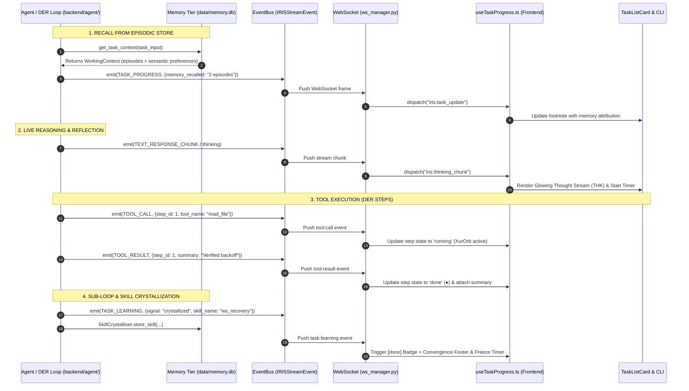

# IRIS Task Progress & Real Backend Architecture Specification

## 1. Executive Summary & Codebase Grounding

The Task Progress Card is the **unified living execution surface** for IRIS. It bridges the Python FastAPI backend to the Next.js/Tauri frontend and developer CLI.

### Grounding in Actual Backend Architecture:
* **Event Stream Core** (`backend/agent/event_bus.py`): Events flow across the WebSocket as typed `IRISStreamEvent` frames (`task:start`, `tool:call`, `tool:result`, `task:progress`, `task:learning`, `task:done`, `task:blocked`, `document:render`).
* **Task Kernel & DER Execution** (`backend/agent/task_kernel.py`): Drives Director $\to$ Explorer $\to$ Reviewer cycles, managing sub-loops, tool executions, and step-level state machines.
* **Three-Tier Memory Architecture** (`backend/memory/`): All encrypted at rest in `data/memory.db` (AES-256 SQLCipher):
  1. **Working Memory** (`working.py`): In-process zone-based active context (system zone, working input, execution history, scratchpad).
  2. **Episodic Store** (`episodic.py`): Vector-searchable task history embedded via `all-MiniLM-L6-v2` (`embedding.py`).
  3. **Semantic Store** (`semantic.py`): User preferences, cognitive model, and domain knowledge.
  4. **Skill Crystallizer** (`skills.py`): Automatically detects and crystallizes verified, high-value tool sequences into the `skills` database table upon `task:learning` signals.

---

## 2. Finalized GUI Card Architecture (2 Verified Designs)

The GUI chat stream surface provides two polished, distinguishable chassis options:

### A. Design 1: Chat View Stream / Industrial Precision (`VariantMonolith.tsx`)
* **Chassis**: Dark carbon plate with razor-sharp anti-aliased typography and 3px left accent rail.
* **Verb Alignment**: Fixed `w-12` (48px) column width for uniform vertical grid alignment across all verbs (`READ`, `PATCH`, `SEARCH`, `EXEC`).
* **Micro-Nodes**: Custom Xur particle orbitals (`<Xur size={9} />` when running, converged photon core `●` when done).
* **Completion Badge**: Displays `<Sparkles size={8} /> done` on task completion / crystallization.
* **Progress Counter**: `[doneCount/totalCount]` (e.g. `[3/4]`).

### B. Design 2: Liquid Ink (`VariantLiquidInk.tsx`)
* **Chassis**: Deep fluid ink surface with an animated warm accent vein (`#f97316` / `#fbbf24` / `#34d399`) glowing through the left edge.
* **Micro-Nodes**: Expanding ripple ring pulse indicators during in-flight execution.
* **Completion Badge**: Displays `<Sparkles size={8} /> done` on task completion.
* **Progress Counter**: Bracketed `[doneCount/totalCount]` (`[4/4]`).

### Labeled Anatomy: GUI Task Progress Card
```
┌────────────────────────────────────────────────────────────────────────────────────────┐
│ [1. ACCENT VEIN/RAIL]                                                                  │
│  │                                                                                     │
│  ▼                                                                        [4. COUNTER] │
│ ▌  [2. XUR NUCLEUS]  [3. OBJECTIVE TITLE]                                       ▼  [5. ▾]
│ ▌      (⟡)           Implement WebSocket Audio Streaming Resilience  [done]   [3/4]    │
├────────────────────────────────────────────────────────────────────────────────────────┤
│ [6. LIVE THOUGHT STREAM (THK)]                                                         │
│  THK  Recalling past WebSocket recovery episodes & reflecting on patterns...   [trace] │
├────────────────────────────────────────────────────────────────────────────────────────┤
│ │ [7. CONNECTOR GUIDE]                                                                 │
│ │                                                                                      │
│ ├── [8. STEP NODE] [9. VERB (w-12)] [10. TARGET ENTITY]     [11. INLINE SUMMARY]       │
│ │       ●           READ            src-tauri/src/ws_client.rs · Verified backoff      │
│ │                                                                                      │
│ ├──     ●           PATCH           hooks/useIRISWebSocket.ts  · Deduplicated listeners│
│ │                                                                                      │
│ │   ├── ┌── [12. SUB-LOOP / BRANCH]                                                    │
│ │   │   ├── ●       SEARCH          FastAPI disconnect handlers ↳ [Sub-Loop: Docs]     │
│ │   │   └── · Found 3 lifecycle patterns                                               │
│ │   └──                                                                                │
│ │                                                                                      │
│ └──     ✦           EXEC            pytest tests/test_ws_resilience.py · Tests passed  │
│                                                                                        │
├────────────────────────────────────────────────────────────────────────────────────────┤
│ [13. CONVERGENCE FOOTER & FOOTNOTE TIMER]                                              │
│  ✦ Retrieved 2 past episodes · data/memory.db (skills)                        ⏱ 0:14   │
└────────────────────────────────────────────────────────────────────────────────────────┘
```

---

## 3. Finalized Developer CLI Architecture (2 Verified Container Formats)

The developer CLI output is formatted with pure semantic actions, zero per-step timestamp/duration noise, and stacked context footers:

### A. CLI Option 1: Flow Pipeline (`renderDoubleTrackPipelineCLI`)
Uses double-rail container borders (`╔══╗`, `╠══╣`, `╚══╝`) with directional flow connectors (`══▶`, `●═▶`, `◆═▶`) and fully enclosed sub-loop chambers:

```text
╔══════════════════════════════════════════════════════════════════╗
║ ▶ TASK: Implement WebSocket Audio Streaming Resilience           ║
║   ▶ THK: Resolving execution trajectory...                       ║
╠══════════════════════════════════════════════════════════════════╣
║  ●═▶ ●  READ    src-tauri/src/ws_client.rs                       ║
║        └─▶ Verified tokio reconnect backoff                      ║
║    │                                                             ║
║  ●═▶ ●  PATCH   hooks/useIRISWebSocket.ts                        ║
║        └─▶ Applied event listener deduplication                  ║
║    │                                                             ║
║  ●═▶ ╔══ ↳ [Sub-Loop: Docs] ═══════════════════════════════════╗  ║
║      ║   ●  SEARCH  FastAPI WebSocket disconnect handlers      ║  ║
║      ║   └─▶ Found 3 connection lifecycle patterns             ║  ║
║      ╚═════════════════════════════════════════════════════════╝  ║
║    │                                                             ║
║  ══▶ ◎  EXEC    pytest tests/test_ws_resilience.py               ║
╠══════════════════════════════════════════════════════════════════╣
║ ✦ CONVERGED                                                      ║
║ Skill crystallized into data/memory.db (skills)                  ║
║ Retrieved 2 past episodes for WebSocket reconnects               ║
╚══════════════════════════════════════════════════════════════════╝
```

### B. CLI Option 2: Blueprint Matrix (`renderBlueprintCellMatrixCLI`)
Uses architectural single-line borders (`┌──┐`, `├──┤`, `└──┘`) with dotted vertical guide rails (`┊`) and hairline sub-chambers (`┄`):

```text
┌──────────────────────────────────────────────────────────────────┐
│ TASK : Implement WebSocket Audio Streaming Resilience            │
│ THK  : Resolving execution trajectory...                         │
├──────────────────────────────────────────────────────────────────┤
│ ┊ ●  READ    src-tauri/src/ws_client.rs                          │
│ ┊    └─ Verified tokio reconnect backoff                         │
│ ┊                                                                │
│ ┊ ●  PATCH   hooks/useIRISWebSocket.ts                           │
│ ┊    └─ Applied event listener deduplication                     │
│ ┊                                                                │
│ ┊ ┌┄┄ ↳ [Sub-Loop: Docs] ┄┄┄┄┄┄┄┄┄┄┄┄┄┄┄┄┄┄┄┄┄┄┄┄┄┄┄┄┄┄┄┄┄┄┄┄┄┐  │
│ ┊ ┊   ●  SEARCH  FastAPI WebSocket disconnect handlers         ┊  │
│ ┊ ┊   └─ Found 3 connection lifecycle patterns                 ┊  │
│ ┊ └┄┄┄┄┄┄┄┄┄┄┄┄┄┄┄┄┄┄┄┄┄┄┄┄┄┄┄┄┄┄┄┄┄┄┄┄┄┄┄┄┄┄┄┄┄┄┄┄┄┄┄┄┄┄┄┄┄┄┄┘  │
│ ┊                                                                │
│ ┊ ◎  EXEC    pytest tests/test_ws_resilience.py                  │
├──────────────────────────────────────────────────────────────────┤
│ ✦ [CONVERGED]                                                    │
│ Skill crystallized into data/memory.db (skills)                  │
│ Retrieved 2 past episodes for WebSocket reconnects               │
└──────────────────────────────────────────────────────────────────┘
```

---

## 4. Key Design Rules Enforced

1. **Purely Semantic Tree**: No raw millisecond or per-step timestamp noise anywhere in the tree branches.
2. **Integrated Living Thought**: `THK:` stream is integrated into the top header block right below the task objective.
3. **Stacked Convergence Footer**: Context text (e.g. episodic memory attribution) is stacked onto dedicated lines inside the container walls to prevent horizontal line overflow.
4. **Single Elapsed Timer**: One card/terminal-level running timer (`⏱ 0:14`) running during active execution and freezing on `done`/crystallized.
5. **No `.mcm` Runtime Dependency**: Build-time/agent coordinate tooling is decoupled from the application runtime; runtime memory exclusively queries `data/memory.db` (`EpisodicStore`, `SemanticStore`, `SkillCrystalliser`).

---

## 5. Backend Event-to-Frontend Flow


